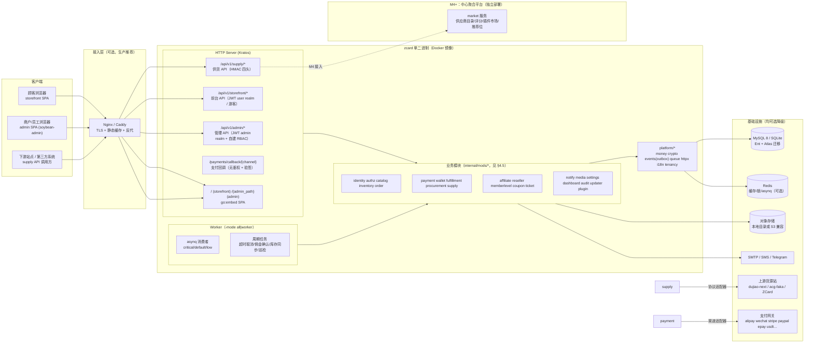
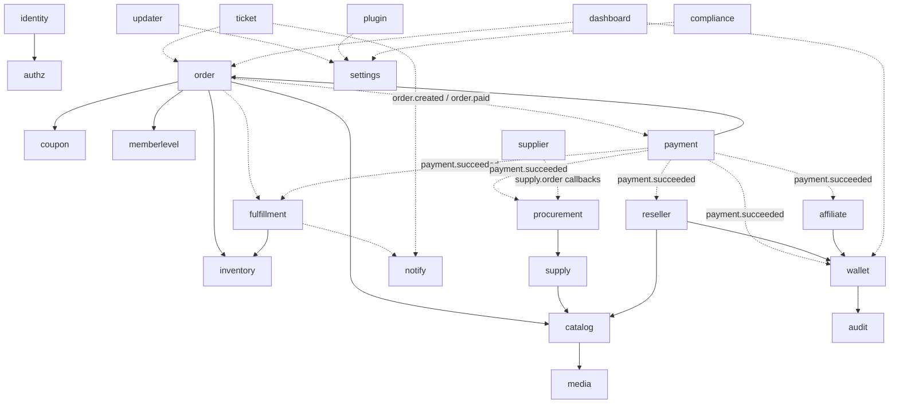
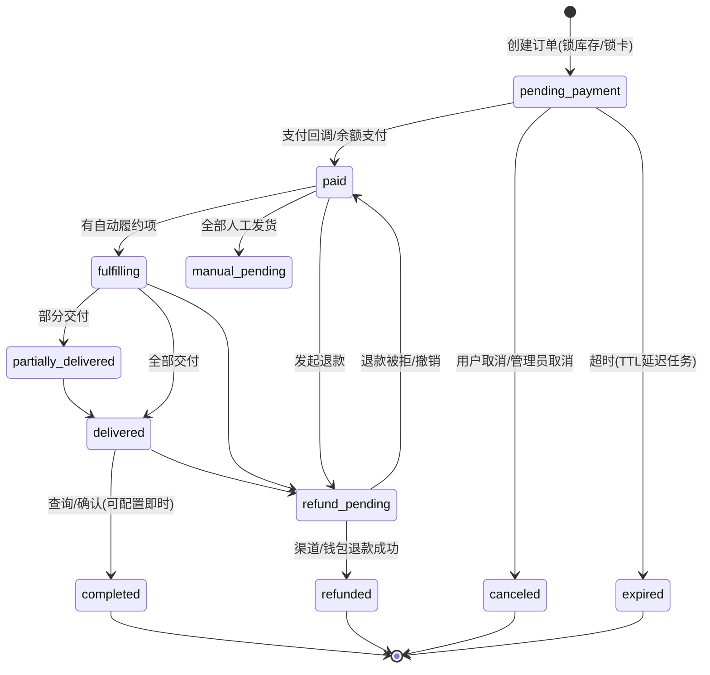
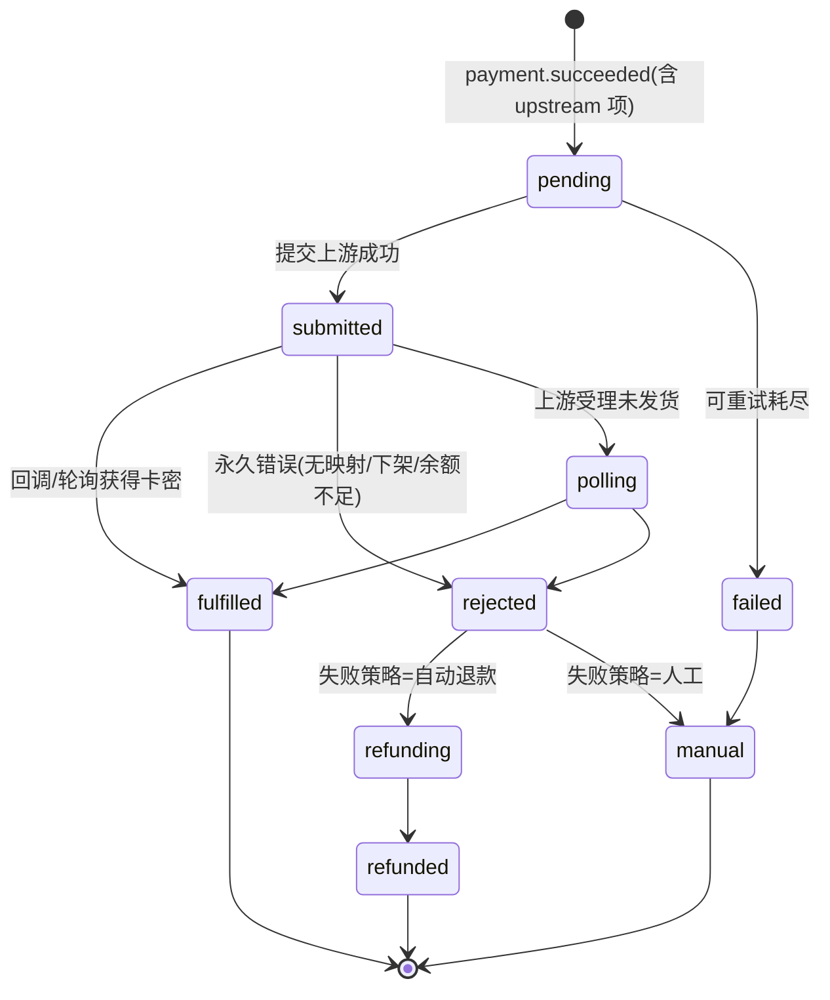
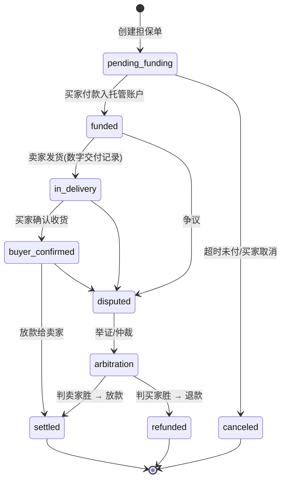
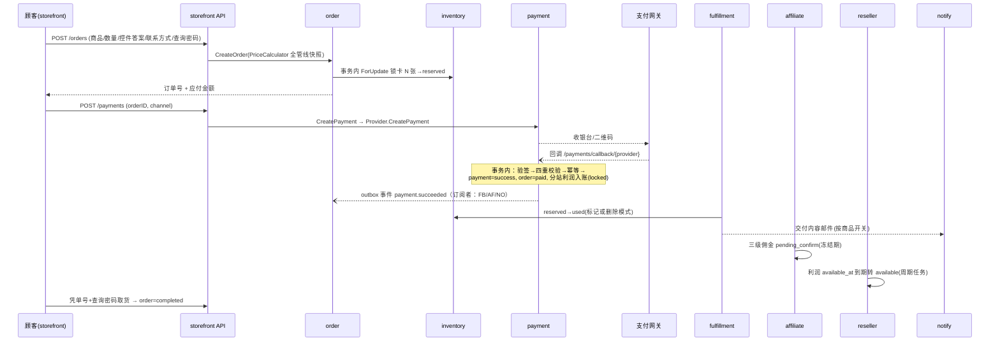
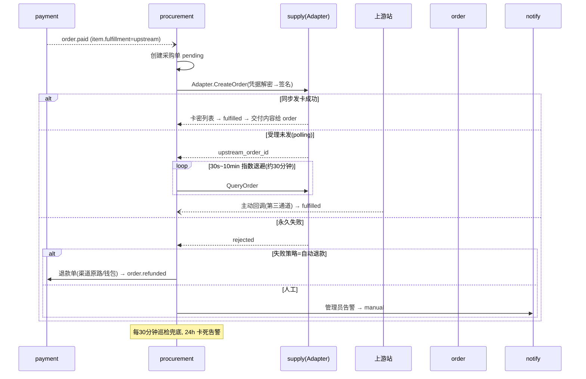

# ZCard 2.0 重构开发规划

> **版本**：v1.2（2026-08-15 评审修订，含：数据库架构与 SaaS 就绪、担保交易、货源对接安全加固、安全防护与防偷卡纵深防御、里程碑范围收敛；文末附变更记录）
> **日期**：2026-08-15
> **技术基线**：Go (Kratos v2) + Ent + soybean-admin
> **输入材料**：《ZCard 商业路书》、《ZCard2.0 后端功能导图》、ZCard 1.x 现有代码库（Laravel 13，VERSION 1.13.x）、友商 dujiao-next 源码调研
> **文档定位**：本文是 2.0 重构的**总纲**——确定架构、模块边界、数据与关键链路设计、迁移与里程碑。具体到每个模块的详细设计，后续以 `docs/superpowers/specs/` 单篇规格补充（沿用 1.x 的文档惯例）。

---

## 目录

- [0. 摘要（TL;DR）](#0-摘要tldr)
- [1. 背景与目标](#1-背景与目标)
- [2. 友商调研：dujiao-next 取长补短](#2-友商调研dujiao-next-取长补短)
- [3. 技术选型](#3-技术选型)
- [4. 总体架构](#4-总体架构)
- [5. 领域模型与核心设计](#5-领域模型与核心设计)
- [6. 关键链路时序](#6-关键链路时序)
- [7. API 设计规范](#7-api-设计规范)
- [8. 数据迁移策略（1.x → 2.0）](#8-数据迁移策略1x--20)
- [9. 前端规划](#9-前端规划)
- [10. 部署与运维](#10-部署与运维)
- [11. 插件机制与 Open Core](#11-插件机制与-open-core)
- [12. 里程碑计划（对齐商业路书）](#12-里程碑计划对齐商业路书)
- [13. 工程规范与协作](#13-工程规范与协作)
- [14. 风险登记册](#14-风险登记册)
- [15. 附录](#15-附录)
- [16. 变更记录](#16-变更记录)

---

## 0. 摘要（TL;DR）

**一句话结论**：用 Go 重写 ZCard，采用「**Kratos v2 作为模块化单体框架 + Ent 作为数据层 + soybean-admin 作为管理后台**」的组合，以**单二进制 + Docker 一键部署**为核心交付形态，在 12 个月内分四个里程碑（M0–M3）把 ZCard 从「发卡程序」升级为「数字商品供应链平台」的客户端底座；平台化（M4：聚合平台/插件市场/担保交易）**独立立项、不挤占本期**。

**关键决策**（详见各章 ADR）：

| # | 决策 | 结论 |
|---|---|---|
| D1 | 架构风格 | 模块化单体（modular monolith），单进程多 Server，预留按模块拆分为微服务的边界（Kratos proto-first + wire 使拆分成本最低） |
| D2 | 框架 | Kratos v2：proto 定义 API、HTTP/gRPC 双协议免费获得、wire 依赖注入、统一中间件（auth/ratelimit/validate/recovery/logging/tracing） |
| D3 | ORM | Ent + Atlas 版本化迁移（拒绝 GORM AutoMigrate，这是友商明确的短板） |
| D4 | 金额 | 沿用 1.x 铁律：**int64 分**存储与传递；基础货币唯一记账真相源；展示货币下单锁快照；换算中间过程用 decimal 库 |
| D5 | 模块通信 | 三通道：窄接口同步调用（consumer-side interface）+ 跨模块事务（Tx 工作单元传递）+ **事务性 Outbox 事件**（补上友商缺失的 outbox） |
| D6 | 异步任务 | asynq（Redis），**可选依赖**：无 Redis 时同步降级 + 进程内定时器；按 critical/default/low 三队列隔离（修复友商单队列互相阻塞问题） |
| D7 | 账务 | 钱包采用「账户 + 幂等键流水 + 冻结/可用分离」；佣金/分站利润统一走 ledger 模式，余额永远可由流水重算 |
| D8 | 退款 | 第一天就建 **refund orchestration**：渠道原路退款 + 钱包退款 + 上游退款传导（友商只有「退钱包」，是商业化短板） |
| D9 | 前端 | 管理后台基于 soybean-admin（Vue3 + Vite + TS + Pinia + NaiveUI + UnoCSS）；前台 storefront 独立重建，支持多模板注册表机制 |
| D10 | 前端交付 | `go:embed` 编译期嵌入，release 产物为**单个二进制**；仓库不再提交前端编译产物（1.x 模式的痛点反转） |
| D11 | 兼容策略 | 2.0 是**全新 API 命名空间**（`/api/v1` 基于新 proto），不做 1.x 线协议兼容；只做**数据迁移工具** + 双跑过渡 |
| D12 | 架构守护 | 照搬友商最有价值的资产：**AST 架构守护测试**（分层规则、模块边界、文件预算由测试强制，而非口头约定） |
| D13 | 插件机制 | Go 原生 plugin 不采用；三层混合：license 特性开关 + 外置扩展服务（稳定扩展点契约）+ webhook/开放 API；M4 上应用市场（友商完全没有插件机制，这是结构性差异点） |
| D14 | 多 SaaS 开站 | 双形态：**分站** = 单实例多租户（默认 Row 行级隔离）；**SaaS 云开站** = 多实例（控制面 + 数据面，隔离模式按套餐选 Row/Schema/Database），M1–M3 只做架构预留（实例自包含、租户上下文、控制面复用 supply 协议、数据出口），**M4+ 独立立项** |
| D15 | 数据库架构 | **业务形态与数据隔离模式解耦**：Row（共享库共享表 + tenant_id 行级）/ Schema（同实例每租户独立命名空间，PostgreSQL schema 或 MySQL 多库）/ Database（每租户独立库，可异地远程）三模式**全开源、config 驱动、可混合部署**；统一 `TenantStore` 抽象让业务零感知模式差异；内部主键自增 + 对外雪花 ID；卡密/凭据应用层加密 + keyed hash；Atlas 版本化 + per-tenant 迁移 |
| D16 | 担保交易 | 交易保障不沉淀资金（铁律十）：资金由持牌机构（担保代收/分账）承接，ZCard 只做 escrow 状态机与证据链编排；争议走工单仲裁 |
| D17 | 安全与防偷卡 | 纵深防御五层：存储加密（卡密强制 AES-GCM + 密钥轮换）、传输 TLS + no-store、应用鉴权（查询密码 + 限流 + 审计 + 掩码）、最小权限（管理员默认看不到完整卡密）、可观测告警；1.x 痛点「加密默认关 + 交付明文快照」在 2.0 强制关闭 |

**里程碑速览**（详见第 12 章）：

| 里程碑 | 周期 | 交付 | 对应路书 |
|---|---|---|---|
| M0 工程地基 | 第 1–4 周 | 仓库骨架、Kratos+Ent 跑通、CI、架构测试、登录/RBAC | 阶段一 准备 |
| M1 核心交易闭环 | 第 5–10 周 | 商品/卡密/下单/支付(4渠道)/本地发货/后台 80 页 | 阶段一「ZCard V2 核心功能」 |
| M2 货源与自动履约 | 第 11–16 周 | 上游对接(3协议)/采购单/库存价格同步/Docker 一键部署/1.x 数据迁移工具 | 阶段一「Docker 一键部署 + 接入 3–5 家供应商」 |
| M3 商业化 | 第 17–26 周 | 订阅/license/插件机制/工单/通知/分站/三级分销/提现 | 阶段二「首批订阅收入」 |
| M4 平台化 | 第 27–52 周（**独立立项，不计入 12 个月承诺**） | 对外供货开放平台/插件市场/自动调价/利润分析/供应商评分/担保交易 | 阶段三「平台增长」 |
| M5 规模化 | 12 个月以后 | 交易保障规模化/企业版/多语言地区扩展 | 阶段四 |

---

## 1. 背景与目标

### 1.1 为什么重构

**商业驱动**（摘自路书）：

- 路书的核心入口是「**开源系统 + Docker 一键部署**」，且明确「从安装到营业的时间」是核心竞争指标。PHP + FPM + Composer + Node 的部署链路对小白站长仍偏重；Go 的**单二进制 + 交叉编译 + 低内存**特性是这个商业目标的最短路径（友商 dujiao-next 已验证该模式可做到官方一键脚本 5 分钟部署）。
- 路书第二增长曲线是「**货源聚合平台 + 插件市场**」：这意味着 ZCard 会演化出「自托管站点」与「中心聚合平台」两种形态。自托管端必须轻量、可离线、易升级；中心平台必须高性能、可水平扩展。Go + proto-first 的服务边界让这两条线可以共享同一套领域代码起步、后期无痛拆分。
- 「系统稳定：持续更新接口、安全修复」——需要一套**可被测试强制的架构**，避免 1.x 式的腐化（见下）。

**技术驱动**（1.x 现状问题，源自仓库 AGENTS.md 自述与代码盘点）：

1. **测试缺口在高风险区**：9+ 个支付驱动无回调验签测试、`OrderService`（锁卡防超卖）无直接测试。Laravel 时代补齐这些测试的成本高（框架启动重、Faker/工厂体系与业务耦合）。
2. **双后台并存的历史包袱**：Filament（开发期 CRUD）与 sysadmin SPA 并存，功能在两处漂移。
3. **以 PHP 进程身份执行 `git reset --hard` / `composer` 的在线更新器**是安全面与稳定性隐患（`UpdateController` 仅 `admin.role` 一道守卫，无锁、无二次确认、无审计）。
4. **常驻进程运维成本**：queue worker、scheduler、pail 多进程并行（`composer dev` 需要拉起 4 个进程），与「单容器一键部署」的目标形态冲突。
5. **提交前端编译产物进仓库**（为免 Node 部署）导致每次发版仓库膨胀、diff 噪音大。

**明确不属于「重构理由」的**（防止为了重写而重写）：

- 1.x 的**领域知识是资产不是负债**：金额分单位、卡密 AES 加密 + hash 去重、HMAC 四头供货协议、各支付渠道的签名口径与成功判据矩阵、分站定价规则、acg-faka/独角上游的协议坑（`docs/superpowers/specs/` 与模块 AGENTS.md 里沉淀了 21+ 个高风险文件的精读结论）。**2.0 的第一原则是：领域规则按文档迁移，代码按新架构重写，行为用契约测试锁死。**

### 1.2 重构目标（可量化验收）

| 维度 | 目标 | 验收口径 |
|---|---|---|
| 部署 | `docker compose up -d` 或解压单二进制，**60 秒内**出现可用的安装向导 | 脚本化冒烟测试（新 VM 从零到可下单） |
| 资源 | 空载内存 < 100MB；2C4G 支撑商品列表 ≥ 500 QPS、下单（本地卡密）≥ 100 TPS | 压测报告（k6/vegeta） |
| 可测 | 支付回调验签覆盖 **100% 渠道**；订单/账务/供货核心链路有集成测试；架构规则 100% 由测试强制 | CI 覆盖率门槛 + 架构测试套件 |
| 可扩展 | 新增支付/上游渠道 = 新增一个 adapter 文件 + 注册，不修改核心代码 | 以「新增一个渠道」为验收用例走查 |
| 可观测 | 结构化日志（事件名 + 关键 ID）、Prometheus 指标、可选 OTel trace | Grafana 看板模板随仓库交付 |
| 可迁移 | 1.x 全量数据（含卡密密文）迁移工具，迁移后抽样对账 100% 一致 | 迁移工具 dry-run 报告 |

### 1.3 不变量（从 1.x 继承的铁律，2.0 违反即架构违规）

这些规则在 1.x 用血泪换来，写入 2.0 的架构守护测试与 code review 清单：

1. **金额一律 int64「分」**。禁止 float32/float64 存金额；跨币种换算仅在展示层与下单快照时发生，用 decimal 中间量后取整。
2. **API-First**：transport 层只做参数校验与装配，业务逻辑必须在 biz 层（对应 1.x 的「逻辑写在 Support 服务」）。
3. **卡密内容加密入库**（AES-256-GCM，密钥与 APP_KEY 解耦），去重靠明文 sha256 的 `content_hash`。
4. **静态路由先于参数路由**注册（`cards/export` 先于 `cards/{id}`）。
5. **上游/下游凭据加密存储；解密失败必须降级为空并提示重配，列表接口绝不 500**。
6. **支付回调幂等三层**：状态机（已 success 直接 ACK）、行锁后二次校验、业务幂等键。
7. **配置真理源**：运行时业务开关在 `settings` 表（后台可改）；`env`/config 文件只作首次部署兜底。
8. **SPA 的 index.html 不缓存**。
9. 语言规范：注释/日志/异常文案/文档**简体中文**，标识符英文。
10. **不沉淀用户资金**：任何涉及资金池的能力（交易保障、托管）必须由持牌机构承接（路书十）。
11. **卡密永远加密、永不落明文**：卡密内容强制 AES-256-GCM 加密入库（**不存在「关闭加密」开关**）；交付记录、审计、日志、缓存、搜索索引任何位置不得持久化明文卡密；去重用 **keyed hash**（HMAC-SHA256(卡密密钥, 明文)），防低熵卡密的彩虹表反推。
12. **卡密取货三重门**：订单号不可枚举 + 查询密码（constant-time 比对）+ 限流/锁定/审计；交付内容默认一次性可见，之后掩码。
13. **最小可见原则（防内部偷卡）**：管理员/员工默认只看掩码卡密（尾 4 位），完整卡密需独立权限 + 二次确认 + 审计；分站主只能看自己租户数据（框架级隔离）。
14. **租户隔离模式与业务解耦**：任何业务形态（主站/分站/SaaS）可选用任何数据隔离模式（Row/Schema/Database，全开源、config 驱动、可混合）；业务代码只经 `TenantStore.Resolve` 取数据句柄，禁止直接持有全局 `*ent.Client` 单例或硬编码租户条件（§4.11.2）。

---

## 2. 友商调研：dujiao-next 取长补短

调研对象：`/Users/mac/Project/Go/dujiao-next`（Go 1.26 + Gin + GORM + asynq + Casbin 的模块化单体，35 个业务模块，Vue3 双前端 go:embed）。以下结论来自对其订单/履约/采购/钱包/支付/分销模块的精读。

### 2.1 值得直接借鉴（10 项）

| # | 友商实践 | ZCard 2.0 落地方式 |
|---|---|---|
| 1 | **AST 架构守护测试**：`internal/architecture/` 50+ 测试解析全树 import，强制分层（domain 不依赖上层、application 禁 import Gin/asynq、只有 gormstore 可 import GORM）、模块结构锁定、目录文件数预算、RBAC 路由覆盖测试 | 原样照搬思路，规则改为 Kratos/Ent 版本（见 §4.10）。这是防腐化的核心保险 |
| 2 | **模块间只经 contract 通信 + bootstrap wiring**：消费方定义窄接口端口，装配在独立 bootstrap 包 | Go 惯例 consumer-side interface，Kratos wire provider 装配（§4.7） |
| 3 | **支付回调在单事务内完成强一致部分**（行锁 payment+order、四重校验：渠道/单号/金额/币种），**事务提交后才入队异步副作用** | 原样采纳为支付回调管线标准（§5.5、§6.2） |
| 4 | **钱包流水的 Reference 唯一索引做幂等键**（`order_pay:<id>`、`order_refund:<id>`），`CreditInTransaction` 重入直接返回 | 采纳，扩展为全账务统一幂等键规范（§5.6） |
| 5 | **支付渠道能力接口拆分**（GatewayProvider / Webhooker / CallbackVerifier / Capturer / SecurityTester），按 `(provider, channel)` 注册表路由 | 原样采纳接口形态，替代 1.x 的大 `PaymentDriver` 接口（§5.5） |
| 6 | **asynq 可选依赖**：Redis 不可用时同步降级，enqueue 前判 `queue.Enabled()` | 采纳，并加「进程内定时器兜底周期任务」（§4.8） |
| 7 | **运维子命令打进同一二进制**（`admin reset-password` / `reset-2fa`），容器免工具 | 采纳，扩展 `migrate-from-v1`、`install`、`self-update`（§10.3） |
| 8 | **go:embed 全栈构建标签**（`fullstack` tag，两个前端 dist 缺一即编译失败）+ **运行时可配置的 admin base path**（占位符启动时改写） | 采纳（§10.1）；admin 安全入口可配（心智图要求） |
| 9 | **上游采购三通道结果获取**：回调 + 短期指数退避轮询（30s~10min）+ 30 分钟级巡检兜底（24h 卡死告警） | 原样采纳为采购单结果获取标准（§5.7） |
| 10 | **多级供货链回调转发**：本站既是上游（upstreamapi）又是下游（procurement），交付沿链多级转发；**白标邮件 fail-closed**（reseller 订单绝不暴露主站品牌） | 采纳（§5.8、§5.9）；分站品牌隔离邮件同理 |

### 2.2 引以为戒 / 友商缺失（ZCard 2.0 必须补齐）

| # | 友商短板 | ZCard 2.0 对策 |
|---|---|---|
| 1 | **退款只能退钱包**，无支付渠道原路退款 API 调用；上游退款不传导给本地用户 | Day-1 设计 refund orchestration：渠道退款适配器 + 钱包退款 + 上游退款传导 + 部分退款（§5.5.4） |
| 2 | **钱包无冻结态**（单一 Balance），无 available/locked 分离 | 账户三列：`available/locked/total`，提现与佣金冻结期走 locked（§5.6） |
| 3 | **无事务性 Outbox**：事务提交后 enqueue 失败仅打日志，事件有丢失窗口（靠轮询兜底） | outbox 表与业务同事务写入，relay 异步投递（§4.8） |
| 4 | **asynq 单队列**：交付/邮件/同步互相阻塞 | 三队列 critical（交付/回调）/ default（邮件/通知）/ low（同步/报表）（§4.8） |
| 5 | **AutoMigrate** 而非版本化迁移文件，升级回滚只靠二进制 selfupdate | Ent + Atlas 版本化迁移，每次发版带 SQL 迁移与回滚脚本（§3.3） |
| 6 | **分销仅单级**；**单币种假设**（钱包 CNY） | 保留 1.x 三级分销 + 多币种（基础货币记账 + 展示货币换算快照）（§5.9、§5.1） |
| 7 | **无工单/客服体系**、无发票税务、无 feature flag | 工单进 M3（心智图核心模块）；feature flag 用 `features.*` + license 联动（§11） |
| 8 | **风控基础**（仅 IP 维度 pending 订单闸门） | 保留 1.x SecurityAudit 思路，M3 加黑名单/设备指纹预留位（§5.17） |
| 9 | 采购单隐含「一子订单一商品」约定靠上层保证 | 2.0 采购单模型显式建模 items，约束由 schema 承载（§5.7） |

### 2.3 一句话总结

dujiao-next 证明了「Go 单二进制发卡系统 + 模块化单体 + 架构测试」这条路完全可行，其**工程纪律**（架构守护、幂等设计、降级策略）是最佳教材；其**产品纵深**（退款、账务冻结、多级分销、多币种、工单）留出了 ZCard 依靠 1.x 领域积累反超的空间。ZCard 2.0 = **友商的工程骨架 + 1.x 的领域深度 + 路书的平台化野心**。

---

## 3. 技术选型

### 3.1 选型总览

| 层 | 选择 | 版本基线 | 备选与放弃理由 |
|---|---|---|---|
| 语言 | Go | ≥ 1.25（建议 1.26） | — |
| 应用框架 | go-kratos/kratos v2 | 最新稳定 | 见 §3.2 |
| ORM | entgo.io/ent + ariga/atlas | 最新稳定 | 见 §3.3 |
| 数据库 | **MySQL 8（自托管标准）/ PostgreSQL 15+（平台多租户）/ SQLite（最小化单体）三档**，一套代码 | — | Ent + `platform/db` 方言适配层；三档能力分级见 §3.5（ADR-D18）/ §3.6（ADR-D19） |
| 缓存/锁 | Redis ≥ 6（**可选**） | go-redis v9 | 缺失时降级：进程内缓存 + DB 锁（沿用 1.x 降级哲学） |
| 异步任务 | hibiken/asynq（Redis 可选） | v0.25+ | 无 Redis 时同步执行 + 进程内 cron 兜底 |
| 认证 | golang-jwt/v5（admin/user 双 realm）+ pquerna/otp（TOTP） | — | — |
| 授权 | **自建 RBAC**（`admin_roles` + `role_permissions`，权限目录自动生成；域内角色由租户隔离实现） | — | 见 §5.14；发卡系统权限模型简单，自建 RBAC 比 Casbin 更轻可控 |
| 金额运算 | int64 分 + shopspring/decimal（仅换算中间量） | — | 存储永不出现浮点 |
| 配置 | Kratos config（file + env 覆盖） | — | 业务运行时配置进 DB settings |
| 日志 | Kratos log（zap driver）+ lumberjack 滚动 | — | 结构化：事件名 + 关键 ID |
| 指标/追踪 | prometheus client + OTel（默认关） | — | `/metrics` 内网口 |
| 验证码 | mojocn/base64Captcha | — | 与 1.x 同源方案 |
| HTTP 客户端 | net/http + 重试中间件（自研 `platform/httpx`） | — | 上游对接的签名/重试/超时统一封装 |
| 管理后台 | soybean-admin 主线（Vue3 + Vite + TS + Pinia + NaiveUI + UnoCSS） | — | 见 §9.1 |
| 前台 | Vue3 + Vite + TS + Tailwind v4（多模板注册表） | — | 见 §9.3 |
| 图表 | ECharts 5 | — | 仪表盘趋势图 |
| 构建/发布 | goreleaser + Docker buildx 多架构 + GitHub Actions | — | §10 |
| API 描述 | protobuf + buf；REST 由 Kratos HTTP 注解生成；OpenAPI 由 proto 导出 | — | §7 |

### 3.2 ADR-D2：为什么是 Kratos

**结论**：用 Kratos v2，但把它当「**带工程脚手架的模块化单体框架**」用，而不是微服务全家桶（不引入注册中心、不拆进程，除了 worker 模式）。

**理由**：

1. **proto-first 的 API 纪律**：所有 API 先写 `.proto`（`api/{admin,storefront,supply,open}/v1/*.proto`），HTTP 路由/参数/校验注解生成。这对 ZCard 的三个对外面（管理 API、前台 API、供货 API）天然对齐 1.x 的「API-First」铁律，且给 M4「第三方系统接入货源平台」留下现成的 gRPC/HTTP 双协议能力——**聚合平台阶段某些模块直接以 gRPC 互联，无需重写接口**。
2. **wire 依赖注入**：编译期生成装配代码，装配错误在编译期暴露；模块 wiring 集中（`internal/bootstrap/<module>/`），与友商「bootstrap 装配 + 模块互不感知」的组织方式无缝对接。
3. **中间件生态**：recovery / logging / tracing / validate / ratelimit / auth / cors 开箱即用，供货 API 的 HMAC 鉴权做成自定义中间件与 1.x `SupplyAuth` 对位。
4. **transport 无关**：biz 层不知道请求来自 HTTP 还是 gRPC，测试可以直接调 service/biz。
5. **退路**：Kratos 的 `App` 只是 server 的容器；万一某天放弃 Kratos，transport 层薄、biz 层框架无关，迁移成本可控（分层规则由架构测试保证 transport 不泄漏进 biz）。

**代价与对策**：

- Kratos 默认面向微服务，脚手架偏重 → 只用其 `kratos-layout` 的最小集（config/log/middleware/http/grpc/wire），注册中心、服务发现、熔断等组件**不引入**。
- Kratos 的 HTTP server 承载 SPA 静态文件与回调路由需要自定义 → 用 `http.Server.Route` 挂载静态与 wildcard 路由，友商的 reserved paths 方案照搬（§10.1）。

### 3.3 ADR-D3：为什么是 Ent（而不是 GORM）

1. **Schema 即代码 + Atlas 版本化迁移**：`ent/schema/*.go` 是唯一真理源，`atlas migrate diff` 生成可审查的 SQL 迁移文件（含回滚），直接修复友商 AutoMigrate 的短板。1.x 的 68 个 Laravel migration 在 2.0 收敛为 Atlas 版本线。
2. **类型安全与图查询**：跨外键的查询（订单→商品→上游映射→连接）是 ZCard 的高频路径，Ent 的 graph traversal 比 GORM 链式手写更可测。
3. **Hooks/Interceptors**：卡密写入前加密、审计日志、分站租户过滤（`subsite_id` 自动注入）都可以在 Ent privacy/interceptor 层统一实现，而不是散落各处——**多租户隔离的正确位置**（§4.9）。
4. **与 Kratos 官方示例契合**：kratos-layout 的 data 层即以 Ent 为例，社区有成熟范式。

**代价与对策**：

- Ent 生成代码体积大 → 生成物（`ent/`、`pb/`）**提交仓库**，CI 校验 `go generate ./...` 无 diff（保证离线可构建）。
- 复杂报表 SQL（仪表盘聚合）不走 Ent 图查询 → data 层允许直接 `QueryContext` 原生 SQL，架构测试限定「只有 `data/` 目录可执行裸 SQL」。
- **双数据库方言**（MySQL 8 + PostgreSQL 15+）一套代码的完整方案见 §3.5（ADR-D18）：Ent schema 跨方言 + `platform/db` 方言适配层 + Atlas 每方言迁移。

### 3.4 金额与时间的基础类型

```go
// platform/money/money.go —— 全仓唯一金额类型
type Cents int64 // 永远是「分」，永远基于基础货币（默认 CNY）

// 换算仅发生在两个位置：
// 1) 展示层：Cents -> DisplayAmount(currency, rate)  四舍五入规则可配
// 2) 下单快照：DisplayAmount -> Cents（锁 exchange_rate，误差入 rounding_adjust）
```

时间一律 `time.Time`（UTC 存储），展示时区由 settings 决定。

### 3.5 ADR-D18：一套代码双数据库（MySQL 8 + PostgreSQL 15+）

**结论**：一套代码同时支持 MySQL 8 与 PostgreSQL 15+，另加 SQLite 作「最小化单体」起步（见 §3.6 ADR-D19）。**核心业务走「最小公分母」，平台/多租户进阶能力走「PG 渐进增强」**；方言差异由三层收口——Ent schema（跨方言真理源）+ `platform/db`（方言适配层）+ Atlas（每方言迁移）。

**分层与收口**：

```
L0  Ent schema      —— 跨方言类型定义，唯一真理源；方言特有列（JSONB/数组/RLS）用 Annotation 标记
L1  Atlas 迁移      —— 每方言独立迁移版本线（atlas migrate diff --dialect mysql | postgres）
L2  查询层          —— 95% 走 Ent builder（跨方言）；裸 SQL 收口 internal/data/report + platform/db 适配层
L3  platform/db     —— Dialect 检测 + 能力开关 + SQL 函数映射 + 类型映射
L4  租户隔离        —— PG: schema + RLS 双保险；MySQL: 多库 + Ent 拦截器（§4.11）
```

**四条硬原则**：

1. **Ent schema 是唯一真理源**，禁止在代码里手写 DDL；类型用跨方言语义（`int64` 分、`bool`、`time.Time`、`json.RawMessage`），物理类型由 Atlas 按 dialect 生成。
2. **业务查询 95% 走 Ent builder**（`client.X.Query().Where(...)`），Ent 生成的 SQL 自动适配方言——这是「一套代码双库」的第一道保障，也是选 Ent 而非手写 SQL 型 ORM 的核心理由。
3. **裸 SQL 必须收口**：仅 `internal/data/report`（报表聚合）可写裸 SQL，且必须经 `platform/db` 方言适配层构造（禁止在业务代码里字符串拼接方言 SQL），架构测试 §4.10-5 强制。
4. **方言能力开关，不追求 100% 对齐**：PG 是「平台/多租户一等公民」，MySQL 是「自托管兼容层」。`platform/db.Dialect` 暴露 `SupportsRLS / SupportsSchema / SupportsJSONB / SupportsArray` 等能力位，运行时检测——PG 启用、MySQL 走降级路径。**明确不做**「把 PG 能力硬塞给 MySQL」。

**核心类型映射（Atlas 自动生成，此处供评审）**：

| 语义 | Ent 类型 | MySQL | PostgreSQL |
|---|---|---|---|
| 主键 | `int64` + 自增 | `BIGINT AUTO_INCREMENT` | `BIGINT GENERATED BY DEFAULT AS IDENTITY` |
| 金额（分） | `int64` | `BIGINT` | `BIGINT` |
| 布尔 | `bool` | `TINYINT(1)` | `BOOLEAN` |
| 时间 | `time.Time` | `DATETIME(3)` | `TIMESTAMPTZ`（UTC） |
| JSON | `json.RawMessage` / `[]byte` | `JSON` | `JSONB` |
| 枚举 | Ent `Enum` | `VARCHAR` + CHECK | 原生枚举 或 `VARCHAR` + CHECK |
| 二进制（卡密密文） | `[]byte` | `VARBINARY/BLOB` | `BYTEA` |

**方言差异收口清单（`platform/db` 屏蔽，业务不感知）**：

| 场景 | MySQL | PostgreSQL | 收口方式 |
|---|---|---|---|
| upsert | `INSERT ... ON DUPLICATE KEY UPDATE` | `INSERT ... ON CONFLICT DO UPDATE` | Ent `Upsert` 自动适配 |
| 大小写不敏感 | `utf8mb4_0900_ai_ci` collation | `ILIKE` / `LOWER()` | `db.ILike()` 能力函数 |
| 字符串拼接 | `CONCAT()` | `||` / `CONCAT()` | `db.Concat()` |
| 分页 | `LIMIT x, y` | `LIMIT y OFFSET x` | Ent `Limit/Offset` |
| 自增回填 | `LAST_INSERT_ID()` | `RETURNING` | Ent `Create` 自动处理 |
| 布尔读回 | `1/0` | `t/f` | Ent 映射回 `bool` |
| 日期运算 | `DATE_ADD()` | `+ interval` | `db.DateAdd()` |
| 全文搜索 | `MATCH AGAINST` | `tsvector` | M3 统一走外置搜索，暂不落地 |

**「PG 渐进增强」（MySQL 无等价物，能力开关关闭时降级）**：

1. **Schema 级租户隔离**：PG `schema` + `search_path`；MySQL 无 schema，降级为「多 database」（§4.11.1 Schema 模式的两种物理形态）。
2. **RLS 行级安全**：PG 在 Ent 拦截器之外加数据库级强制兜底（§5.20 纵深防御）；MySQL 无，靠 Ent 拦截器 + 架构测试单层保障。
3. **JSONB 高级查询**：`settings`/订单快照/outbox payload 的 `@>` / GIN 索引 / 原子更新；MySQL JSON 能用但弱，PG 场景走 JSONB 路径。
4. **数组/部分索引/窗口函数**：报表与风控场景 PG 直接用；MySQL 用 JSON 模拟或降级为普通查询。

**迁移与测试（双库的隐性成本，必须计入排期）**：

- **Atlas 每方言独立迁移线**：`migrations/mysql/` 与 `migrations/postgres/` 两套，`atlas migrate diff` 按 dialect 生成；CI 校验两套迁移都能从零 apply。
- **`migrate-from-v1` 支持跨方言**：1.x 是 MySQL，PG 路线意味着 MySQL→PG 跨库迁移（类型映射 + JSON 列 + 卡密 CBC→GCM 重加密），迁移工具要抽象方言层——这是选双库最大的隐性成本，**M2 的迁移工具排期必须算进去**。
- **CI 三线测试矩阵**：SQLite（单元/快）+ MySQL（集成）+ PostgreSQL（集成）三线；**PG 线必跑**（SQLite↔PG 方言差更大，`ILIKE`/JSONB/数组/序列容易在 SQLite 开发期被掩盖）。这顺带覆盖 §4.11 的 `schemaStore`（PG schema）测试。

**为什么能「一套代码」**：分层把方言差异压到最窄的两处——Ent schema（声明式，Atlas 生成 DDL）与 `platform/db`（裸 SQL 适配层）；其余 95% 业务代码用 Ent builder 天然跨方言。代价是三条纪律：**不得在业务代码手写裸 SQL**（架构测试强制）、**每加一个 PG 特性要补一个 MySQL 降级路径**、**迁移工具与 CI 各多一条方言线**。破坏任一条，双库就会漏水。

### 3.6 ADR-D19：SQLite 最小化单体（单站小微形态）

**结论**：SQLite 升格为**正式一等部署形态**，定位「最小化单体（单站小微）」——单二进制 + 单 `.db` 文件 + 无 MySQL/PG/Redis 依赖；与 MySQL（自托管标准）、PG（平台/多租户）构成三档能力分级。

**为什么有必要（友商验证 + 路书对齐）**：

- **友商默认就是 SQLite**：dujiao-next `config.yml.example` 的 `driver: sqlite`，且用纯 Go 驱动（`glebarez/sqlite`，底层 `modernc.org/sqlite`，无 CGO）。「SQLite 默认起步」是发卡系统获客的标准姿势——小白站长零依赖开跑，对应路书「从安装到营业时间」的最短路径。
- **单文件心智负担最低**：整个数据就是一个 `.db`，备份 = 复制文件、迁移 = 拖文件，对小微站长最友好。
- 符合 §1.2「空载内存 < 100MB」与 1C1G 目标。

**定位与能力分级（三档，不可混用）**：

| 形态 | 数据库 | 多租户 | 场景 |
|---|---|---|---|
| 最小化单体（lite） | SQLite（WAL） | 无（单站） | 单站小微、开发/测试 |
| 自托管标准 | MySQL 8 | 分站（Row 行级） | 自托管主力 |
| 平台/多租户 | PostgreSQL 15+ | 分站 + Schema/Database + RLS | SaaS/大客户/远程库 |

**技术要点**：

1. **纯 Go 驱动，无 CGO**：用 `modernc.org/sqlite`（或 `glebarez/sqlite`，友商同款），保证单二进制交叉编译（amd64/arm64）不被 CGO 破坏——这是「最小化单体」能成立的前提；`mattn/go-sqlite3` 需 CGO，弃用。
2. **WAL 模式**：默认 `PRAGMA journal_mode=WAL` + `busy_timeout`，读并发显著提升，写仍是单写者。
3. **防超卖降级**：SQLite 无 `FOR UPDATE`，用 `BEGIN IMMEDIATE`（单写者串行化）+ `UPDATE ... WHERE status=available` 校验 affected rows 的 CAS 语义（§5.20.3 已述，此处落为 SQLite 专属路径，纳入 R7 集成测试）。
4. **同一二进制，运行时切 dialect**：Ent 支持按 DSN 选 `sqlite/mysql/postgres`，「最小化单体版本」= 同一个 `zcard` 二进制 + SQLite DSN + 无 Redis，**不是单独编译**；可另发 `zcard-lite` 标记版省略 MySQL/PG 驱动减小体积（可选优化）。

**能力边界（诚实标注）**：

- SQLite 形态**禁用/降级**：分站多租户（需 MySQL/PG）、远程库、RLS、JSONB 高级查询、跨实例分布式锁。
- **类型弱**：SQLite type affinity 会掩盖 MySQL/PG 的类型错误，故 CI 三线里 SQLite 只作单元/快测，**生产语义以 MySQL/PG 集成线为准**（§3.5）。
- **单写者瓶颈**：WAL 下读并发 OK、写并发串行；发卡系统单站量级（几十~几百单/天）无压力，但分站/SaaS 不用 SQLite。

**与 ADR-D18 的关系**：SQLite 是第三方言，`platform/db` 适配层从「双库」扩为「三方言」（能力开关增加 `SupportsReturning / SupportsILike / ...`，SQLite 多数为 false）；Ent schema 不变，Atlas 增加 `migrations/sqlite/`（开发期可先用 Ent auto-migrate 过渡）。

### 3.7 ADR-D20：platform/db 方言适配层（全仓唯一触碰方言的包）

**结论**：全仓**唯一允许触碰方言**的代码只有两处——Ent schema 的 Annotation（声明式，Atlas 生成 DDL）与 `platform/db`（裸 SQL 适配层）。`platform/db` 是三方言（SQLite/MySQL/PG）差异的唯一收口，`mods/*` 业务代码禁止直接 import 驱动特定包。

**Dialect 与检测**：

```go
// platform/db/dialect.go
type Dialect string
const (
    MySQL    Dialect = "mysql"
    Postgres Dialect = "postgres"
    SQLite   Dialect = "sqlite"
)
func Detect(entDialect string) Dialect // 从 Ent client 的 dialect 名检测，运行时确定
```

**能力开关（运行时决策，非编译期 build tag）**：

```go
type Capabilities struct {
    SupportsRLS          bool // PG true；MySQL/SQLite false
    SupportsSchema       bool // PG true；MySQL(database==schema)；SQLite(attach 模拟，默认不用)
    SupportsJSONB        bool // PG true；MySQL JSON 弱等价；SQLite JSON1 弱
    SupportsReturning    bool // PG/SQLite true；MySQL false
    SupportsILIKE        bool // PG true；MySQL/SQLite 用 LOWER 降级
    SupportsForUpdate    bool // PG/MySQL true；SQLite false
    SupportsArray        bool // PG true；MySQL/SQLite false
    SupportsPartialIndex bool // PG/SQLite true；MySQL false
}
func (d Dialect) Capabilities() Capabilities
```

**核心决策（方向钉死，不许摇摆）**：

1. **运行时能力开关，不是 build tag**：同一 `zcard` 二进制支持三方言，运行时按 DSN 检测 dialect、查能力位、走对应路径——「最小化单体」「自托管」「平台」是同一个二进制（呼应 §3.6 第 4 条），**不搞三套编译产物**。
2. **能力降级是显式分支，不是静默错误**：`SupportsX == false` 时业务必须走降级路径或返回明确错误「该能力当前数据库不支持」；**禁止**「假装支持然后运行时炸 SQL」。
3. **report 层裸 SQL 必须经 `platform/db.SQL` 原语构造**，禁止字符串拼接方言 SQL；架构测试新增规则：`mods/*` 不得 import 驱动特定包（`go-sql-driver/mysql`、`pgx`、`modernc.org/sqlite`），只能经 `platform/db`。

**SQL 跨方言原语（report 层唯一允许的裸 SQL 构造器）**：

```go
// platform/db/sql.go
type SQL struct{ d Dialect }
func New(d Dialect) *SQL

func (s *SQL) ILike(col string) string                 // PG: col ILIKE ?；MySQL/SQLite: LOWER(col) LIKE LOWER(?)
func (s *SQL) Concat(parts ...string) string           // PG/SQLite: a||b；MySQL: CONCAT(a,b)
func (s *SQL) DateAdd(col, unit string, n int) string  // MySQL: DATE_ADD；PG: col + interval；SQLite: datetime()
func (s *SQL) Bool(v bool) string                      // MySQL: 1/0；PG/SQLite: TRUE/FALSE
func (s *SQL) Paginate(limit, offset int) string       // MySQL: LIMIT o,l；PG/SQLite: LIMIT l OFFSET o
func (s *SQL) QuoteIdent(id string) string             // MySQL: `id`；PG/SQLite: "id"
```

**默认方言优先级（新增特性的开发顺序，方向钉死）**：先 PG（平台/多租户一等公民）→ 再 MySQL（自托管）→ 最后 SQLite（最小化单体降级）。**每新增一个 PG 特性，必须同时**补 MySQL/SQLite 的降级路径或能力开关关闭分支，否则 CR 拦截。

---

## 4. 总体架构

### 4.1 ADR-D1：模块化单体

**决策**：单进程（`zcard`）承载全部业务模块；`-mode all|api|worker` 支持拆分部署（友商验证的模式）；**不做**每模块一服务的微服务拆分。

**理由**：路书冷启动团队是「1 核心 dev + 1 运营 + 1 供应链」。微服务在这个人力下是自杀。但聚合平台（M4）到来时，「站点实例 ↔ 中心平台」天然是两个部署单元，proto-first 的接口让这个拆分只是「把某模块部署两份」而不是重写。

**模块可拆分性的保证手段**：模块间只通过窄接口与事件通信（§4.7）、Ent schema 按模块划分所有权（§4.5）、wire 装配按模块文件组织——这三点使未来抽出 `supply-market`（货源市场）或 `notify`（通知）为独立服务时，只改 bootstrap。

### 4.2 系统架构图



要点：

- **一个二进制两种进程角色**：api 与 worker 共享全部代码，靠启动参数选择装配的 server（wire 两套 provider set）。
- **Redis/SMTP/S3 全部可降级**：与 1.x 的「Redis 缺失降级 database 缓存」哲学一致，部署矩阵见 §10.2。
- 供货 API 与管理/前台 API 在**同一进程不同路由组**，各自独立鉴权中间件与限流策略。

### 4.3 仓库与目录结构（monorepo）

**新开仓库**（建议 `zcard-next` 或 org 下 `zcard/v2`），1.x 仓库进入维护模式（只修安全 bug）。理由：CI/发布链路完全不同（Go 工具链 vs PHP/Node 双链）、历史包袱不带入、license 策略可独立。

```
zcard/
├── server/                          # Go 后端（module: github.com/zcard/zcard/v2）
│   ├── api/                         # proto 唯一真理源（buf 管理）
│   │   ├── admin/v1/                # 管理后台 API（按域拆分 order.proto, product.proto…）
│   │   ├── storefront/v1/           # 前台 API（游客可访问部分单独注解）
│   │   ├── supply/v1/               # 对外供货 API（本站作上游）
│   │   ├── open/v1/                 # M4：开放平台/插件市场
│   │   └── common/v1/               # 公共类型（Money, Pagination, Error…）
│   ├── cmd/zcard/main.go            # 入口：-mode all|api|worker；子命令 install/migrate-from-v1/admin/self-update
│   ├── internal/
│   │   ├── conf/                    # config proto + 生成代码
│   │   ├── server/                  # http.go grpc.go（可选）wire 装配
│   │   ├── bootstrap/               # 每模块 wiring.go/adapters.go（友商模式）
│   │   ├── mods/                    # 业务模块（见 §4.5）
│   │   │   └── order/
│   │   │       ├── port/            # 模块对外契约：接口 + DTO（零依赖包，供其他模块 import）
│   │   │       ├── biz.go           # 用例编排（跨模块只 import 各方 port/）
│   │   │       ├── service.go       # Kratos transport（薄）
│   │   │       ├── data.go          # Ent 仓储实现
│   │   │       ├── events.go        # 订阅/发布的事件声明
│   │   │       └── order_test.go
│   │   ├── data/                    # Ent client、schema/、事务工作单元、裸 SQL 报表
│   │   │   └── ent/schema/          # 全部 schema（所有权注释归属模块）
│   │   ├── platform/                # 与业务无关的基础设施
│   │   │   ├── money/ crypto/ httpx/ i18n/ tenancy/ queue/ events/ outbox/
│   │   ├── architecture/            # 架构守护测试（只有测试，无生产代码）
│   │   ├── web/                     # go:embed SPA（build tag: fullstack）
│   │   └── admincmd/                # 运维子命令实现
│   ├── configs/config.example.yaml
│   ├── Makefile                     # buf generate / ent generate / atlas migrate / test / lint
│   └── .golangci.yml
├── admin/                           # soybean-admin 定制版（见 §9.1）
├── storefront/                      # 前台 SPA（见 §9.3）
├── deploy/
│   ├── docker-compose.yml           # app + mysql (+ redis 可选 profile)
│   ├── Dockerfile                   # 多阶段：前端构建 → go build -tags fullstack
│   └── install.sh                   # 对标友商 manager.sh 的一键脚本
├── docs/
│   ├── ZCard2.0-重构开发规划.md     # 本文
│   ├── superpowers/specs|plans/     # 模块级规格（沿用 1.x 惯例）
│   └── release-notes/
└── .github/workflows/               # ci.yml release.yml
```

### 4.4 模块内分层（Kratos 分层 × 友商切片的融合）

```
transport 层（mods/<m>/service.go + api/*.proto 生成代码）
    ↓ 只依赖 biz 接口
biz 层（mods/<m>/biz.go）—— 用例编排、领域规则、事务边界
    ↓ 只依赖自己定义的端口接口（repo、其他模块的窄接口）
data 层（mods/<m>/data.go + internal/data/ent）—— Ent 仓储、外部网关适配器
```

分层规则（由架构测试强制，§4.10）：

| 层 | 允许 import | 禁止 |
|---|---|---|
| `api/`（proto） | common proto | 任何 Go 业务代码 |
| `mods/*/port/` | 仅标准库、`platform/*`、`api/common` 生成类型 | 一切业务实现、Ent、Kratos transport、asynq（**零依赖契约包**，跨模块引用的唯一合法入口） |
| `mods/*/service.go` | 本模块 biz、api pb、Kratos transport | Ent、asynq、其他模块 port/biz/data |
| `mods/*/biz.go` | 本模块 port、`platform/*`、**其他模块的 `port/` 包** | Ent、Gin/Kratos transport 类型、asynq、其他模块的 biz/data/service |
| `mods/*/data.go` | Ent、本模块 port、platform | 其他模块 biz（跨模块取数走窄接口，由 bootstrap 注入） |
| `platform/*` | 第三方基础库 | 任何 `mods/*`（反向依赖 = 测试失败） |
| `internal/data/ent/schema` | ent | 业务模块代码 |

> **为什么必须有 `port/` 包（v1.1 修正）**：Go 的 import 是包级的。若 A 模块 biz 直接 import B 模块 biz 获取接口，会把 B 的全部依赖拉进 A 的编译图，且 A↔B 互调时（如 order ↔ payment 回调）直接构成**编译期 import 环**。友商用每模块独立 `contract/` 包解决，本设计采纳为 `port/`：跨模块接口与 DTO 定义在**被调方**的 `port/` 包（依赖为零）；消费方不需要对方类型时，也可按 Go 惯例在消费方自定义单方法窄接口。

### 4.5 模块清单（bounded contexts）

模块划分融合了 1.x `app/Support` 服务清单、2.0 功能导图、友商 35 模块的粒度校准（太细则 wiring 膨胀，太粗则失去边界）。2.0 收敛为 **19 个模块**：

| 模块 | 职责 | 1.x 对应 | 友商对应 | 里程碑 |
|---|---|---|---|---|
| `identity` | 管理员/员工/用户/注册登录/密码/TOTP/会话 | Auth 体系、User/Merchant/MerchantMember | identity + admincmd | M0 |
| `authz` | 自建 RBAC（admin_roles + role_permissions）、权限目录自动生成、角色种子 | sysadmin 前端权限 + admin.role | authz + rbac 覆盖测试 | M0 |
| `settings` | settings 真理源、系统设置、模板配置、安装向导状态 | StorefrontConfig、Setting | settings | M0 |
| `catalog` | 商品/SKU/分类/标签/控件/虚拟数据/会员商品组/积分商品 | Product/ProductSku/Category/Review(虚拟部分) | catalog + content | M1 |
| `inventory` | 卡密/链接/兑换码、导入导出、锁定预留、加密、预售/靓号 | Card/CardImport/CardService/CardCipher | cardsecret | M1 |
| `order` | 下单用例、父子订单、状态机、价格计算管线、查询密码、控件答案 | OrderService/Order/OrderItem | order（+价格管线扩展） | M1 |
| `payment` | 支付渠道/支付单/回调管线/补单/退款编排 | PaymentService + 11 Drivers | payment（+refund orchestration） | M1 |
| `wallet` | 余额账本/充值/赠送/提现/积分账本/手动调账 | BillService/Recharge/Withdrawal | wallet（+冻结+积分+提现执行） | M1(充值)/M3(提现) |
| `fulfillment` | 本地卡密交付（标记/即删两模式）、交付留言、邮件通知 | DeliveryService/OrderDelivery | fulfillment | M1 |
| `procurement` | 上游采购单、提交/轮询/巡检/上游退款传导 | FetchFromUpstreamOnOrderPaid、UpstreamOrderService | procurement | M2 |
| `supply` | 上游连接、协议适配器（zcard/dujiao/acg-faka）、商品映射、库存价格同步 | app/Supply 全家（16 文件） | siteconnection + channelclient + catalog/mapping + upstream(适配器) | M2 |
| `supplier` | 供货商账户、供货余额账本、**对外供货 API**（本站作上游） | SupplierAccount/SupplierLedgerEntry + /api/supply | upstreamapi + channelapi | M2 |
| `memberlevel` | 会员等级、升级条件（充值/消费）、等级折扣、积分规则 | UserGroup/MemberUpgradeService | memberlevel | M1(等级)/M3(升级自动化) |
| `coupon` | 优惠券、限时秒杀、使用规则 | CouponService/Coupon | coupon + promotion | M1(券)/M3(秒杀) |
| `affiliate` | 三级分销、佣金计算/冻结/确认、返利 | CommissionService/Commission | affiliate（单级→我们三级） | M3 |
| `reseller` | 分站：申请/审核/域名/白标配置/分站定价/分账账本/提现 | Subsite* 5 个服务 + Subsite* 5 个模型 | reseller（ Profil+Site+账务三件套） | M3 |
| `ticket` | 工单：售前/售后、优先级（含付费加急）、会话式处理 | 无（新增） | 无（友商缺） | M3 |
| `notify` | 站内信/邮件/短信/Telegram/webhook、模板、定时与定向发送 | MailService/SmsService/AdminNotifier | notification + telegram | M1(邮件)/M3(全量) |
| `misc` 组 | `media`(素材库) `dashboard`(工作台与报表) `audit`(审计日志/安全审计) `updater`(在线更新) `plugin`(插件/license，M3+) `compliance`(禁售/巡检，M4) | MediaService/VisitLog/SecurityAuditLog/UpdateController | upload/reporting/auditlog/compliance/updater | M1/M2/M3/M4 |

> **模块粒度校准说明**：友商 35 模块里 giftcard/cart/sitemap/adproxy 等暂不立项（giftcard 可作 M3 插件）；1.x 的 `SecurityAudit` 与友商 `auditlog` 合并为 `audit`；`dashboard` 与 `reconciliation` 合并为 `dashboard`（对账功能并入报表）。

### 4.6 模块依赖图

箭头 = 「依赖对方的窄接口或订阅对方的事件」。**事件订阅不产生编译期依赖**（通过 outbox 事件名解耦），图中实线为编译期依赖，虚线为事件订阅。



**依赖规则**（架构测试断言）：

1. `platform/*` 不依赖 `mods/*`（反向依赖检测）。
2. `catalog`/`inventory`/`wallet` 等被依赖方**不得反向依赖** `order`/`payment`（无环检查）。
3. 跨模块编译期依赖**只能指向对方的 `port/` 包**（接口 + DTO），不得 import 对方 biz/data/service；A↔B 互调（如 payment ↔ order）合法，因为双方只 import 彼此的 port，不构成包级环。
4. 允许的例外（循环依赖的破环点，参照友商 setter 注入）：`payment → order` 与 `order -.-> payment` 事件共存时，`payment` 通过 `OrderLifecycle` 窄接口回调 order，由 bootstrap 注入，代码注释必须标明装配顺序。

### 4.7 模块间通信：三通道

| 通道 | 用途 | 机制 | 例 |
|---|---|---|---|
| **A. 窄接口同步调用** | 需要对方**返回值**的强依赖 | 接口与 DTO 定义在**被调方 `port/` 包**（零依赖）；bootstrap 把实现注入消费方（不涉及对方类型时，消费方可自定义单方法窄接口） | order 需要 `inventory/port.Inventory.Reserve(items) → Reservation` |
| **B. 共享事务工作单元** | 必须与调用方**同事务提交**的操作 | `data.Tx(ctx)` 携带 `*ent.Tx`，各模块 repo 接口接受 `WithTx`；biz 层不见 `*ent.Tx` | 支付回调事务内：更新 payment + 订单置 paid + 钱包入账 + 分站入账 |
| **C. Outbox 事件（异步）** | 事务提交后的副作用、可重试、可多订阅 | 业务事务内写 `outbox_events`，relay 投递 asynq（或进程内分发），消费方幂等 | `order.paid` → 发货 / 采购 / 佣金 / 邮件 / 统计 |

**事件消费幂等**：`processed_events(event_id, consumer)` 唯一索引，消费成功即记录；重复投递直接 ACK。

**通道选择决策树**：需要返回值 → A；失败必须回滚调用方 → B；其余一律 C（默认异步，保持核心事务短小）。

### 4.8 Outbox 与任务队列设计

```
业务事务:
  INSERT orders ...;
  INSERT outbox_events(id, module='order', type='order.paid',
                       aggregate_id=..., payload JSONB, dedupe_key='order:123:paid');
COMMIT;
       │
       ▼
outbox relay（goroutine，500ms 扫描，批量标记 publishing→published）
  ├─ 有 Redis:  asynq.Enqueue(task type = "event:"+type, payload)
  └─ 无 Redis:  进程内 dispatcher 同步调用订阅者（失败记 dead-letter 表 + 告警）
```

- **队列隔离**：`critical`（订单交付、采购提交、支付补单）、`default`（邮件/短信/通知/回调转发）、`low`（库存价格同步、报表聚合、巡检）。asynq weighted priority 6:3:1。
- **dedupe_key 唯一索引**天然防重复发布（如订单重复回调只发一次 `order.paid`）。
- **周期任务**：asynq Scheduler（有 Redis）或进程内 cron（无 Redis）：订单超时取消、佣金/分站账单到期确认、上游库存同步、采购巡检、对账日结、outbox 死信告警。
- **降级矩阵**：

| 能力 | 有 Redis | 无 Redis |
|---|---|---|
| 异步任务 | asynq（重试/延迟队列） | 同步执行 + 失败落 `failed_tasks` 表供手动重放 |
| 周期任务 | asynq scheduler | 进程内 cron（多实例部署时要求单 worker 模式） |
| 分布式锁 | SETNX | DB 行锁 / `settings` 心跳租约 |
| 缓存 | Redis | 进程内 LRU + DB |

### 4.9 多租户与多 SaaS 开站形态（ADR-D14，v1.1 扩充）

「多 SaaS 开站」存在两种形态，**必须区分决策**，混淆会导致架构两头不讨好。

> **v1.3 关键澄清：业务形态 ≠ 数据隔离模式。** 「分站 / SaaS 云」是**业务形态**（谁在用、怎么开通）；「Row / Schema / Database」是**数据隔离模式**（数据怎么落盘）。两者解耦：任何业务形态可选用任何隔离模式，三种模式**全部开源**、`config` 驱动、可混合部署——隔离模式的完整设计见 §4.11。

| 形态 | 定义 | 模型 | 决策 |
|---|---|---|---|
| **形态 a：分站（单实例多租户）** | 一个 ZCard 实例内，站长申请分站、绑域名、白标经营 | 默认 **Row 模式**（共享库 + `subsite_id` 行级），大分站可升级 Schema/Database | **M3 实现**（1.x 分站体系的延续，量级几十~几百租户/实例，行级隔离性能与运维最优） |
| **形态 b：SaaS 云开站（多实例）** | 商户不在意开源部署，直接在 ZCard 云上开通**独立站点** | 控制面（云控制台 = M4 聚合平台扩展）+ 数据面（每商户一个 zcard 实例；隔离模式按套餐选 Row/Schema/Database） | **架构预留、不提前实现**；路书主入口是「开源 + Docker 获客」，SaaS 托管是 12 个月后的可选收入（对应「企业服务/团队版」） |

**形态 a 的隔离实现**（沿袭 1.x 的「共享库 + subsite 标识」，但把隔离从「服务层自觉」下沉为**框架级强制**）：

1. **域名解析中间件**（对标 1.x `ResolveSubsite`）：Host → `reseller_sites`（已验证域名）→ 注入 `tenancy.Context{SubsiteID, IsMain}`；主站域名走配置，分站域名走 `DomainVerificationService` 的 DNS/文件验证（1.x 已有，逻辑照搬）。
2. **Ent Privacy/Interceptor 自动注入**：所有带 `subsite_id` 列的表（product/category/order/coupon/media/banner…），读拦截器自动追加 `subsite_id IN (ctx.SubsiteID)`；写拦截器自动填充。**业务代码不写租户条件** → 忘写 = 不可能发生。裸 SQL 报表通道同样受架构测试约束（§4.10 规则 12）。
3. **账务与商品归属**：分站订单落主站库，快照分站定价（1.x `SubsiteOrderSnapshot` 模式保留）；分站利润进 `reseller` 账本。
4. **品牌隔离**：邮件/页面标题/支付渠道（分站可配自有支付）按站点上下文解析，**fail-closed**：解析失败回退订单所属站品牌，绝不暴露主站（照搬友商 mailbrand 纪律）。

**形态 b 的架构预留**（M1–M3 必须遵守、零成本实现的边界约束，未来开 SaaS 时不返工）：

1. **实例自包含**：单二进制 + 单库 schema + 配置驱动装配（wire），无任何「同进程跨实例共享状态」——一个容器即一个商户站点，横向铺开即可。
2. **租户上下文与域名路由抽象**：`tenancy.Context` 不假设「一个进程只有一个主站」，主站身份来自配置而非代码常量（SaaS 下每实例的主站 = 该商户）。
3. **控制面协议复用供货协议**：云控制台与商户实例之间用 supply API v2 + license API 通信（开通/升级/插件授权/货源目录下发），**不发明第二套协议**——这与 M4「聚合平台 ↔ 自托管站」是同一拓扑，一套代码两种规模。
4. **数据出口**：`migrate-from-v1` 工具反向能力（实例导出/导入）保留在架构中——SaaS 商户退租时必须能带着数据走（开源口碑 = 路书获客前提）。
5. **license 绑定域名/实例 ID 而非 MAC 等硬件**，云实例与自托管实例同一套校验逻辑。

> **形态 b 的自助开通完整设计**（控制面/数据面、开通流程、域名路由、备份与数据出口）见 §4.11.10；三模式隔离（Row/Schema/Database）与远程数据库见 §4.11.1–§4.11.3。

### 4.10 架构守护测试（照搬友商核心资产）

`server/internal/architecture/`（只有 `_test.go`），用 `golang.org/x/tools/go/packages` 解析全仓 import，规则：

1. **分层规则**：§4.4 表格逐条断言。
2. **无环**：模块依赖图（§4.6）无环。
3. **platform 纯净**：`platform/*` 不 import `mods/*`、不 import Kratos transport。
4. **transport 不泄漏**：`biz.go`/`data.go` 不 import `github.com/go-kratos/kratos/v2/transport/*`。
5. **Ent 收口**：只有 `mods/*/data.go` 与 `internal/data` 可 import `ent`；只有 `internal/data/report` 可执行裸 SQL。
6. **金额纪律**：`platform/money.Cents` 之外禁止定义金额类型；`float32/float64` 禁止出现在带 `amount/price/fee/balance` 名字的字段/参数（AST 扫描）。
7. **结构锁定**：每模块文件数预算（如 biz 目录 ≤ 12 文件，超预算需改测试并说明理由）；schema 文件所有权（`ent/schema/order.go` 只能被 order 模块的测试引用）。
8. **RBAC 覆盖**：每条 `/api/v1/admin/*` 路由必须被至少一个内置角色 seed 覆盖（防「加了路由忘了授权」→ 超管可见、其他角色不可见的意外）。
9. **回调路由不可鉴权依赖**：payments/callback 与 supply 回调路由不得挂在需要 JWT 的路由组（防中间件误装配）。
10. **回归坟墓**：已废弃的 1.x 风格路径（如「控制器里写业务」的模式标记）列入「复活即失败」清单。
11. **port 纯净**（v1.1 新增）：`mods/*/port/` 包 import 白名单外任何包即失败；同时断言模块间引用（A 模块 import B 模块）只允许落在 B 的 `port/`。
12. **报表租户安全**（v1.1 新增）：`internal/data/report` 中的裸 SQL 若查询带 `subsite_id` 的表，SQL 语句必须包含租户条件占位（静态扫描 + 集成测试以两个租户数据断言隔离），防止绕过 Ent 拦截器的泄漏。

CI 中 `go test ./internal/architecture/...` 与单元测试同权重，**红灯即阻断合并**。

### 4.11 数据库架构：多租户数据隔离与远程数据库（开源，config 驱动）

> 本章回答三个问题：①三种数据隔离模式（Row/Schema/Database）分别怎么落盘、各自适用什么场景；②如何用一个 `TenantStore` 抽象让业务代码**零感知**模式差异；③远程数据库、迁移、备份导出、SaaS 自助开通如何统一编排。与 §4.9（业务形态）解耦：§4.9 定义「谁在用」，本章定义「数据怎么存」。

#### 4.11.1 三种数据隔离模式（核心决策，D15）

| 模式 | 物理形态 | 隔离强度 | 适用场景 | 里程碑 |
|---|---|---|---|---|
| **Row（行级）** | 共享库共享表，`subsite_id`/`tenant_id` 列区分 | 弱（逻辑隔离，靠 Ent 拦截器框架级强制） | 主站 + 分站（几十~几百，共享货源/账本）；开源自托管默认形态 | M1/M3 |
| **Schema（Schema 级）** | 共享**同一数据库实例**，每租户独立命名空间：PostgreSQL 用 `schema`（`search_path`）；MySQL 用独立 `database`（MySQL 中 schema==database）；可选 table-prefix 增强 | 中（同实例内物理命名空间隔离） | 中小商户、需要按租户独立备份/导出的场景 | M3 预留 / M4+ |
| **Database（库级）** | 每租户独立 database，**可同实例、可异地远程主机** | 强（物理 + 网络 + 性能三重隔离） | 大客户、合规要求、异地部署、需独立 DSN 的场景 | M4+ |

**关键设计：业务形态与隔离模式解耦、且可混合**：

- 同一 ZCard 实例内，**不同租户可用不同模式**（`tenants.mode` 字段决定）：主站 + 普通分站走 Row（共享库），某大客户分站配独立 Database（远程库），互不影响。
- 三种模式**全部开源**、`config.yaml` 的 `tenancy.mode` + `tenancy.dsn_template` 驱动，**不属于商业版 feature flag**；商业版/SaaS 的差异在控制面自动化与增值能力，不在隔离模式本身。
- `subsite_id` 列在三种模式下统一保留（Row 模式用于行级过滤；Schema/Database 模式下库内恒为 0，列保留零成本），**Ent schema 定义不因模式而变**。

#### 4.11.2 租户数据后端抽象（TenantStore，业务零感知）

让 biz/data 层完全不知道底层是哪种隔离模式，核心是统一接口（`platform/tenancy`）：

```go
// platform/tenancy/store.go —— 三模式统一抽象
type Store interface {
    Resolve(ctx context.Context, c Context) (*Handle, error)   // 解析租户 → Ent 访问句柄（业务唯一入口）
    Migrate(ctx context.Context, tenantID uint64) error        // 该租户 schema 迁移到目标版本
    Export(ctx context.Context, tenantID uint64) (io.ReadCloser, error) // 整租户导出（数据出口）
    Import(ctx context.Context, tenantID uint64, r io.Reader) error
    Ping(ctx context.Context, tenantID uint64) error           // 连接健康检查
}

type Handle struct {
    Client   *ent.Client      // Row=共享 client；Schema/Database=该租户专属 client
    Ctx      context.Context  // 已注入 tenancy.Context{TenantID} 的上下文（Row 模式 interceptor 从 Ctx 读租户）
    TenantID uint64
}
```

三种实现（`platform/tenancy/store_row.go` / `store_schema.go` / `store_database.go`）：

| 实现 | Resolve 行为 | 隔离落点 |
|---|---|---|
| `rowStore` | 返回共享 client + 注入 `tenancy.Context{TenantID}` | Ent interceptor 自动追加/填充 `subsite_id`（§4.9 形态 a 第 2 条） |
| `schemaStore` | 按 `tenantID → schema 名` 取（或建）专属 client | PostgreSQL `search_path` / MySQL 独立 database |
| `databaseStore` | 按 `tenantID → DSN` 取专属 client（远程连接池） | 每租户独立 database + 独立连接 |

**业务代码唯一约定**：`data` 层不直接持有全局 `*ent.Client` 单例，而是 `store.Resolve(ctx)` 取句柄——这使「今天单库、明天给某租户拆独立库」不触及任何 biz 逻辑。Row 模式的 interceptor 与 Schema/Database 模式的多 client 因此可在同一套代码下共存（架构测试 §4.10-5 收口：`mods/*/data.go` 经 `platform/tenancy.Store` 获取 client，而非直接 import 全局 ent 单例）。

#### 4.11.3 远程数据库与连接管理（Database 模式）

- **租户注册表 `tenants`**：`tenant_id / name / mode(row|schema|database) / dsn(加密存储，复用 ZCARD_DATA_KEY) / schema_name / status / region`。控制面（M4）或后台（M3 分站）写入；DSN 密码**加密存储、解密失败降级并告警**（铁律 5）。
- **连接池按需建连**：`databaseStore` 维护 `tenantID → *ent.Client`，按需创建、**空闲 LRU 回收**、单租户连接上限 + 全局连接总数上限（防连接泄漏/风暴）。
- **健康检查与熔断**：`Ping` 周期探测每个远程库；某租户库不可用时该租户请求快速失败并告警（**不影响其他租户**），恢复后自动重建连接。
- **远程库安全**：DSN 走 TLS（`tls=true` + 证书校验）；远程库账号最小权限（业务账号仅 DML、无 DDL，DDL 归迁移专用账号）；出站白名单（`httpx` 同源理念，§5.7.3 可复用）。
- **异地多活与延迟**：远程库高延迟由连接池 + 只读副本 + 报表走 `daily_stats`（§5.18）消化；跨地域强一致写不在本期承诺。

#### 4.11.4 ID 策略（对外不可枚举 + 跨库唯一）

| ID | 策略 | 理由 |
|---|---|---|
| 内部主键 | `bigint` 自增 | 单库内 B+ 树友好、写放大低；Schema/Database 模式下各库独立自增互不冲突 |
| 对外业务单号（订单/工单/退款单） | **雪花 ID**（`platform/id`：时间位 + worker 位 + 序列位，可配前缀） | ①对外可见必须不可枚举（防 IDOR 取货，铁律 12）；②跨库导出/合并/迁移不冲突（1.x `upstream_order_id` 存错单号的教训：对外号与内部 ID 严格分离） |
| 幂等键 | 业务语义字符串（`order_pay:<id>`） | 参考 §5.6，不依赖自增 |

- 雪花 worker 位在 Schema/Database 模式下由实例 ID 派生，保证跨实例唯一。
- 迁移工具（§8）维护 `v1_id_map(old_id → new_id)`，内部主键可重排，对外单号保持可追溯。

#### 4.11.5 租户列、索引与数据保留

1. **租户列规范**：所有「租户可见」表带 `subsite_id bigint NOT NULL DEFAULT 0`；读/写由 Ent interceptor 自动注入（§4.9），业务代码不手写。
2. **复合索引**：`(subsite_id, created_at)`、`(subsite_id, id)` 覆盖租户过滤下的分页/排序；**唯一索引必须含 `subsite_id`**（如 `(subsite_id, product_id, content_hash)`），避免分站间误判重复。
3. **软删除 vs 硬删除**：卡密内容、交付内容**物理删除**（防偷卡，不留明文/密文残骸）；订单、账务、审计日志**只软删除**（对账与追溯）。
4. **数据保留策略**：审计日志/安全日志按 settings 配置保留期（默认 180 天）后归档或清理；卡密交付记录保留期后脱敏。

#### 4.11.6 加密与密钥（数据层视角，应用安全见 §5.20）

| 对象 | 算法 | 密钥 | 去重/索引 |
|---|---|---|---|
| 卡密内容 | AES-256-GCM（随机 nonce + AAD 绑定 product/tenant） | `ZCARD_CARD_KEY`（env/secret 注入，**永不进 DB/日志/git**） | **keyed hash** `content_hash = HMAC-SHA256(cardKey, plain)`（防低熵卡彩虹表反推） |
| 凭据列（supply/payment channel） | AES-256-GCM | `ZCARD_DATA_KEY` | 无（解密失败降级为空并提示重配，铁律 5） |
| DB 整库 | 可选 TDE（云 RDS）+ 备份加密 | 云侧 KMS | — |

- **密钥轮换**：`zcard reencrypt-cards` 子命令，双密钥窗口（旧 key 解密 + 新 key 重加密），轮换期间解密依次尝试新旧 key；与迁移工具（§8 的 CBC→GCM 重加密）复用同一套「密文形态识别 + 重加密」基建。
- 卡密密钥与业务数据密钥、JWT 密钥、APP 密钥**四把钥匙解耦**。

#### 4.11.7 迁移编排（含远程库，per-tenant）

- **单库 / Row 模式**：Atlas 版本化迁移（§3.3），启动时加锁串行执行，失败拒绝启动（§10.4）。
- **Schema / Database 模式（多库，含远程）**：迁移统一走 `Store.Migrate(tenantID)`——控制面维护 `tenants` 表，迁移任务按 tenant 顺序执行 + **失败隔离**（单库失败不阻断其他租户）+ **版本漂移告警**（某库落后于目标版本即告警）。远程库迁移用「DDL 专用账号 + TLS」连接（§4.11.3），与业务账号分离。
- **迁移与二进制更新解耦**（§10.4）：启动时检测待执行迁移，失败拒绝启动；per-tenant 迁移可异步、可重试，全程审计。

#### 4.11.8 备份、导出与数据出口（三模式统一）

- **Row 模式**：整库备份（mysqldump / 快照）+ 按 `tenant_id` 过滤导出单租户数据（`zcard export --tenant=<id>`）。
- **Schema / Database 模式**：按 schema/database 粒度备份（`mysqldump --databases <tenant_db>` / PostgreSQL `pg_dump -n <schema>`），天然支持单租户独立备份与恢复。
- **数据出口（开源口碑）**：`zcard export` 输出「SQL + 附件归档」，`zcard import` 恢复——SaaS 退租、自托管迁移、供应商搬家共用同一套工具；与 `migrate-from-v1`（§8）反向能力复用。
- **备份策略**：`tenants` 表记录每租户备份计划（保留期/频率）；Database 模式远程库备份由控制面调度 + 目标实例就近执行，PITR 依赖云侧（RDS 等）能力。

#### 4.11.9 分库分表预留（不提前做）

- M1–M3 单库单表足够（发卡系统单站量级）；`order/order_items/card` 以 `subsite_id`（Row 模式）或 schema/database（Schema/Database 模式）为天然 shard key，未来可按 `subsite_id` 哈希分片，**路由规则已在 data 层收敛**（`TenantStore` + Ent interceptor 与报表裸 SQL 都过同一租户上下文）。
- 报表聚合走 `daily_stats` 日结表 + 只读副本，不扫大表（§5.18）。

#### 4.11.10 SaaS 自助开通（三模式统一编排，M4+ 独立立项）

**组件**：

```
控制面（ZCard Cloud，独立部署，复用 supply 协议与 license API）
  ├─ 租户/订阅/license/计费     （复用交易能力：开通费/月费/套餐）
  ├─ 实例/租户编排器            （按隔离模式 provision：行级登记 / 建 schema / 建库·含远程；发 license；滚动升级）
  ├─ 域名路由                    （Host → 实例映射，L7 ingress）
  └─ 备份与数据出口              （per-tenant 备份 + export，§4.11.8）

数据面（每商户一个 zcard 实例；隔离模式按套餐选 Row/Schema/Database，§4.11.1）
  └─ 单二进制 + 配置驱动装配（wire），与自托管实例同一产物
```

**自助开通流程**：注册 → 选套餐（套餐决定隔离模式 + 资源配额）→ 支付 → 自动 provision（建 tenant 记录 → 按模式建 schema/库 或 行级登记 → `Store.Migrate` → 发 ed25519 license 绑定域名/实例 ID）→ 域名就绪（默认 `*.zcard.dev` 子域 + 自定义域名 CNAME + ACME 证书）→ `/install` 首启引导 → 可用。全程无人工干预，对应路书「从安装到营业时间」在 SaaS 形态的延伸。

**域名路由**：网关按 Host 路由到对应实例；自定义域名校验复用 1.x `DomainVerificationService` 逻辑（DNS TXT / HTTP 文件），防止域名抢占。

**数据出口（开源口碑核心）**：退租时 `zcard export`（§4.11.8）按模式导出——Row 模式按 tenant 过滤导出、Schema/Database 模式整库导出 + 附件 → 商户带走，可迁回自托管或第三方；与 `migrate-from-v1` 反向能力复用。

**升级**：控制面统一发版，实例滚动升级（canary → 全量），DB 迁移 per-tenant（§4.11.7）。

> **边界重申**：以上 4.11.10 是 M4+ 蓝图。M1–M3 只保证四条零成本边界（实例自包含、租户上下文不假设单主站、控制面复用 supply 协议、数据出口预留，§4.9 形态 b），**不在本期实现**。三种隔离模式本身（§4.11.1 的 Row/Schema/Database + `TenantStore`）中，Row 在 M1/M3 落地、Schema/Database 在 M3 预留接口、M4 完整落地——**隔离模式是开源能力，SaaS 控制面才是 M4 的商业化封装**。

---

## 5. 领域模型与核心设计

> 本章按模块给出**设计要点**：数据模型、状态机、规则、与 1.x/友商的差异、必测项。Ent schema 细节在模块规格文档展开。

### 5.1 金额与多币种（order/wallet/payment 共用）

- **记账**：全链路 `money.Cents`（基础货币，默认 CNY）。
- **展示**：`currencies` 表（代码/符号/符号位置/小数位/汇率/启用），1.x `CurrencyService` 的表结构照搬；汇率来源：手动 + 可选定时拉取（M3 插件）。
- **下单快照**：订单保存 `display_currency / exchange_rate / amount_display / rounding_adjust`。换算路径：`Cents → decimal ÷ rate → round(currency.precision)`；**展示价与记账价的差**入 `rounding_adjust`，对账时消化——修复 1.x `UsdtDriver` 元↔USDT 往返截断导致 `amount mismatch`（付款成功不发货）这类问题的**机制性**方案：回调金额核对永远对 `Cents(基础货币)`，展示币金额仅作辅助校验（± rounding 容差）。
- **必测项**：往返换算一致性（crypto 渠道重点）、汇率快照不可变、多币种订单报表口径。

### 5.2 目录与定价（catalog）

**数据模型**：

- `products`：名称/标识/描述(Markdown，服务端 sanitize)/封面/详情图集/排序/状态（上架/下架/隐藏——隐藏=游客不可见会员可见，对应导图「商品隐藏」）/库存类型（卡密/链接/兑换码）/购买方式（常规/靓号自选）/库存显示开关/积分兑换（开关+积分数）/发货模式（标记/即删）/发货留言模板/联系方式必填(无/手机/邮箱/QQ/任意)/支付后邮件开关/查询密码开关/最大最小购买数/限购数(总)/会员限购(等级×数量)/优惠券参与开关/限时秒杀关联/API 对接开关(禁止直购，仅 API)/折扣禁用开关/推荐开关/虚拟销量。
- `product_skus`：多规格（名称/规格值组合/独立价格/独立库存位/成本价/上游映射引用）。
- `categories`：树形（parent_id）、图标、启用/隐藏、主站/分站归属（分站可见性白名单）。
- `tags`：名称/标识/图标/颜色/显示位置（右上方/标题前/右下方）/隐藏——导图「商品标签」。
- `product_controls`：自定义控件（文本/密码/下拉/数字/多选/单选；必填/可选；选项 JSON）——下单时收集（如「充值账号」），答案存订单。
- `member_product_groups`：会员商品组（组名/商品集/折扣/折扣叠加规则：与会员折扣叠加？与优惠券叠加？/标签样式）。
- 虚拟数据：`virtual_reviews`（虚拟评论）、`fake_sales_count`（虚拟销量，展示销量 = 真实 + 虚拟）。

**价格计算管线**（order 模块的 `PriceCalculator`，顺序固定、每一级可跳过，结果全部落订单快照）：

```
基础价(sku 或 product)
  → 会员等级折扣（memberlevel）
  → 会员商品组折扣（叠加规则判定）
  → 限时秒杀价（coupon 模块，时间窗内覆盖）
  → 优惠券（coupon，参与开关 + 范围判定）
  → 积分抵扣（用户选择，上限可配）
  → 分站定价（reseller：SKU>商品>分站默认，markup%/固定加价/固定价）
  → 数量 × 单价 → 运费(无) → 应付 Cents + 明细快照
```

**必测项**：管线顺序快照、叠加规则矩阵（会员×分组×券 8 种组合）、分站定价优先级、隐藏商品对游客 404。

### 5.3 订单（order）

**父子单模型**（采纳友商）：`orders`（父，一个交易单元：金额/支付/联系方式/查询密码）+ `order_items`（每商品一行：快照价/数量/履约类型 auto|manual|upstream/履约状态/佣金快照/分站利润快照）。父状态由子状态聚合计算（`CalcParentStatus`，优先级： refunded > partially_refunded > canceled > manual_pending > partially_delivered > fulfilling > delivered > completed …）。

**状态机**（Kratos 无状态机库，自研 `statemachine` 包：`Allow(from, to)` 白名单 map + 迁移审计日志，照搬友商 `IsTransitionAllowed`）：



- `paid` 之后禁止回 `canceled`（退款走独立路径）。
- **下单并发控制**：本地卡密在事务内 `SELECT ... FOR UPDATE` 锁定可用卡密行（1.x `lockForUpdate` 防超卖经验的等价物；Ent 支持 `ForUpdate()`）；库存校验失败即回滚，不发事件。
- **订单标识**：对外单号（雪花/序列，前缀可配）与内部 ID 分离；查询密码哈希存储。
- **风控预留**：`risk_flags` JSON 字段（IP/设备指纹/黑名单命中），M3 填充。

**必测项**：并发下单防超卖（100 并发买 10 张卡）、状态机非法迁移、超时取消释放库存、父子聚合。

### 5.4 卡密与库存（inventory）

**类型矩阵**（导图要求的完整支撑）：

| 库存类型 | 说明 | 发货语义 |
|---|---|---|
| 卡密（普通/账号预售/靓号自选） | 一条一卖；靓号支持买家在锁定窗口内**自选**具体卡号 | 买 N 发 N；预售=先售后采（生成采购单） |
| 链接 | 一条链接可无限次发货（网盘链接等） | 发货不消耗库存 |
| 兑换码 | 一条一卖，买家去第三方兑换 | 同卡密 |

**状态机**：`available → reserved(订单锁定/TTL 自动释放) → used(出售)`；旁路 `disabled`（禁用开关）。`MarkUsed` 校验 affected rows 防并发（友商纪律）。

**存储**：内容 AES-256-GCM 加密（key 来自 env `ZCARD_CARD_KEY`，32B；**与业务加密 key 分离**）；`content_hash = sha256(明文)` 唯一索引去重（同商品内唯一）；加价成本、来源（自营/上游站名）、关联订单、备注、创建/出售时间。

**导入**：模板下载（csv/txt）、预览确认（去重开关：与库内重复跳过/报错）、批量上限与分片（大文件走 low 队列）；导出按筛选条件 csv（CsvSafe 防 Excel 注入，1.x 经验照搬）。

**必测项**：加密往返、hash 去重、锁定的 TTL 释放、靓号自选窗口并发抢占、导入幂等（同文件重导）。

### 5.5 支付（payment）

#### 5.5.1 渠道能力接口（采纳友商拆分，替代 1.x 大接口）

```go
// payment/gateway.go
type Provider interface {
    Type() string
    ValidateConfig(cfg SettingMap) error
    CreatePayment(ctx, req CreatePaymentRequest) (*RedirectInfo, error) // 收银台/二维码/参数包
}
type Webhooker interface { ParseWebhook(headers, body) (*WebhookEvent, error) }   // JSON webhook（stripe/paypal）
type CallbackVerifier interface { VerifyCallback(form url.Values) (*CallbackFact, error) } // 表单同步回调（epay/alipay）
type Capturer interface { QueryPayment(ctx, gatewayOrderNo) (*PaymentStatus, error) }      // 主动查单补单
type Refunder interface { Refund(ctx, gatewayOrderNo, amount Cents, reason) error }        // 原路退款（2.0 新增能力位）
```

注册表按 `(provider, channel)` 路由；渠道配置存 `payment_channels`（凭据加密存储，解密失败降级为空并提示重配——1.x 铁律）。

#### 5.5.2 渠道清单（M1 四家 + M2 扩展）

| 批次 | 渠道 | 备注 |
|---|---|---|
| M1 | alipay（当面付/网页）、wechatpay、epay（易支付协议族，兼容 codepay/okpay 同族）、钱包余额 | 覆盖国内外主流 + 兜底 |
| M2 | stripe、paypal | 跨境 |
| M2/M3 | epusdt、bepusdt、tokenpay、usdt 原生 | 加密货币；**必须带往返换算容差测试**（1.x UsdtDriver 已知隐患） |

1.x 的 11 个驱动**不迁移代码**，只迁移「签名口径 / 成功判据 / 金额换算矩阵」文档（`app/Payment/Drivers/AGENTS.md` 已有沉淀），每渠道带 **golden vector 契约测试**（固定 key + 固定 body → 期望签名/验签结果），这是 1.x 最大的测试缺口，2.0 作为门禁。

#### 5.5.3 回调处理管线（统一入口）

```
POST /payments/callback/{provider}
  1. 读取 raw body（上限 1MB）
  2. Provider.ParseWebhook / VerifyCallback → CallbackFact{渠道ID, 网关单号, 业务单号, 金额, 币种, 状态}
  3. HandleCallback（事务内）:
     a. 行锁 payment + order
     b. 四重校验：渠道匹配 / 单号匹配（独立 GatewayOrderNo 隔离下游回传格式）/ 金额>0 且与本地一致（基础货币口径）/ 币种严格一致
     c. 幂等：已 success → 只更新回调元数据并 ACK
     d. markPaid：订单→paid、扣库存/锁卡、分站利润入账（同事务，窄接口通道 B）
  4. 事务提交 → outbox 发 payment.succeeded → 交付/采购/佣金/邮件 异步展开
```

- **补单**：用户/管理员触发 `CapturePayment` 用 Capturer 拉真实状态复走同一管线（1.x「手动补单」的规范化）。
- **回调探测分发**：单一共享回调端点按 provider 顺序探测（友商模式）vs 每渠道独立路径——采用**独立路径**（`/payments/callback/{provider}`），日志与限流更清晰，1.x 同款。

#### 5.5.4 退款编排（refund orchestration，2.0 新增）

`refund_orders`（退款单：订单/金额(可部分)/渠道 or 钱包/原因/操作者/状态 `created→processing→succeeded|failed`）：

1. 管理员/工单发起（需 `order:refund` 权限 + 二次确认 + 审计）。
2. 有 Refunder 能力的渠道走原路退款；失败自动降级「退钱包」需人工确认。
3. 钱包余额支付的订单直接退钱包（幂等键 `order_refund:<id>:<seq>`）。
4. 上游采购订单：联动 `procurement` 向上游发起退款，按上游结果推进本地退款单（失败转人工）。
5. 退款成功 → 逆向处理：佣金扣回（affiliate）、分站利润扣回（reseller）、库存回补（可选）、通知买家。

### 5.6 钱包与账务（wallet）

**账户模型**（超越友商的冻结分离）：

- `wallet_accounts(user_id, currency='BASE', available Cents, locked Cents, updated_at)`——`total = available + locked` 永真。
- `wallet_transactions(id, user_id, direction in|out, type, amount, balance_before, balance_after, reference UNIQUE, remark, created_at)`——**reference 即幂等键**：`order_pay:<orderID>` / `order_refund:<orderID>:<seq>` / `recharge:<payID>` / `commission:<commID>` / `adjust:<auditID>` …
- 积分 `point_accounts/point_transactions` 同构（type=1 积分）。

**核心规则**：

1. 一切余额变动必须经 `wallet.InTx(tx)`：行锁账户 → 非负校验 → 更新 → 写流水（幂等重入：reference 已存在直接返回成功）。
2. **冻结流转**：佣金/分站利润产生时入 `locked`（带 `available_at`），到期确认任务转 `available`（1.x 三级分销冻结期、友商 ConfirmDays 的合流）；提现申请即 `available→locked`，驳回退回。
3. **手动调账**：仅审计过的操作（`adjust:<auditID>`），调账单需二级权限 + 原因必填。
4. **充值**：`recharge_orders` 复用支付管线；充值预设赠送（充 X 送 Y 余额 Z 积分，导图要求）；最低/最高充值可配。
5. **提现**：申请（最低金额/手续费/收款方式白名单）→ 审核（批量通过/驳回，导图交互）→ 打款方式 M3 为「人工打款 + 记录」，M4 可接支付渠道代付。

**必测项**：并发充值/消费幂等（同 reference 并发只入账一次）、locked 流转、余额永不为负、流水重放重算余额一致。

### 5.7 上游货源与采购（supply + procurement）

#### 5.7.1 连接与适配器（supply）

```go
// supply/adapter.go
type Adapter interface {
    Protocol() string                                  // zcard | dujiao_next | acg_faka
    Ping(ctx, conn *Connection) (*PingResult, error)   // 连通性 + 余额
    ListCategories(ctx, conn) ([]UpstreamCategory, error)
    ListProducts(ctx, conn, catID) ([]UpstreamProduct, error)
    QueryStock(ctx, conn, upProductID) (int, error)    // -1 = 无限
    CreateOrder(ctx, conn, req UpstreamOrder) (*UpstreamOrderResult, error)
    QueryOrder(ctx, conn, upOrderID) (*UpstreamOrderResult, error)
    RefundOrder(ctx, conn, upOrderID, reason) error    // 可选能力
}
```

- `supply_connections`：名称/协议/base_url/凭据（AES 加密）/状态/库存模式（真实拉取 vs 展示充足）/发卡模式（同步/异步）/发卡失败策略（自动退款/转人工）/定价策略（百分比加价/固定加价/不加价/留空不上架）/自动上架开关/重试策略（RetryMax + 间隔数组）。
- **三个协议适配器**从 1.x `app/Supply/Drivers` 迁移**协议知识而非代码**：ZCard 自家 v2 协议（§5.8）、dujiao-next（其 upstreamapi 协议）、acg-faka（1.x 踩坑记录：Kernel 拆段路由、`PHP_EOL` 拆卡密、`upstream_order_id` 语义、amount 字段——全部转为 golden vector 契约测试）。
- **签名纪律**（1.x 双重 md5 事故的教训）：`signedHeaders()` 的签名串必须与发送字节同源，契约测试断言「签名字节 == 发送字节」。
- **商品映射**：`supply_mappings(connection, upstream_category, local_category, upstream_product, local_product, upstream_sku, local_sku, up_stock 缓存, 定价覆盖)`；同步任务（low 队列 + Redis SetNX 锁）按连接分组并发拉取，更新 `up_stock` 缓存与本地价（按定价策略 + 汇率 × 加价 × 取整模式 none/ceil_int/ceil_tenth——友商取整模式采纳）。
- **下单前兜底**：缓存库存不足时实时查上游单品；**上游查询失败 fail-open 放行**（容忍上游抖动，友商经验），失败转由采购环节处理。

#### 5.7.2 采购单（procurement）



- 结果三通道（友商标准）：上游主动回调 + 指数退避轮询（30s~10min 约 30 分钟）+ 每 30 分钟巡检兜底（24h 卡死告警）。
- 上游卡密按其分隔规范解析（acg-faka 用 `PHP_EOL` 的坑）后入本地交付记录。
- 采购单显式建模 items（多卡密/多 SKU），不隐含单商品约定。

#### 5.7.3 货源对接安全与重放防护（v1.2 新增）

货源对接是**出站 SSRF**与**入站伪造**的重灾区（连接 URL 由站长配置、回调 URL 由下游提供），必须独立成安全面：

**出站请求安全（`platform/httpx` 统一强制，架构测试断言）**：

1. **URL 与 host 校验**：`base_url` 仅允许 `http/https`，scheme/host 白名单 + 私有地址段黑名单（`127.0.0.0/8`、`10.0.0.0/8`、`172.16.0.0/12`、`192.168.0.0/16`、`169.254.0.0/16`、`::1`、`fc00::/7`、`fe80::/10`）——阻断「供货站填内网地址探测元数据/SSRF」。
2. **DNS rebinding 防护**：解析后对**目标 IP** 二次校验（不得是私有/回环段），且连接强制绑定已校验 IP（防解析漂移）；`httpx` 内建，适配器无感知。
3. **重定向逐跳重校验**：跟随 30x 时对每一跳重新执行 host/IP 校验，禁止「白名单 → 302 → 内网」。
4. **出站网络隔离（部署层可选）**：生产建议给 zcard 出站走代理/防火墙，仅放行已知上游域名。

**入站回调安全（本站作下游，上游主动回调）**：

- 回调入口 `POST /supply/callback/{connection}` **不挂 JWT**（架构测试规则 9），鉴权由「驱动验签 + 时间窗 ±300s + nonce 防重放 + 单号/金额核对」完成（1.x `SupplyAuth` 逻辑平移）；验签失败 401、状态冲突 200+忽略、系统错误 500 触发上游重试。

**凭据与幂等**：

- 连接凭据 AES-GCM 加密存储，解密失败降级为空并提示重配（铁律 5），**凭据与签名串永不进日志**。
- `CreateOrder` 携带幂等键（`Idempotency-Key` 或上游单号），上游重复调用返回首次结果；采购单落库前以 `(connection, upstream_order_id)` 唯一索引防重。
- 回调/轮询/巡检三通道结果都汇聚到同一「结果确认」入口，靠采购单状态机 + `dedupe_key` 幂等（§4.8）。

**卡密落地安全**：上游返回的卡密**一到手即在内存解密→立即用 `ZCARD_CARD_KEY` 重加密入库**，绝不落入明文 `OrderDelivery` 或日志（与 §5.20 防偷卡一体）；上游卡密解析（acg-faka `PHP_EOL` 拆分等）在「已解密内存态」完成，不落盘明文。

**上游健康度与 failover**：

- `supply_connections` 维护健康评分（Ping 成功率、响应延迟、履约率、退款率），同步/采购时优先高分连接；同一商品多上游映射时支持失败切换（A 提交失败自动走 B，日志留痕）。M4 供应商评分（§5.7 与市场）在此基础上升级。

### 5.8 对外供货 API（supplier，本站作上游）

- **协议 ZCard Supply v2**：REST（proto 定义），四头签名 `X-Supply-Key / X-Supply-Timestamp / X-Supply-Nonce / X-Supply-Signature`；签名串 `HMAC-SHA256(secret, METHOD + "\n" + PATH + "\n" + timestamp + "\n" + md5(rawBody))`（**单一 md5**，1.x spec §4.2 修复后口径）；±300s 时间窗；Nonce Redis/DB 双实现防重放；能力级限流（每 key 每秒 N 次）。
- 端点：`ping / categories / products / stock / orders(POST 下游下单) / orders/{id}(查询) / orders/{id}/refund`；下游下单用**供货余额**支付（supplier 账本，幂等键 `supply_order:<downID>`）；交付完成主动回调下游 `notify_url`（重试 + 死信）。
- **下游管理**（导图「下游对接申请」）：申请→审核→发 key；供货商余额充值（复用支付）与账单（`SupplierLedgerEntry` 模式保留）。
- **与聚合平台的关系**：本 API 就是 M4 中心平台与站点实例之间的同一套协议——自托管站之间互联、站 ↔ 平台互联，**一套协议两种拓扑**，这是「生态开放」目标的技术锚点。

### 5.9 分销与分站（affiliate + reseller）

**affiliate 三级分销**（1.x 能力保留 + 友商账务纪律重造）：

- 归因：推广码（注册/下单时绑定上级，三级链快照进订单：`inviter_l1/l2/l3`）。
- 佣金：`commission = 计算基数 × 费率`；基数可选「订单金额 / 订单利润」（1.x 支持，保留）；费率按等级/商品可覆盖；自购不可返利。
- 账务：`affiliate_commissions`（状态 `pending_confirm → available → withdrawn`；确认期可配，到期任务转 available；唯一索引 `(order_id, level)` 防重）→ 提现走 wallet 提现通道。
- 退款逆向扣回（可用不足时进入负债态，后续佣金优先抵扣——账务完整性优于体验）。

**reseller 分站**（1.x 深度能力 + 友商结构化重造）：

- `reseller_profiles`（用户开通站长资格：申请→审核；等级）+ `reseller_sites`（域名/DNS 验证/白标配置：LOGO/站名/模板/客服）+ `reseller_pricing`（定价模式：inherit / markup_percent / fixed_markup / fixed_price，优先级 SKU > 商品 > 分站默认；上下限管控）+ 分站等级（不同等级不同权限：自定义域名/供货权限/自助上架/拉取主站货源——导图「分站设置·权限」）。
- `reseller_ledger_entries`（幂等键 `order_profit:<orderID>`；`pending_confirm → available`，AvailableAt 冻结期）+ `reseller_balance_accounts`（余额缓存可由流水重算）+ 提现（同 wallet 提现通道）。
- 分站商品与库存：主站供货（拉取主站货源）+ 自营上架（权限位控制）；下单链路与主站共用 order 管线（租户上下文 §4.9）。
- 品牌隔离 fail-closed（§4.9 第 4 条）。

### 5.10 会员等级与积分（memberlevel）

- `member_levels`：名称/徽标/升级条件（按充值/按消费/双条件 AND|OR）/升级金额/等级折扣/积分产生规则（消费 X 元产 Y 分）/排序/启用。
- 升级：支付成功事件异步评估（1.x `UpgradeUserGroupOnOrderPaid` 逻辑），只升不降（可配）。
- 积分：账本见 §5.6；积分商城 = `points_required` 标记的商品（catalog），下单走 order 管线的积分抵扣/兑换分支。

### 5.11 优惠券与营销（coupon）

- `coupons`：名称/生成数量/类型（固定金额/百分比）/范围（全场/指定商品/指定分类/指定会员等级或会员）/折扣值/到期时间/可用次数/每人限用/前缀。
- 使用校验管线位置见 §5.2（顺序固定在会员折扣之后）；订单取消/退款返还券（可配）。
- 限时秒杀：`flash_sales`（商品/规格/秒杀价/起止时间/限量/限购），与商品价格管线集成；防超卖与卡密锁定同一把锁。
- 营销位（公告/轮播/推荐栏）属于 settings 的模板配置（§5.15）。

### 5.12 工单（ticket，新增）

- `tickets`：工单号/用户(含游客联系方式)/类型（售前/售后）/优先级（低/中/高/**付费加急**——加急费走支付）/关联（订单/商品）/状态（待处理/处理中/已解决/已关闭）。
- `ticket_messages`：会话式（用户/客服双向，支持附件走 media）；内部备注（用户不可见）。
- SLA 预留：优先级响应时限字段（M4 接告警）；付费加急在列表持续高亮（导图交互要求）。

### 5.13 通知（notify）

- 通道：站内信（用户中心铃铛）/邮件（SMTP）/短信（服务商适配器）/Telegram bot/webhook（M4 开放给第三方）。
- 事件驱动模板：`notify` 订阅业务事件（order.paid / order.delivered / ticket.replied / withdraw.reviewed…），模板存 DB（占位符），i18n 按 settings。
- 管理员群发（导图「通知管理」）：目标筛选（全部/等级/指定会员/分站后台弹窗）、定时发送、送达/阅读统计（覆盖人数预估）、重新发送/取消（未到定时点的）。
- 降级：SMTP 未配置 → 队列任务标记 skipped 不报错雪崩（友商纪律）。

### 5.14 员工与 RBAC（authz）

- `admin_roles`（权限组：名称/描述/权限集）+ `admin_users`（员工：头像/昵称/账号/密码/权限组/备注/启用/TOTP/最近登录 IP 与时间）。
- **权限目录自动生成**：启动时从 Kratos 路由表提取 `/api/v1/admin/*` → 权限点树（对应前端 soybean 动态路由）。
- **内置角色种子手工维护**（友商经验）：新增路由未挂到任何角色 = 仅超管可见；`rbac_coverage_test` 保证每条路由被覆盖。
- 审计：所有变更类管理操作经 `audit` 拦截中间件落 `audit_logs`（操作者/权限点/前后快照/IP）。

### 5.15 设置中心与多语言（settings + i18n）

- `settings`（group/key/value JSON）：站点基础（LOGO/名称/网址/SEO/后台安全入口/顶部自定义按钮）、模板（PC/移动端/会员中心模板选择、背景图、分类导航样式、默认视图、每行/每页数量、排序方式、元素显隐开关）、页脚（介绍/导航/协议/客服/社媒/备案）、推荐位（顶部大图轮播/导航栏推荐）、交易（游客下单/联系方式必填/查询密码）、安全（注册开关/注册方式/验证码矩阵：注册×登录×下单 × 系统/手机/邮箱/找回密码方式/用户名最小长度）、运维（维护模式与公告样式：弹窗/滚动、公告类型：文字/图片/轮播）、充值提现、积分、分销、货源、邮件短信、多语言货币。
- **i18n**：后端与前端文案 embed bundle（zh_CN/en 起步，架构支持任意扩展），DB 覆盖层（后台可改文案，M3）；金额展示格式随货币配置。
- 安装向导：`/install`（复用 1.x 交互流），状态落 settings；`EnsureInstalled` 中间件先于业务路由。

### 5.16 媒体库（media）

分类树、上传（本地 `uploads/` 或 S3 兼容）、改名、批量移动/删除、外链导入、复制链接；图片引用计数（被商品/设置引用的素材删除需确认）。1.x `MediaService` 的能力平移。

### 5.17 审计与合规（audit + compliance）

- `audit_logs`（管理员操作）/`security_audit_logs`（登录失败/异地/敏感操作，1.x 同名能力平移）/`visit_logs`（来源统计，轻量化：只记聚合事件）。
- compliance（M4）：禁售目录、商品巡检任务、投诉入口、下架工作流——路书风险控制的技术承接。

### 5.18 工作台与报表（dashboard）

**指标口径表**（数据源 = orders/order_items/wallet/payments 聚合，今日数据实时查，历史走 `daily_stats` 日结表——由 low 队列每日聚合，避免大表扫描）：

| 指标 | 口径 |
|---|---|
| 订单数/失败订单 | 状态分布（expired/canceled 计失败） |
| 交易总额/货源成本 | paid 及之后状态的 amount / cost 合计 |
| 利润/利润率 | 交易额 − 成本 − 佣金 − 分站利润；(利润/交易额) |
| 支付成功率/失败数 | 回调成功数 ÷ 创建支付单数 |
| 新增用户/总用户 | registered_at 维度 |
| 充值金额/失败数 | wallet recharge_orders |
| 库存/库存不足商品 | inventory 可用数；商品库存 < 阈值（可配） |
| 提现金额/笔数/未处理 | wallet withdrawals |
| 分站申请/总分站/分站佣金 | reseller |
| 推广返利金额 | affiliate |
| 下游对接申请数 | supplier 下游申请 |

时间维度：今日/7 天/30 天/全部/自定义（≤今天）。趋势图（交易金额/订单数/充值金额/注册数）与商品交易排行榜（排序/名称/笔数/金额/利润/上游货源站名或自营）基于同一口径层——**口径层是 data 层的一个独立包，前端只消费不重算**。

### 5.19 担保交易（escrow，M4 上线，M1 架构预留）

**定位**：数字商品交易保障——买家付款后资金由持牌机构托管，确认收货/交付完成才放款给卖家，争议走仲裁。这是路书十「交易保障」的技术承接，也是 M4 聚合平台（下游站向上游站采购）的信任底座。

**铁律（铁律 10）**：**不沉淀用户资金**。ZCard 只做 escrow 状态机、资金通道编排与证据链管理，资金由持牌机构承接，ZCard 钱包余额**绝不**进入担保资金池。

**数据模型**：

- `escrow_transactions`：担保交易单（订单关联 / 买卖双方 / 担保金额 / 资金通道 / 状态 / 证据链引用 / 平台服务费）。
- 与订单**解耦**：一张订单可关联 0..1 张担保单（`order.escrow_id` 可空，M1 预留列，不强制）；一个聚合交易（货源聚合平台）可关联多张。

**状态机**（复用自研 `statemachine` 包）：



**资金通道（持牌）**：

- 支付机构「担保交易 / 担保代收」产品（支付宝担保交易、微信担保支付、第三方资金分账）——由 `payment` 模块的 `EscrowGateway` 能力位接入。
- 放款时按比例**分账**：平台服务费 + 供应商货款（复用 supplier 账本 / reseller 账本）。
- 全部流水入账本（§5.6），幂等键 `escrow_settle:<id>` / `escrow_refund:<id>`。

**证据链与仲裁**：交付凭证（卡密交付时间/IP/取货记录，见 §5.20 取货审计）、数字交付记录、双方沟通（工单 ticket）自动挂到担保单；争议 → 人工仲裁（复用工单 + `audit` 审计），裁决结果留痕。

**与货源聚合的契合**：下游站经 supplier 供货 API（§5.8）向本站采购时可选担保交易——买家确认才放款给供应商，降低「上游跑路/假卡」风险，是 M4 平台「供应商评分 + 履约率看板」的数据来源之一。

**边界与必测**：M1 只做「订单关联 escrow_id 可空 + 状态机扩展点 + EscrowGateway 能力位」预留，**M4 上线**。必测：状态机非法迁移、放款/退款幂等（并发只入账一次）、仲裁后资金流向与账本一致、资金不落 ZCard 钱包。

### 5.20 安全防护与防偷卡（贯穿全系统）

> 本章是 v1.2 新增的**安全总纲**：先建威胁模型，再按「存储 / 应用 / 权限 / 接口运行时 / 可观测」五层纵深防御，最后给出可验收的门禁清单。目标是把 1.x 血泪（加密默认关、交付明文快照、管理员看明文、9 驱动无验签测试）在 2.0 全部关死。

#### 5.20.1 威胁模型（谁在偷卡，怎么偷）

| 威胁者 | 手段 | 1.x 现状 | 2.0 对策 |
|---|---|---|---|
| 外部攻击者 | 越权取货：猜订单号/查询密码取他人卡密 | 单号可枚举风险、查询密码可选关闭 | 雪花单号不可枚举 + 查询密码 constant-time + 限流锁定（§5.20.3） |
| 外部攻击者 | 未支付触发发货：伪造回调/篡改状态 | 依赖驱动验签，9 驱动无验签测试 | 回调四重校验 + golden vector 门禁（§5.5.3） |
| 外部攻击者 | 并发超卖：买 1 拿 N | `lockForUpdate` 已有 | `FOR UPDATE` + affected rows + SQLite 显式锁（§5.20.3） |
| 外部攻击者 | 供货 API 重放/伪造签名 | HMAC 四头已有 | nonce + 时间窗 + 限流 + 签名字节同源（§5.7.3 / §5.8） |
| 外部攻击者 | SSRF：供货站填内网地址探测 | 无防护 | `httpx` 出站校验 + DNS rebinding（§5.7.3） |
| 内部人员 | 查库 / 批量导出看卡密 | 管理员可看明文、可导出 | 掩码默认 + 权限 + 二次确认 + 审计（§5.20.4） |
| 数据泄露 | 拖库 / 备份 / 日志泄露卡密 | 加密默认关 + `OrderDelivery` 明文 | 强制加密 + 无明文快照 + keyed hash + 备份加密（§5.20.2） |

#### 5.20.2 存储层：卡密永不落明文

1. **强制加密**：卡密 AES-256-GCM（随机 nonce + AAD 绑定 `product_id`/tenant），**删除「关闭加密」开关**——1.x `card_encryption_enabled` 关闭即明文入库的痛点，2.0 不存在该路径（§4.11.4）。
2. **无明文快照**：交付**不写**明文 `OrderDelivery`；只存「卡密引用 + 一次性取货令牌」，取货时现场解密返回、不落库明文——1.x `DeliveryService` 明文快照的机制性反转。
3. **keyed hash 去重**：`content_hash = HMAC-SHA256(cardKey, plain)`，防低熵卡密（短兑换码）的彩虹表反推。
4. **密钥管理**：`ZCARD_CARD_KEY` 独立、env/secret 注入、不进 DB/日志/git；轮换用 `zcard reencrypt-cards`（双密钥窗口，§4.11.4）。
5. **整库**：备份加密 + 可选 TDE；卡密/交付记录**物理删除**、不留残骸（§4.11.3）。

#### 5.20.3 应用层：取货三重门 + 防超卖

**取货三重门（铁律 12）**：

1. **单号不可枚举**：订单号雪花 ID（§4.11.2），禁止自增裸号对外。
2. **查询密码**：argon2/bcrypt **constant-time** 比对，**默认强制开启**（1.x 可关闭，2.0 强制 + 复杂度可配）；密码错误与单号错误对外表现一致（1.x `queryOrder` 语义平移）。
3. **限流 + 锁定 + 审计**：取货接口按 IP + 订单双维度限流，连续失败锁定，每次取货记审计（谁/何时/IP/取了哪张卡，**不含明文**）。

**交付内容一次性**：默认取货 1 次后掩码（尾 4 位）；再次查看走「重新显示」流程（重校验密码 + 审计）；响应 `Cache-Control: no-store`，不落 CDN/前端持久化。

**防超卖**：

- MySQL：事务内 `SELECT ... FOR UPDATE` 锁卡（1.x 等价物）。
- **SQLite：显式 `BEGIN IMMEDIATE` 事务 + 单写者**（SQLite 无 `FOR UPDATE`），或用「`UPDATE ... WHERE status=available` 校验 affected rows」的 CAS 语义——此路径必须纳入 R7 集成测试（§5.3 的并发下单测试双数据库跑）。
- `MarkUsed` 校验 affected rows（友商纪律），防并发重发。

#### 5.20.4 最小权限：防内部偷卡

1. **默认掩码**：管理员/员工列表与详情默认 `****尾4位`；完整卡密需独立权限点 `card:view_content` + **二次确认**（密码/TOTP）+ 审计 + 解密日志。
2. **导出管控**：批量导出需 `card:export` 高权限 + 审批 + 审计 + 限流 + 导出文件加密。
3. **RBAC 细粒度**：`card:view_content` / `card:export` / `order:view_delivery` 分离；架构测试 RBAC 覆盖规则（§4.10-8）强制每条路由有角色覆盖。
4. **租户隔离**：分站主只可见自己租户（Ent 拦截器强制，§4.9）。
5. **DB 账号最小权限**：应用账号 DML、无 DDL；报表只读账号；卡密列可由 DB 视图/列级权限进一步收口（可选增强）。

#### 5.20.5 接口与运行时安全

- 全站 TLS + HSTS；admin 入口路径可配（§7.3）；回调/供货路由不挂 JWT（§4.10-9）。
- XSS：商品描述/评价/控件答案服务端 sanitize（1.x `HtmlContentSanitizer` 平移）；卡密前端展示 `textContent`，禁 `innerHTML`。
- 上传：类型白名单 + 图片重编码（防图片马）+ 大小限制（§5.16）。
- 依赖漏洞扫描 `govulncheck`；最小镜像 distroless、非 root；更新签名校验 ed25519（§10.4）。

#### 5.20.6 可观测与告警

- 敏感操作（解密/取货/导出/权限变更/密钥轮换）结构化日志：事件名 + 关键 ID，**明文永不入日志**（§13 第 4 条）。
- 异常检测：单 IP 高频取货、批量查询、失败风暴、异常导出频率 → 告警（`security_audit_logs` 1.x 能力平移 + 阈值告警）。

#### 5.20.7 防偷卡验收门禁（红灯即阻断）

- [ ] 卡密全链路（导入/存储/交付/导出/日志/缓存）无明文落盘
- [ ] 交付记录无明文快照；取货一次性 + 掩码 + 三重门生效
- [ ] 管理员默认掩码，完整卡密需 `card:view_content` + 二次确认 + 审计
- [ ] 加密默认强制、无关闭开关；`content_hash` 为 keyed hash
- [ ] 供货/支付回调验签 + 幂等 + nonce 门禁测试通过（golden vector）
- [ ] SSRF 出站校验测试（内网地址 / 重定向 / DNS rebinding 用例）
- [ ] 并发防超卖测试（MySQL + SQLite 双路径）

---

## 6. 关键链路时序

### 6.1 游客下单 → 支付 → 本地卡密交付 → 佣金/分站结算



### 6.2 支付回调幂等管线（细节见 §5.5.3）

重复回调、乱序回调（成功先于创建）、金额不符、币种不符、渠道不匹配 → 全部有确定处理路径与日志事件；**任何分支不得 500**（ACK 策略：验签失败 401、状态冲突 200+忽略、系统错误 500 触发渠道重试）。

### 6.3 上游采购链路（payment.succeeded → procurement）



### 6.4 充值 → 余额支付（wallet）

充值单复用支付管线（`order_type=recharge`）；支付成功事务内：recharge=success + 赠送计算（预设档位）+ 钱包入账（幂等键 `recharge:<payID>`）。余额支付下单：CreateOrder 事务内 `wallet.DebitInTx`（reference=`order_pay:<orderID>`）→ 直接 order=paid → outbox `payment.succeeded(type=balance)` 复用交付链路。余额不足 → 明确错误码，订单不创建（或 pending 供改用其他渠道，可配）。

### 6.5 分站域名解析与上下文传播

请求 → tenancy 中间件（Host 匹配：主站配置域名 / reseller 已验证域名）→ `tenancy.Context` 注入 → Ent 拦截器自动过滤/填充 `subsite_id` → 支付渠道按分站配置解析（分站自有支付或走主站代收——**代收模式的资金路由在 M3 规格中定案，默认分站自配渠道**）→ 邮件/页面品牌 fail-closed。

---

## 7. API 设计规范

### 7.1 proto 组织与 REST 映射

- 目录：`api/{admin,storefront,supply,open}/v1/<domain>.proto`；公共类型（`Money{amount int64, currency string}`、`PageReq/PageResp`、`TimeRange`）在 `common/v1`。
- REST：Kratos HTTP 注解（`google.api.http`），路径风格 RESTful：`GET /api/v1/admin/orders?status=&page=`、`POST /api/v1/storefront/orders`；**静态路由先于参数路由**（Kratos 路由树注册顺序由注解文件控制，CI 加路由冲突测试，1.x 铁律的框架化）。
- 校验：proto validate（buf 生成的 constraint 注解），service 层不做重复校验。

### 7.2 错误模型

Kratos errors + proto reason 枚举，HTTP 映射自动：

```json
{ "code": 404, "reason": "order.ORDER_NOT_FOUND", "message": "订单不存在", "metadata": {} }
```

错误码 reason 区段分配（附录 B）：`identity.*` `order.*` `payment.*` `inventory.*` `wallet.*` `supply.*` `reseller.*` …；message 走 i18n（zh_CN 默认）。前端按 reason 做文案与重定向，不解析 message。

### 7.3 认证与安全

- **双 realm JWT**：admin / user 独立密钥与声明（防提权串用；1.x 同理念）；access(2h) + refresh(14d 轮换)；TOTP 用于 admin（可选强制）。
- **API Key**（M4 开放平台）：按 key 限流 + 权限 scope。
- **幂等**：写接口支持 `Idempotency-Key` 头（下单/支付创建/提现必带，重复返回首次结果）。
- **限流**：Kratos ratelimit 中间件按路由组配置（storefront 下单/IP 维度、supply 按 key、回调按渠道）。
- **CORS**：同源部署为主（SPA 嵌入），开发模式放开 vite origin。

### 7.4 版本与文档

- `/api/v1` 从 2.0 起步（新命名空间，不与 1.x 冲突）；破坏性变更升 v2。
- OpenAPI：proto → openapi（buf 插件）随 release 发布，供第三方接入（路书「第三方系统接入」的文档基础）。

---

## 8. 数据迁移策略（1.x → 2.0）

### 8.1 原则

- **只迁数据，不迁代码**；1.x 与 2.0 双跑过渡，不追求 API 兼容。
- 迁移工具是 2.0 二进制的子命令：`zcard migrate-from-v1 --dsn-old=... --dsn-new=... [--dry-run]`。
- 幂等可重跑：按表逐个「已迁移跳过」；**ID 映射表**（`v1_id_map(table, old_id, new_id)`）维护新旧对照，支持分站分批切换后的问题追溯。

### 8.2 迁移内容与要点

| 1.x 数据 | 要点 |
|---|---|
| users / user_groups / merchant* | 密码 bcrypt 直迁（Go 兼容 verify）；等级映射 memberlevel |
| products / skus / categories / coupons | 结构差异（tags/controls 为新表，置空起步）；金额字段直接 int 复制 |
| **cards（卡密密文）** | 用旧 `CARD_ENCRYPTION_KEY` AES-256-CBC 解密 → 新 key AES-256-GCM 重加密；`content_hash` 重算校验；抽样人工比对 |
| orders / order_items / deliveries | 状态映射到新状态机（1.x pending→pending_payment 等，映射表在工具内置）；历史单冻结态佣金折算 |
| payments / payment_channels | 渠道配置凭据 Crypt 解密重加密；**在途单（pending 支付）建议切换窗口前自然清空（等 TTL），残余人工处理** |
| bills / recharges / withdrawals | 重放为 wallet 流水（幂等键 `v1_import:<table>:<id>`），**余额以 1.x 快照为准入账，流水与快照差异输出对账报告** |
| commissions / subsite_* / supplier_* | 三级佣金与分站账本按新 ledger 结构重建（历史 pending 佣金折算为冻结态） |
| supply_sources / supplier_accounts / supply_* | 凭据解密重加密；nonce 历史可弃 |
| settings / media | settings key 映射表（文档附完整映射）；media 文件复制 + 记录 |

### 8.3 流程与验收

1. 演练：测试库全量 dry-run → 差异报告（行数/金额汇总/卡密抽样 hash 比对）。
2. 切换窗口：1.x 停写 → 最终增量 → 校验报告 100% → 2.0 开流量。
3. 回滚：窗口内保留 1.x 只读快照，DNS/入口切回即回滚。
4. 分站：主站先行，分站按站长意愿分批（双跑期分站可留在 1.x，供货 API 不互通——**明确告知**，作为迁移动员策略）。

### 8.4 跨方言迁移（MySQL 源 → MySQL / PostgreSQL / SQLite 目标）

1.x 是 Laravel + MySQL，迁移目标由用户选择三方言之一（§3.5/§3.6）。`migrate-from-v1` 内部经 `platform/db` 方言层做类型映射与 DDL 生成，**源方言固定 MySQL**。

**类型映射表（源 MySQL → 三目标）**：

| 1.x MySQL 类型 | 语义 | → MySQL 8 | → PostgreSQL 15 | → SQLite |
|---|---|---|---|---|
| `BIGINT`（主键/金额分） | 整数 | `BIGINT` | `BIGINT` | `INTEGER` |
| `INT` / `INT UNSIGNED` | 整数 | `INT` | `INTEGER` | `INTEGER` |
| `TINYINT(1)`（布尔） | 布尔 | `TINYINT(1)` | `BOOLEAN` | `INTEGER`（0/1） |
| `VARCHAR(n)` | 短文本 | `VARCHAR(n)` | `VARCHAR(n)` | `TEXT` |
| `TEXT` / `LONGTEXT` | 长文本 | `TEXT`/`LONGTEXT` | `TEXT` | `TEXT` |
| `DATETIME` / `TIMESTAMP` | 时间 | `DATETIME(3)` | `TIMESTAMPTZ` | `TEXT`（ISO8601） |
| `DECIMAL(p,s)` | 精确小数 | `DECIMAL(p,s)` | `NUMERIC(p,s)` | `NUMERIC`（松散） |
| `JSON` | JSON | `JSON` | `JSONB` | `TEXT`（存 JSON 文本） |
| `ENUM(...)` | 枚举 | `VARCHAR`+CHECK | 原生 enum 或 `VARCHAR`+CHECK | `TEXT`+CHECK |
| `BLOB`/`LONGBLOB`（卡密密文） | 二进制 | `VARBINARY` | `BYTEA` | `BLOB` |
| `BOOLEAN`（Laravel 生成） | 布尔 | `TINYINT(1)` | `BOOLEAN` | `INTEGER` |

**关键决策（方向钉死）**：

1. **金额列永不 float**：迁移发现 1.x 金额列非整数（历史 float），**阻断并告警**，要求人工确认后按「分」整数重写——铁律 2 的迁移侧强制。
2. **时间统一 UTC**：`DATETIME` → PG `TIMESTAMPTZ` 时按 1.x 配置时区转 UTC（§3.4）；SQLite 存 ISO8601 文本，读回由 Ent 统一解析。
3. **JSON → JSONB 需显式 cast**：MySQL `JSON` 文本迁 PG `JSONB` 用 `::jsonb`；SQLite 存 JSON 文本（TEXT），读写走 JSON1 函数。
4. **自增序列显式复位**：MySQL `AUTO_INCREMENT` → PG `IDENTITY` 后必须 `setval` 序列到 `max(id)+1`，否则后续插入显式 ID 会撞主键（跨库经典坑）。
5. **卡密重加密顺序**：先按方言映射类型（`BLOB`→`BYTEA`），再 CBC→GCM 重加密 + `content_hash` 重算（§8.2），两步同一事务内完成，避免「类型对了密文错了」。
6. **dry-run 报告含方言列**：dry-run 输出「源类型 → 目标方言类型」逐列映射，供切换前人工复核（§8.3 第 1 条）。

---

## 9. 前端规划

### 9.1 管理后台：soybean-admin 定制

**基线**：soybean-admin 主线（Vue3 + Vite + TS + Pinia + NaiveUI + UnoCSS），选它而非从零：动态路由/权限、主题（含深浅色——导图明确要求深色偏深蓝而非纯黑）、i18n、布局系统开箱即用，社区活跃。

**定制清单**：

1. **动态路由接权限目录**：登录后拉 `/api/v1/admin/authz/menu`（由路由表生成的权限点树 + meta），喂给 soybean 的 dynamic-route 模式——后端是路由真理源，前端零硬编码菜单。
2. **API client 生成**：OpenAPI → openapi-typescript + axios 封装（统一错误 reason → i18n 文案、幂等头注入）。
3. **页面模块**（对应功能导图 13 个导航组）：工作台(ECharts)/商品(商品/分类/标签/卡密/优惠券/评价)/货源站/用户中心(用户/等级/商品组/工单/通知)/交易中心(订单/充值/账单/佣金/提现/分站)/系统设置(网站/模板/交易/安全/运维/邮件短信/充值提现/积分/语言货币/分销/货源/支付/货币)/素材/员工(权限组/管理员/在线更新)/应用广场(M3+)。
4. **工程**：pnpm + eslint + strict TS；构建产物不再提交仓库（go:embed 在 CI 里完成）；`VITE_ADMIN_BASE` 占位符机制支持运行时可配后台路径（友商方案照搬）。
5. **大表性能**：卡密/订单列表虚拟滚动 + 后端游标分页；批量操作走任务进度条（复用 outbox 任务查询接口）。

### 9.2 storefront：多模板注册表

- 技术栈与 admin 对齐（Vue3 + Vite + TS + Tailwind v4），但**独立包**（顾客端体积敏感）。
- **模板机制**（友商 templates/registry 思路 + 1.x 模板配置愿望的落地）：`templates/<name>/` 页面级覆盖，`?template=x` 预览；M1 只做 `classic`（列表/网格/大图三种视图 + 分类导航两种样式，由 settings 驱动）；移动端响应式同模板适配（不做独立移动模板，降低维护成本——**与导图的差异点，理由：现代 CSS 方案下双模板成本大于收益**）。
- 会员中心：余额/积分/订单/卡密取回（查询密码）/推广码/工单/通知/分站申请入口。
- i18n 与多货币展示由 storefront API 下发的 settings + currencies 驱动。

### 9.3 前端与后端的协作面

- proto 是接口唯一真理源 → OpenAPI → 前端类型，**禁止手写接口类型**（CI 校验生成物无 diff）。
- 错误 reason → 前端 i18n key 约定：`errors.order.ORDER_NOT_FOUND`。
- 长任务（导入/同步/批量）统一任务中心组件：查询 outbox/任务状态接口展示进度。

---

## 10. 部署与运维

### 10.1 交付形态

- **单二进制**（`fullstack` build tag 嵌入 admin+storefront dist；dist 缺失编译失败——友商纪律）+ configs/config.yaml。
- **Docker 镜像**：多阶段构建（前端 → goreleaser go build → distroless 基镜像），多架构 amd64/arm64；`deploy/docker-compose.yml`：`zcard + mysql`，`--profile redis` 可选。
- **一键脚本** `install.sh`（对标友商 manager.sh）：裸机 systemd + Nginx + Let's Encrypt + SQLite 起步（小微用户零依赖），菜单式管理（status/logs/restart/configure-domain/admin-reset）。
- 静态与保留路径：`/api /uploads /health /payments /install` 为保留前缀，未匹配路径回落 SPA shell；SPA index.html 永不缓存（1.x NoCacheHtml 纪律）。

### 10.2 运行模式与部署矩阵

| 部署 | 模式 | 说明 |
|---|---|---|
| 最小化单体（1C1G，lite） | `-mode all` + SQLite（WAL）+ 无 Redis | 单站小微：单二进制 + 单 .db 文件；同步降级 + 进程内 cron（§3.6） |
| 标准 | docker compose：all + MySQL + Redis | 推荐 |
| 高负载 | `-mode api` ×N（前置 LB）+ `-mode worker` ×1–N + MySQL 主从 + Redis | worker 水平扩展（asynq 竞争消费） |

健康检查 `/health`（DB/队列/迁移版本）；`/metrics`（Prometheus，仅内网）。

### 10.3 运维子命令（单二进制内）

```
zcard install                       # 交互式初始化（对标 1.x zcard:install）
zcard admin list|reset-password|reset-2fa|create
zcard migrate-from-v1 ...           # §8
zcard self-update [--rollback]      # §10.4
zcard decrypt-check                 # 凭据/卡密密钥健康检查
```

### 10.4 在线更新安全模型（重写 1.x 最危险组件）

- 更新源：GitHub Releases（或聚合平台镜像源）；**产物 ed25519 签名强制校验**，公钥编译进二进制。
- 流程：检查更新 → 展示 changelog → 二次确认 → 下载校验 → 备份当前二进制与 DB → 原子替换 + 重启 → 健康检查失败自动回滚二进制（DB 迁移只前滚，靠备份恢复）。
- **DB 迁移与二进制更新解耦**：启动时检测待执行 Atlas 迁移并加锁串行执行，失败拒绝启动并提示（替代 1.x 以 PHP 进程跑 `git reset --hard` 的高危模式）。
- Docker 用户走镜像更新，self-update 仅面向裸机安装。
- 全程审计日志 + 操作人（M3 多员工时强制权限 `system:update`）。

### 10.5 可观测性

- 日志：结构化（事件名 + order_id/payment_id/connection_id…），按天滚动，`log.level` 配置；关键分支（跳过/降级/失败）必有日志事件（友商纪律）。
- 指标：HTTP QPS/延迟、队列深度/重试/死信、outbox 积压、支付成功率、采购超时数、DB 连接池——Grafana 看板模板随仓库交付。
- 追踪：OTel 可选开启（采样率配置），聚合平台阶段默认开。

---

## 11. 插件机制与 Open Core

**结论（ADR-D13）**：Go 原生 plugin（`.so`）跨平台/版本兼容性差（编译器版本、CGO、平台符号绑定），**不采用**。采用「三层混合」：

1. **内置特性开关 + license**（M3）：`features.*` 配置（1.x 思路）+ ed25519 license 文件（离线可验、绑定域名/实例 ID、含订阅到期与特性清单）控制高级功能（数据统计/利润分析/多店铺团队/品牌定制去广告/自动调价）。开源核心功能 = 路书「基础系统免费」。
2. **扩展点契约 + 外置插件服务**（M4）：插件是**独立小进程**（任意语言实现），ZCard 定义稳定扩展点接口（见下表），插件进程经本地 gRPC/HTTP 注册进来。市场分发的是**签名镜像/二进制 + manifest**，不是动态库。
3. **Webhook/开放 API**（M4）：事件推送给外部系统（ERP/机器人），open/v1 API 供查询与受控写入。

**调研结论**：dujiao-next **没有任何插件/应用市场机制**——35 个模块全部编译期内建，唯一「可扩展」痕迹是 `adproxy` 广告位代理与两个内置 storefront 模板，新增支付/上游渠道必须改源码重编译。ZCard 2.0 的插件市场因此是**结构性差异化**，且直接承载路书的「单项插件 1U/月、专业套餐 3U/月」收入模型。

### 11.1 扩展点契约（extension points）

扩展点即 `mods/*/port/` 的正式化子集，**一旦发布即 API 承诺**（语义化版本，只加不改）：

| 扩展点 | 接口能力 | 用例 |
|---|---|---|
| `PaymentProvider` | 渠道接入（创建/验签/查单/退款） | 第三方支付渠道包 |
| `SupplyAdapter` | 上游协议接入（§5.7.1 的 Adapter 同构） | 新上游协议（如某聚合站的私有协议） |
| `Notifier` | 通道发送（邮件/短信/TG 之外的通道） | 企业微信/飞书/Bark 通知 |
| `Pricer` | 价格管线自定义环节（挂在 §5.2 管线预留槽位） | 自动调价、竞价定价 |
| `RiskScorer` | 下单风控评分（返回 0–100 + 建议动作） | 第三方风控、设备指纹 |
| `DashboardWidget` | 后台仪表盘卡片（声明式配置 + 数据端点） | 自定义经营报表 |
| `StorefrontTheme` | 前台模板包（静态资源 + 模板变量契约） | 付费主题 |

实现形态：插件进程声明自己实现的扩展点，ZCard 侧由**适配层**把外部进程适配成本地 port 接口——业务模块**完全不知道**某个实现来自内核还是插件（端口透对称，§4.7 通道 A 不变）。

### 11.2 插件清单与安装流（安全模型）

```yaml
# manifest.yaml（市场分发的元数据，随包签名）
id: com.vendor.auto-pricing
name: 自动调价
version: 1.2.0
minCore: 2.3.0            # 最低核心版本（semver 约束）
extensions:               # 声明的扩展点与所需 scope
  - point: Pricer
    scopes: [catalog:read, supply:read]
  - point: DashboardWidget
    scopes: [order:read]
runtime:
  type: container          # container | binary | http-endpoint
  image: registry.zcard.dev/auto-pricing:1.2.0
entry: /serve
license: required          # free | required(订阅) | bundled(套餐内)
signature: ed25519:...     # 市场对 manifest+artifact 的签名
```

安装流（后台「应用广场」一键安装）：

1. 实例向市场（控制面）请求包描述 → 校验**市场签名**（公钥编译进核心）。
2. 管理员确认 **scope 授权**（与 RBAC 同一套权限点语言，权限目录 §5.14 自动纳入）。
3. 下载工件（镜像/二进制）→ 再次验签 → 落 `installed_plugins` 表（含版本、scope、license 指纹）。
4. 容器运行时：ZCard 不直接操控 Docker——`docker compose` 场景下由安装器更新宿主 compose 文件（需宿主侧授权的 agent），纯二进制场景插件以子进程/systemd 单元托管。**M4 先支持 `http-endpoint` 类型**（用户自行部署插件进程、在后台填地址），容器托管作为聚合平台 SaaS 形态（§4.9 形态 b）的增强。
5. 卸载：扩展点注销 + 数据清理钩子（插件自带 migration-down 提示）+ 审计。

安全基线：签名强制、scope 最小化授权、插件 API 走本地回环或加密通道、按插件限流与超时、失败熔断不拖垮主链路（扩展点调用超时降级为「无该插件」路径）、全部调用审计。

### 11.3 应用市场服务端（M4，聚合平台组成部分）

| 组件 | 职责 |
|---|---|
| 目录与搜索 | 插件/主题/模板 listing、版本历史、changelog、评分与真实安装量 |
| 开发者控制台 | 提交、CI 构建签名、semver 发布、灰度（按核心版本分发布） |
| 商业化 | 免费/订阅/买断定价、购买与订阅续费（复用交易能力）、收入分成（路书未定比例，默认 70/30 起步） |
| 分发 | 签名工件仓库、镜像 registry、实例侧拉取 CDN |
| 兼容性治理 | `minCore` 校验、核心破坏性变更时的市场侧版本拦截（防旧插件撞新核心） |
| 赞助商位 | 广告位目录（对接导图「应用广场·赞助商列表」），明确标识（路书风险十） |

自托管实例的「应用广场」页 = 市场目录的内嵌视图（实例携 license 与核心版本查询市场），安装即 §11.2 流程。**市场与实例之间复用 supply API v2 的签名与限流设施**（§4.9 形态 b 第 3 条）。

---

## 12. 里程碑计划（对齐商业路书）

> 基线人力假设：冷启动「1 核心 dev（后端/全栈）+ 1 运营 + 1 供应链」；标注 ⚠ 的项需要临时增援前端或超出单人带宽，建议裁剪或外包。每里程碑给出**验收标准**（对应路书阶段目标），全绿的里程碑才算结束。

> **v1.2 排期与范围修订**（评审结论落地）：
> 1. **12 个月承诺范围收敛为 M0–M3**；M4（聚合平台/插件市场/担保交易）独立立项、不挤占本期（下方 M4 表格仅作蓝图参考）。
> 2. **M1 拆分**：原「6 周 10 模块」排期乐观约 2 倍，改为 M1a「后端交易闭环」+ M1b「前端与营销」两段（见下），M1 合计约 14 周。
> 3. **1.x 维护预算**：1.x 在重构期只承诺「安全修复 + 迁移阻断级 bug」，**冻结新功能**（否则双线开发不成立）。
> 4. **增援改为 gate**：M2 结束若无增援，M3 按优先级裁剪，M4 正式冻结。
> 5. 下表「周期」列仍为理想化基线，**实际交付以验收标准为准**。

### M0 工程地基（第 1–4 周）

| 交付 | 内容 |
|---|---|
| 仓库与 CI | monorepo 骨架、buf/ent/atlas/golangci-lint 流水线、架构守护测试框架 + 前 3 条规则 |
| 服务骨架 | Kratos http server、wire 装配、config、日志、健康检查、go:embed 空壳前端 |
| identity + authz | 登录（admin realm）、JWT、自建 RBAC、权限目录生成、TOTP（可选）、`admin` 子命令 |
| settings + 安装向导 | settings 读写 API、/install 流程 |
| admin 壳 | soybean-admin 接通动态路由与登录，导航骨架 |

**验收**：`docker compose up` → 完成安装向导 → 管理员登录后台（空页面）；架构测试在 CI 红灯阻断。

### M1 核心交易闭环（原第 5–10 周 → 修订后第 5–18 周，拆 M1a/M1b）＝ 路书「ZCard V2 核心功能」

> **v1.2 修订**：拆两段。M1a 后端交易闭环与 M1b 前端开发可并行，接口以 proto 契约先行锁定。

**M1a 后端交易闭环（第 5–12 周）**

| 交付 | 内容 |
|---|---|
| catalog + inventory | 商品/SKU/分类/标签/控件、卡密三类库存/导入导出/加密、Ent 租户拦截器 |
| order | 下单管线（价格计算全管线 v1：会员/分组/优惠券/积分）、状态机、超时取消、查询密码、**取货三重门**（§5.20.3） |
| payment | 渠道抽象 + **alipay/wechat/epay/钱包** + 回调管线 + 补单 + 退款单（钱包退款起步）+ golden vector 测试框架 |
| wallet | 账户/流水/充值/赠送；手动调账 + 审计 |
| fulfillment | 标记/即删两模式、交付邮件、**无明文交付快照**（§5.20.2） |
| 安全基线 | 卡密强制加密 + keyed hash、SSRF 出站校验、取货审计（§5.20.7 门禁项落地） |

**M1b 前端与营销（第 13–18 周）**

| 交付 | 内容 |
|---|---|
| storefront classic | 商品列表（三视图）、商品详情、下单、支付页、取货页、会员中心 v1（注册/登录/订单）⚠ |
| admin 页面 | 商品/订单/卡密/支付/钱包/设置等核心页（soybean-admin）⚠ |
| dashboard v1 | 今日/7/30 天核心指标 + 趋势图 + 商品排行 |
| memberlevel/coupon | 等级与折扣、优惠券基础版 |

**验收**：测试环境真实渠道走通「注册→下单→支付→收卡密→佣金（预留）」；并发防超卖测试 100/10（MySQL + SQLite 双路径）；压测达标（§1.2）；**§5.20.7 防偷卡门禁全绿**；1.x 主要竞对功能演示可录屏。

### M2 货源与自动履约（原第 11–16 周 → 修订后第 19–24 周）＝ 路书「接入 3–5 家供应商 + Docker 一键部署」

| 交付 | 内容 |
|---|---|
| supply | 连接管理、3 协议适配器（zcard v2/dujiao/acg-faka）+ 契约测试、商品映射、库存价格同步（fail-open 兜底） |
| procurement | 采购单状态机、三通道结果获取、失败策略（自动退款/人工）、巡检告警 |
| supplier | 对外供货 API v2（HMAC 四头 + nonce + 限流）、供货余额账本、下游申请与回调转发 |
| 退款编排 v2 | 渠道 Refunder（alipay/wechat）+ 上游退款传导 |
| 部署 | Docker 镜像 + compose + install.sh + self-update（签名校验） |
| **migrate-from-v1** | 全量迁移工具 + 演练与对账报告 |
| payment 扩展 | stripe/paypal/epusdt 族 |

**验收**：与 2 家真实上游（1 家 dujiao-next、1 家 acg-faka）完成互通演示（下单-发货-退款）；1.x 站点全量数据迁移演练通过；新 VM 从零到可交易 ≤ 30 分钟（脚本）；种子用户（路书 20–50 名）可开始导入。

### M3 商业化（原第 17–26 周 → 修订后第 25–36 周）＝ 路书「首批订阅收入 + 抽佣模型验证」

| 交付 | 内容 |
|---|---|
| reseller | 分站全套（申请/域名/白标/定价/分账/提现）+ 分站后台（子权限域）⚠ |
| affiliate | 三级分销/冻结确认/提现 |
| ticket + notify | 工单（含付费加急）、通知中心（站内/邮件/短信/TG、定时定向群发） |
| 提现执行 | 审核流 + 人工打款记录（代付对接视渠道） |
| license + features | 订阅/license 校验、付费功能开关、应用广场壳 |
| 秒杀/积分商城/评价 | 营销补全；评价审核流（真实+虚拟） |
| i18n 全量 | en 前后端补全、DB 文案覆盖层 |

**验收**：专业套餐（3U/月、30U/年）可购买激活；分站端到端（注册分站→绑域名→改价→出单→提现）演示；路书阶段二目标（首批持续订阅）开始计量。

### M4 平台化（原第 27–52 周 → **独立立项，不计入 12 个月承诺**）＝ 路书「平台增长」

> **v1.2 修订**：本节整体移出 12 个月承诺，作为 M3 交付后的独立产品线立项（含聚合平台、插件市场、担保交易 §5.19、SaaS 自助开通 §4.11.10）。M1–M3 仅兑现其架构预留边界（§4.9 形态 b、§5.19 M1 预留），不提前实现。

中心聚合平台（独立部署 `market` 服务，复用 supply 协议）：供应商目录与评分、履约率/退款率看板、插件市场与分发（§11.2/§11.3 全套：目录、签名工件、开发者控制台、收入分成）、推荐位/品牌广告（明确标识）、第三方系统接入（3–5U/月）、自动调价与库存同步插件、利润分析报表、开发者开放 API/webhook、供应商自助入驻与合规巡检（compliance）、**担保交易上线**。插件 SDK 与开发者文档（扩展点契约 v1 + `http-endpoint` 安装流）随市场同步发布。

**验收**：路书阶段三指标（成交额、留存、服务费率）可度量；≥ 3 家第三方系统付费接入。

### M5 规模化（12 个月以后）

交易保障（持牌机构托管/仲裁，落地即 §5.19 担保交易的规模化）、供应商分级风控、团队版/企业版（SSO/审计导出/私有化支持）、更多语言地区与本地支付。

### 人力风险提示（v1.2 更新）

单人 dev 带宽下，M1 的 storefront ⚠ 与 admin 页面 ⚠、M3 的分站后台 ⚠ 是最大排期风险。对策优先级：① M1 storefront 可先用极简主题（单视图）压到 3 周内；② 分站后台复用 admin 壳（权限域裁剪）而非独立前端；③ 必要时引入 1 名前端外包（soybean-admin 定制是理想的外包边界，接口契约由 OpenAPI 锁定）。

**三条硬约束（v1.2 新增）**：① 1.x 在重构期只承诺「安全修复 + 迁移阻断级 bug」，**冻结新功能**——1.x 正在快速演进（11 天内 1.9.5→1.13.0、+24 迁移），不冻结则双线开发不成立；② **M2 结束即 gate**：无增援则 M3 按优先级裁剪（秒杀/积分商城/评价/i18n 全量降级），M4 正式冻结；③ 范围伸缩是预设机制，不是临场判断。

---

## 13. 工程规范与协作

1. **分支与提交**：trunk-based，短分支 + PR；conventional commits（1.x 惯例延续，`feat/fix/docs(...)` + 中文描述）；发版打 tag → goreleaser。
2. **代码生成物提交**：`pb/`、`ent/`、前端 `src/typed/api` 提交仓库，CI `make check-gen` 校验无 diff（离线可构建 + review 可见 schema 变更）。
3. **测试金字塔**：biz 单元（mock 端口）→ 模块集成（SQLite 内存 + 真 HTTP）→ 架构守护 → 契约（支付/上游 golden vector）→ e2e 冒烟（docker compose 起环境跑关键旅程）。覆盖率门槛：`mods/*/biz.go` ≥ 80%，新增代码 ≥ 70%。**数据库方言三线矩阵（§3.5）**：SQLite（单元/快）+ MySQL（集成）+ PostgreSQL（集成，**必跑**）——PG 线覆盖 schema 隔离、RLS、JSONB 等 SQLite 掩盖的方言差异。
4. **日志/错误规范**：错误返回 `errors.New(code, reason, msg)` 带 reason；禁止裸 `fmt.Errorf` 跨层；日志事件命名 `module.action.outcome`（如 `payment.callback.rejected`）。
5. **注释与文档**：简体中文注释；模块级设计变更必须同步 `docs/superpowers/specs/`；本规划文档为活文档，每里程碑复盘更新。
6. **危险操作清单**（CR 必查）：金额计算、状态机迁移、事务边界、凭据解密、退款、租户条件、回调 ACK 语义、路由注册顺序。
7. **安全基线**：依赖扫描（govulncheck）、密钥不进日志、admin 路径可配 + 登录失败锁定 + 异地告警（audit）、上传类型白名单。

---

## 14. 风险登记册

| # | 风险 | 概率 | 影响 | 缓解 |
|---|---|---|---|---|
| R1 | 单人核心 dev 的巴士系数与排期超期 | 高 | 高 | 里程碑强验收制；⚠ 项预设裁剪方案；架构测试+文档保证接手成本；M2 后评估增援 |
| R2 | Kratos 框架学习/定制成本超预期 | 中 | 中 | 只用最小集；transport 薄层隔离（架构测试保证可替换）；社区布局案例充足 |
| R3 | 支付渠道回调口径踩坑（1.x 级别的事故） | 中 | 高 | golden vector 契约测试先行；金额核对以基础货币为准；测试环境真实渠道回归清单 |
| R4 | 数据迁移丢失/口径不一致 | 中 | 高 | 幂等工具 + dry-run 对账报告 + 双跑窗口 + 抽样比对；卡密迁移先行演练 |
| R5 | 重构期间 1.x 用户流失（路书装机量受损） | 中 | 中 | 1.x 维护模式承诺（安全修复 6 个月+）；迁移工具零成本承诺；分批切换 |
| R6 | 多租户（分站）隔离泄漏 | 低 | 高 | Ent 拦截器框架级强制 + 专项测试（跨租户读写用例） |
| R7 | 无 Redis 降级 + **SQLite 无行锁**的并发缺陷 | 中 | 高 | 降级矩阵纳入集成测试；SQLite 路径显式 `BEGIN IMMEDIATE`/CAS 语义并纳入并发测试（§5.20.3）；生产默认推荐带 Redis + MySQL |
| R8 | license/插件机制被破解（路书风险十） | 高 | 中 | 接受现实：核心收入转向货源聚合与服务费；license 仅作诚实付费者门槛 |
| R9 | 合规风险（禁售/资金池） | 中 | 高 | 禁售目录与巡检（M4 compliance）；资金业务只经持牌机构（路书红线）；ToS 明确 |
| R10 | Ent 生成链路（buf/atlas/wire 三套 codegen）拖慢迭代 | 中 | 低 | Makefile 一键化；生成物提交；codegen 时间预算在 CI 缓存 |
| R11 | 1.x 快速演进导致双线开发/领域知识漂移 | 高 | 中 | 1.x 冻结新功能（§12 人力风险提示）；领域规则按「迁移文档 + golden vector」锁死；每里程碑复盘 1.x 变更是否影响迁移口径 |
| R12 | 担保交易/资金池触碰监管红线（路书十） | 中 | 高 | 资金绝不落 ZCard 钱包，只经持牌机构（§5.19）；上线前法律评审；ToS 与禁售目录明确 |

---

## 15. 附录

### 附录 A：1.x 服务/模型 → 2.0 模块映射（摘要）

| 1.x | 2.0 模块 | 备注 |
|---|---|---|
| OrderService / Order,OrderItem,OrderDelivery | order + fulfillment | 父子单重构 |
| PaymentService + 11 Drivers | payment | 接口拆分 + 退款编排新增 |
| CardService/CardImportService/CardCipher + Card,CardImport | inventory | 协议知识平移，代码重写 |
| DeliveryService / FulfillmentService | fulfillment | — |
| BillService + Bill,Recharge,Withdrawal | wallet | 幂等键流水重构 |
| CommissionService + Commission | affiliate | 账务纪律重造 |
| Subsite*Service ×5 + Subsite* 模型 ×5 | reseller | 结构化（profile/site/pricing/ledger） |
| SupplyManager/Sync*/Order*/Pricing*/Callback* + Supply* 模型 | supply + procurement + supplier | 三模块分拆 |
| UserGroup/MemberUpgradeService | memberlevel | — |
| CouponService/Coupon | coupon | +秒杀 |
| CurrencyService/Currency | settings（展示）+ platform/money（记账） | — |
| MailService/SmsService/AdminNotifier/AdminLoginAlert | notify | — |
| MediaService + Media,MediaCategory | media | — |
| ReviewService/Review | catalog（评价） | +虚拟评论 |
| SecurityAudit/SecurityAuditLog/VisitLog | audit | — |
| StorefrontConfig/Setting | settings | — |
| Merchant/MerchantMember | identity + authz | — |
| UpdateController | updater（self-update） | 安全模型重写 |
| CaptchaService/DomainVerificationService/HtmlContentSanitizer/CsvSafe/ServiceWidgetScript/WorkerRuntime/AppHelper | platform（captcha/tenancy/sanitize/csv/queue…） | 基础设施化 |

### 附录 B：错误码 reason 区段

`identity.* authz.* settings.* catalog.* inventory.* order.* payment.* wallet.* fulfillment.* procurement.* supply.* supplier.* memberlevel.* coupon.* affiliate.* reseller.* ticket.* notify.* media.* audit.* compliance.* common.*`（HTTP code 与 reason 一一映射由 proto 注解定义，全表在 `api/common/v1/errors.proto`）。

### 附录 C：Outbox 事件目录 v1（M1 冻结）

`order.created / order.paid / order.delivered / order.completed / order.canceled / order.refunded / payment.succeeded / payment.failed / refund.requested / refund.succeeded / withdrawal.reviewed / ticket.created / ticket.replied / user.registered / recharge.succeeded / sync.completed / procurement.fulfilled / procurement.failed`（事件 payload schema 由 proto 定义，向后兼容规则：只加字段不改语义）。

### 附录 D：与 dujiao-next 的功能对照（差异定位）

| 能力 | dujiao-next | ZCard 2.0 |
|---|---|---|
| 退款 | 仅退钱包 | 渠道原路 + 钱包 + 上游传导 |
| 钱包冻结 | 无 | available/locked 分离 |
| 分销 | 单级 | 三级 + 冻结期 |
| 分站 | reseller 白标（单域） | 白标 + 分站等级 + 供货/上架权限位 + 分站后台 |
| 多币种 | 单币种 + 展示换算 | 基础货币记账 + 快照换算 + 取整容差 |
| 卡密类型 | 单一 | 卡密（普通/预售/靓号）/链接/兑换码 |
| 工单/通知中心 | 无 | 工单（付费加急）+ 定时定向通知 |
| 上游协议 | 自家单协议 | ZCard v2 + dujiao + acg-faka 三协议 |
| 插件/应用市场 | **无**（35 模块全部编译期内建；`adproxy` 仅为广告位渲染代理；两个内置模板；新增渠道需改源码重编译） | 三层插件机制 + 扩展点契约 + 应用市场（M3 license / M4 市场，见 §11） |
| 迁移 | AutoMigrate | Atlas 版本化 |
| 事件 | 无 outbox（直 enqueue） | outbox + 三队列 |
| 安全/防偷卡 | 卡密加密可选、交付明文快照、管理员可见明文 | 卡密强制加密 + keyed hash + 无明文快照 + 取货三重门 + 最小可见（§5.20） |
| 担保交易 | 无 | escrow 状态机 + 持牌机构资金通道 + 证据链仲裁（§5.19） |
| 多租户隔离 | 无（单一站点形态） | Row/Schema/Database 三模式 + TenantStore 解耦 + 远程数据库，全开源可混合（§4.11） |

### 附录 E：参考资料

- dujiao-next 源码（`/Users/mac/Project/Go/dujiao-next`）：架构守护测试（`internal/architecture/`）、支付回调管线（`payment/application/payment_service_callback.go`）、钱包幂等（`wallet/`）、采购三通道（`procurement/`）。
- ZCard 1.x 仓库 AGENTS.md 索引体系（根 + 12 模块 + 3 深挖），尤其 `app/Payment/Drivers/AGENTS.md`、`app/Supply/Drivers/AGENTS.md` 的渠道/协议口径矩阵。
- 《ZCard 商业路书》（2026-08）、《ZCard2.0 后端功能导图》（2026-08）。
- Kratos 文档（go-kratos.dev）、Ent 文档（entgo.io）、Atlas（atlasgo.io）。
- soybean-admin 文档（docs.soybeanjs.cn）与仓库（github.com/soybeanjs/soybean-admin）。

---

## 16. 变更记录

### v1.7（2026-08-15）—— 数据架构落地 + 开源/商业版边界 + 友商全模块对齐

- **新增四份数据架构文档**（`docs/重构/`）：`数据库架构设计.md`（开源版业务表，精确到字段 + 表关系 + 1000 万索引优化）、`商业版数据模型.md`（商业版 12 张表，不开源）、`platform-db-方言适配层设计.md`（Go 接口 + 三方言 SQL 对照）、`功能模块设计.md`（30 个模块按 P0–P4 分层，职责/功能/表/逻辑/交互 + 依赖矩阵），形成「架构 → 数据 → 代码 → 功能」完整闭环。
- **开源/商业版边界澄清（口径钉死）**：开源版 = 自托管 + 分站（`subsite_id` 行级隔离）；商业版 = SaaS 云开站（多实例 + database-per-tenant + 订阅/license）。**隔离模式三选中开源版只启用 Row（分站）**；Schema/Database、远程库、`tenants` 表、订阅/license、插件市场、担保交易均属商业版——字段先定、代码不开源，开源版仅留 `orders.escrow_id` 挂载点（见《商业版数据模型.md》）。
- **深挖友商 35 模块补齐遗漏（开源版业务表）**：购物车 `cart_items`、内容 `banners`/`posts`/`post_categories`、风控 `risk_lock_keys`、礼品卡 `giftcards`、促销 `promotions`、第三方登录 `external_identities`、邮箱验证 `email_verifications`、通知日志 `notification_logs`、下游回调重试 `downstream_callbacks`、对账 `reconciliation_jobs`/`reconciliation_items`、货源定价字段（`exchange_rate`/`price_markup_percent`/`price_rounding_mode`/`auto_sync_price`）、分站加价率上下限、分站关联账户 `reseller_related_accounts`。
- **复查 1.x 全量模型补齐遗漏（开源版业务表）**：对照 1.x 全部 38 个 Eloquent 模型逐一映射，补齐 `reviews`（真实评价）、`supplier_product_prices`（对外供货定价，语义区别于 `supply_mappings` 的「上游→本地」）、`supply_sync_tasks`（同步任务追踪：进度/统计/心跳/取消）、`orders` 的分站利润快照 `subsite_profit`/`profit_eligible`（`SubsiteOrderSnapshot` 合并进父单）——**1.x 全模型 100% 映射到 2.0 表，无遗漏**。
- **合理性复查修正（数据库文档 v1.4）**：① `cards` 补 `owner_id`/`draft_premium`/`draft_cost`（预选卡密字段）；② `giftcards.code` 从明文改为 AES-GCM + keyed hash（修复违反「卡密永不落明文」铁律的安全漏洞，**优于友商明文 `code varchar(80)`**）；③ `orders` 补 `risk_ip`（风控复合索引引用的规范化 IP，IPv6 按 /64 聚合）；④ 明确 `subsite_id` 由 Ent interceptor 从父实体继承校验（杜绝跨租户错配）；⑤ `downstream_callbacks` 关联对象澄清为 `supply_orders`（下游订单）；⑥ `content_hash` keyed hash 的密钥轮换需与密文重加密同事务重算。
- **数据架构优于友商的 12 点**（`数据库架构设计.md` §10）：①金额 `int64` 分 vs 友商 `decimal(20,2)`；②钱包 `available/locked` 冻结分离 vs 友商单一 `Balance`；③卡密强制 AES-GCM + keyed hash + 无明文快照 vs 友商 `fulfillment.Payload text` 存交付内容；④三级分销 + 多币种 vs 友商单级单币种；⑤退款编排三通道 vs 友商仅退钱包；⑥outbox 事务性事件 vs 友商直 enqueue；⑦多租户三模式隔离 + 远程库 vs 友商无多租户；⑧采购单显式 items vs 友商隐式单商品；⑨三方言数据库 vs 友商 sqlite/postgres；⑩乐观锁 `version` + 全账务幂等键规范；⑪**行式金额模型 `order_amount_lines`（一行一笔，加折扣不加列）vs 友商 20 个平铺 Amount 字段**；⑫**状态事件溯源 `order_status_events`（谁/何时/为何改状态）vs 友商单一 `status` 字段**。
- **乐观锁 + 扩展位规范**：并发表带 `version int32` 乐观锁、核心表带 `extra json` 扩展位（未来加字段进 `extra` 不进主列，避免后续 DDL 大改）。
- **权限引擎修正（自建 RBAC）**：修正 §3.1 的「casbin/v3 + 域内角色」为「**自建 RBAC（`admin_roles` + `role_permissions`）**」——发卡系统权限模型简单，自建 RBAC 比 Casbin 更轻可控；「域内角色」（分站主只见自己分站）由 `subsite_id` 租户隔离实现，而非 Casbin domain（避免双套权限源）。功能模块设计补齐权限管理三要素：**功能权限（接口级）+ 数据权限（行级隔离）+ 前端权限（动态路由）**，并补 identity 验证码（captcha）遗漏。
- **OmniSaaS 评估（SaaS 底座直接复用）**：核查 `/Users/mac/Project/Go/OmniSaaS`（同为本人开发，无授权障碍），结论：**ZCard SaaS 版本直接以 OmniSaaS 为「中台底座」二次开发**——两者技术栈 100% 一致（Kratos v2 + Ent + Wire + Monorepo），OmniSaaS 定位「多租户 SaaS 中台」，已提供 ZCard SaaS 最难的通用能力：① permission 服务（**五层权限**：角色/API/数据/字段/菜单，比本规划「功能+数据+前端」还多字段权限）；② billing 服务（`Plan + Subscription + Entitlement Check + Quota Check + Role Binding`——正是「权限包/套餐购买使用」的完整实现）；③ appstore 服务（`App + SSO 接入 + install + min_plan_tier`）；④ tenant 服务（shared-table + tenant_id 隔离，Ent Privacy Policy）。**架构分工**：OmniSaaS 中台（租户/权限/计费/应用商店/审计/通知）直接复用，ZCard 只开发发卡业务（商品/卡密/订单/支付/货源/分销），作为 OmniSaaS 的「App」经 SSO 接入。商业版数据模型 §3 已对齐 OmniSaaS billing 的套餐/订阅/授权模型。

### v1.6（2026-08-15）—— platform/db 方言适配层接口 + 跨方言迁移映射

- **新增 §3.7（ADR-D20）**：`platform/db` 定为**全仓唯一触碰方言的包**；给出 Dialect 枚举 + `Capabilities` 能力开关 + SQL 跨方言原语（`ILike/Concat/DateAdd/Bool/Paginate/QuoteIdent`）。
- **三个方向钉死**：①运行时能力开关（非 build tag，同一二进制三方言）；②能力降级是显式分支、非静默错误；③report 裸 SQL 必须经 `platform/db.SQL` 构造（架构测试新增「`mods/*` 禁 import 驱动特定包」规则）。
- **默认方言优先级**：先 PG → MySQL → SQLite 降级；每新增 PG 特性必须同步补降级路径。
- **新增 §8.4 跨方言迁移**：MySQL 源 → MySQL/PG/SQLite 三目标类型映射表 + 六个关键决策（金额永不 float、时间统一 UTC、JSON→JSONB cast、自增序列 `setval`、卡密重加密顺序、dry-run 含方言列）。

### v1.5（2026-08-15）—— SQLite 最小化单体（ADR-D19）

- **新增 §3.6（ADR-D19）**：SQLite 升格为正式「最小化单体（单站小微）」形态，与 MySQL（自托管标准）、PG（平台多租户）构成三档能力分级。
- **查证**：友商 dujiao-next `config.yml.example` 默认 `driver: sqlite`，且用纯 Go 驱动（`glebarez/sqlite` / `modernc.org/sqlite`，无 CGO）——「SQLite 默认起步」是发卡系统获客标准姿势，ZCard 2.0 跟进并明确边界。
- 技术要点：纯 Go 驱动无 CGO（保单二进制交叉编译）、WAL 模式、`BEGIN IMMEDIATE` + CAS 语义防超卖（替代无 `FOR UPDATE`）、同一二进制运行时切 dialect（`zcard-lite` 为可选体积优化）。
- 能力边界：SQLite 形态禁用多租户分站/远程库/RLS/JSONB 高级查询；`platform/db` 从双库扩为三方言。
- 更新 §3.1 数据库行（三档）、§3.5（指向 D19）、§10.2 部署矩阵（最小化单体形态）。

### v1.4（2026-08-15）—— 双数据库方言（MySQL + PostgreSQL）一套代码

- **新增 §3.5（ADR-D18）**：一套代码同时支持 MySQL 8 + PostgreSQL 15+（+ SQLite 起步）。核心「最小公分母」+ PG「渐进增强」；方言差异由三层收口（Ent schema / `platform/db` 方言适配层 / Atlas 每方言迁移）。
- 四条硬原则：Ent schema 唯一真理源、95% 查询走 Ent builder、裸 SQL 收口 `report` 层、方言能力开关（PG 一等公民、MySQL 兼容层、不做硬塞）。
- 附核心类型映射表、方言差异收口清单（upsert/ILIKE/CONCAT/分页/布尔/日期等）、PG 渐进增强清单（schema/RLS/JSONB/数组）。
- **隐性成本入排期**：Atlas 每方言迁移线、`migrate-from-v1` 跨方言（MySQL→PG）、CI 三线测试矩阵（PG 线必跑）。
- 更新 §3.1 数据库行（双一等公民）、§3.3（指向 §3.5）、§13 测试金字塔（三线矩阵）。

### v1.3（2026-08-15）—— 多租户数据隔离三模式 + 远程数据库

- **数据库架构重构（§4.11 重写）**：把「业务形态」（分站/SaaS）与「数据隔离模式」解耦，从二分（分站行级 / SaaS 库级）扩展为 **Row（行级）/ Schema（同实例独立命名空间，PG schema 或 MySQL 多库）/ Database（独立库，可异地远程）三模式**；三模式**全开源、config 驱动、可混合部署**（`tenants.mode` 字段决定）。
- **新增 §4.11.2 TenantStore 抽象**：统一 `Resolve/Migrate/Export/Import/Ping` 接口 + 三种实现（`rowStore`/`schemaStore`/`databaseStore`），业务 data 层零感知模式差异。
- **新增 §4.11.3 远程数据库**：租户注册表 `tenants`（DSN 加密存储）、按需连接池 + LRU 回收、健康检查熔断、远程库 TLS + 最小权限账号 + 出站白名单。
- **新增 §4.11.8 备份/导出/数据出口**（三模式统一）+ **§4.11.10 SaaS 三模式统一编排**（原 database-per-tenant 蓝图改为按套餐选隔离模式）。
- **更新 D14/D15、§4.9**：业务形态与隔离模式解耦说明；新增铁律 14（租户隔离与业务解耦）；附录 D 补「多租户隔离」对照行。

### v1.2（2026-08-15）—— 评审修订：数据库/SaaS/货源安全/担保交易/防偷卡/排期

- **新增 §4.11 数据库架构与 SaaS 自助开通**：租户隔离三分级（主站单库 / 分站共享库行级 / SaaS database-per-tenant）、ID 策略（内部自增 + 对外雪花）、keyed hash 去重、Atlas per-tenant 迁移编排、分库分表预留、SaaS 自助开通蓝图（控制面/数据面/开通流程/域名路由/数据出口）。
- **新增 §5.7.3 货源对接安全与重放防护**：SSRF 出站校验（私有段黑名单 + DNS rebinding + 重定向逐跳校验）、入站回调验签/nonce、凭据加密、幂等、上游卡密到手即加密、健康度与 failover。
- **新增 §5.19 担保交易（escrow）**：不沉淀资金铁律下由持牌机构承接资金，ZCard 只做状态机 + 证据链 + 仲裁编排；M1 预留、M4 上线。
- **新增 §5.20 安全防护与防偷卡**：威胁模型 + 存储/应用/权限/接口运行时/可观测五层纵深防御 + 验收门禁清单；针对 1.x 实测痛点（`CardCipher` 加密默认关、`DeliveryService` 明文快照、管理员看明文、9 驱动无验签测试）逐一关闭。
- **新增铁律 11–13**（卡密永不落明文、取货三重门、最小可见）与 **ADR D15–D17**（数据库架构/担保交易/安全防偷卡）。
- **排期收敛**：12 个月承诺收敛为 M0–M3；M1 拆分 M1a/M1b（6 周→14 周）；M2/M3 周期顺延；M4 独立立项；新增「1.x 冻结新功能 + M2 结束即 gate」硬约束。
- **风险登记册**：R7 升级（SQLite 无行锁）、新增 R11（1.x 快速演进/双线维护）、R12（担保交易合规）；附录 D 补「安全/防偷卡」「担保交易」对照行。

### v1.1（2026-08-15）—— 架构复核修订

- **修正（编译期环风险）**：跨模块契约改为每模块独立 `port/` 零依赖包。原设计允许 biz 互引获取接口，Go 包级 import 会拉入对方全部依赖，且 order↔payment 类互调直接构成编译期环。§4.3 目录树、§4.4 分层表、§4.6 依赖规则、§4.7 通道 A 同步更新。
- **新增（ADR-D14 多 SaaS 开站）**：区分两种形态并分别决策——分站 = 单实例多租户（M3，共享库 + subsite_id + Ent 拦截器）；SaaS 云开站 = 多实例（控制面 + 实例/租户），M1–M3 只做零成本架构预留（实例自包含、租户上下文不假设单主站、控制面复用 supply 协议、数据导出义务、license 绑定域名/实例）。
- **深化（ADR-D13 插件市场）**：§11 从三层结论扩展为完整设计——扩展点契约表（PaymentProvider/SupplyAdapter/Notifier/Pricer/RiskScorer/DashboardWidget/StorefrontTheme）、manifest 格式与 ed25519 签名安装流、scope 授权复用 RBAC 权限点、市场服务端六大组件、收入分成起步 70/30。
- **查证结论**：dujiao-next 源码全文检索确认**无任何插件/应用市场机制**（后端 Go 零匹配 plugin/marketplace/应用广场；`adproxy` 是广告位代理；模板仅 classic/vault 内置）。附录 D 补对照行。
- 架构测试新增两条规则：port 包纯净（§4.10-11）、裸 SQL 报表租户条件强制（§4.10-12）。

### v1.0（2026-08-15）—— 初稿

- 基于《ZCard 商业路书》《ZCard2.0 后端功能导图》、1.x 代码盘点与 dujiao-next 源码调研形成初稿。

---

*本文档由 ZCard 2.0 重构规划起草（v1.2）。评审通过后：M0 启动前冻结 §4 架构决策与 §12 里程碑；模块详细规格按里程碑在 `docs/superpowers/specs/` 逐篇展开并回链本文。*
