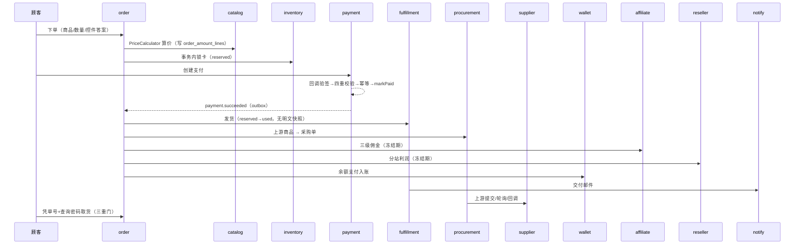

# 功能模块设计（ZCard 2.0）

> **版本**：v1.1（2026-08-15，权限管理三要素补齐 + 自建 RBAC 修正 + 验证码补充）
> **关联文档**：`docs/ZCard2.0-重构开发规划.md`（总纲 ADR）、`docs/重构/数据库架构设计.md`（表/字段）、`docs/重构/商业版数据模型.md`（商业版表）、`docs/重构/platform-db-方言适配层设计.md`（代码层）
> **定位**：把数据库架构中的**全部表**，按「基础架构 → 核心交易 → 货源增值 → 商业化 → 平台化」分层为 **P0–P4**，逐一阐述模块职责、功能清单、数据表、核心逻辑、与其它模块的交互。
> **分层原则**：P0 = 地基（缺了跑不起来）；P1 = 发卡系统最小可用闭环；P2 = 自动履约 + 对外供货（对接生态）；P3 = 商业化（分销/分站/营销/工单）；P4 = 平台化（商业版，不开源）。

---

## 0. 模块全景与分层


**模块 → 表映射总表**（完整，与数据库文档一一对应）：

| 层 | 模块 | 数据表 |
|---|---|---|
| P0 | platform | `outbox_events` `processed_events` `failed_tasks` `currencies` `v1_id_map` |
| P0 | identity | `users` `admin_users` `sessions` `external_identities` `email_verifications` `user_groups` |
| P0 | authz | `admin_roles` `role_permissions` |
| P0 | settings | `settings` |
| P1 | catalog | `products` `product_skus` `categories` `tags` `product_controls` `member_product_groups` `reviews` `virtual_reviews` |
| P1 | inventory | `cards` `card_imports` |
| P1 | order | `cart_items` `orders` `order_items` `order_amount_lines` `order_status_events` |
| P1 | payment | `payment_channels` `payments` `refund_orders` |
| P1 | wallet | `wallet_accounts` `wallet_transactions` `point_accounts` `point_transactions` `recharge_orders` `withdrawals` `giftcards` `giftcard_batches` |
| P1 | fulfillment | `order_deliveries` |
| P2 | supply | `supply_connections` `supply_mappings` `supply_sync_tasks` |
| P2 | procurement | `procurement_orders` `procurement_items` |
| P2 | supplier | `supplier_accounts` `supplier_ledger_entries` `supply_orders` `supply_nonces` `supplier_product_prices` `downstream_callbacks` |
| P2 | content | `banners` `posts` `post_categories` |
| P2 | notify | `notifications` `notify_templates` `notification_logs` |
| P2 | audit | `audit_logs` `security_audit_logs` `visit_logs` `risk_lock_keys` |
| P3 | affiliate | `affiliate_commissions` |
| P3 | reseller | `reseller_profiles` `reseller_sites` `reseller_pricing` `reseller_ledger_entries` `reseller_balance_accounts` `reseller_related_accounts` |
| P3 | memberlevel | `member_levels` |
| P3 | coupon | `coupons` `flash_sales` `promotions` |
| P3 | ticket | `tickets` `ticket_messages` |
| P3 | media | `media` `media_categories` |
| P3 | dashboard | `daily_stats` `reconciliation_jobs` `reconciliation_items` |
| P4 | tenancy | `tenants` |
| P4 | escrow | `escrow_transactions` `escrow_evidence` |
| P4 | subscription | `subscriptions` `tenant_plans` `licenses` |
| P4 | openapi | `api_keys` `api_scopes` |
| P4 | plugin | `installed_plugins` `plugin_manifests` |
| P4 | market | `market_suppliers` `supplier_ratings` |

---

## 1. P0 基础架构（地基）

### 1.1 platform（平台基础设施）

**职责**：为所有模块提供与业务无关的横切能力，业务模块零感知方言/租户/事件差异。

**功能清单**：

- **金额** `money.Cents`（int64 分）：全仓唯一金额类型，禁止 float；
- **事件 Outbox**：业务事务内写 `outbox_events`，relay 投递（asynq 或进程内），`processed_events` 保证消费幂等；
- **任务队列**：asynq（Redis 可选）+ `failed_tasks` 死信表，critical/default/low 三队列；
- **方言适配** `platform/db`：Dialect 检测 + Capabilities 能力开关 + SQL 跨方言原语（§平台规格）；
- **多租户** `platform/tenancy`：`TenantStore` 抽象，三模式隔离（Row/Schema/Database）；
- **HTTP 客户端** `httpx`：上游对接的签名/重试/超时/SSRF 出站校验；
- **加密** `crypto`：卡密 AES-GCM、凭据加密、keyed hash；
- **多语言** `i18n`：文案 bundle + DB 覆盖层；
- **多币种**：`currencies` 表 + 汇率换算（`CurrencyService` 逻辑平移）。

**核心逻辑**：金额一律分、事件事务性（outbox 与业务同事务）、方言运行时切换（非 build tag）。

**交互**：被所有模块依赖（`platform/*` 不依赖任何 `mods/*`，架构测试强制反向依赖检测）。

### 1.2 identity（身份认证）

**职责**：管理员/员工/顾客的注册、登录、会话、TOTP、第三方登录、邮箱验证。

**功能清单**：

- 顾客 `users`：注册（用户名/邮箱）、登录（密码 bcrypt/argon2）、第三方登录 OAuth（`external_identities`）、邮箱验证（`email_verifications`）、密码找回；
- 员工 `admin_users`：账号、密码、TOTP 二步验证、启用/禁用、最近登录 IP/时间；
- 会话：JWT 双 realm（admin/user 独立密钥与声明），`sessions` 记录设备/IP/UA；
- 会员归属：`user_groups`（1.x 兼容，映射到 memberlevel）；
- 三级上级链：`invite_l1/l2/l3`（注册/下单时绑定，供 affiliate 归因）；
- 图形验证码（captcha）：注册/登录/下单三场景，按 settings「验证码矩阵」开关（系统/手机/邮箱）。

**核心逻辑**：

- 双 realm JWT（防提权串用）；access(2h) + refresh(14d 轮换)；
- 查询密码/登录密码 constant-time 比对；登录失败锁定 + 异地告警（写 `security_audit_logs`）；
- 邮箱验证码 `email_verifications`：目的（register/reset）、过期、尝试次数上限；
- 图形验证码 `base64Captcha`（1.x 同源方案）：按 settings 验证码矩阵（注册/登录/下单 × 系统/手机/邮箱）开关，防爆破。

**交互**：产出「用户上下文」供 order（下单归属）、affiliate（归因）、reseller（分站主）、wallet（账户）使用；登录事件触发 notify（异地登录提醒）+ audit（登录审计）。

### 1.3 authz（权限管理，**功能权限 + 数据权限 + 前端权限**）

**职责**：RBAC 权限模型，覆盖「功能权限（接口/按钮级）+ 数据权限（行级隔离）+ 前端权限（动态路由）」三个维度；权限目录从路由表自动生成。

**功能清单**：

- **功能权限（接口/按钮级，RBAC）**：
  - `admin_roles`（角色/权限组）+ `role_permissions`（角色→权限点，多对多）+ `admin_users.role_id`（员工→角色，单角色）；
  - 权限目录启动时从 Kratos 路由表提取 `/api/v1/admin/*` → 权限点树（`order:list` / `card:view_content` / `card:export` / `order:refund` / `system:update`…）；
  - 内置角色种子（超管/运营/客服/分站主）；`rbac_coverage_test` 保证每条路由被至少一个角色覆盖。
- **数据权限（行级隔离）**：分站主只能访问自己分站的数据——由 `tenancy` 的 `subsite_id` 租户隔离（Ent interceptor 框架级强制）+ reseller「域内角色」共同实现（**不是靠业务层手写租户条件**，§4.9）。
- **前端权限（动态路由）**：后端权限目录 → 前端 soybean-admin 动态路由（登录后拉 `/authz/menu`），前端零硬编码菜单。
- 细粒度敏感权限点（防内部偷卡 §5.20）：`card:view_content`（看完整卡密需二次确认）、`card:export`（导出需审批）、`order:view_delivery`、`order:refund`、`system:update`。

**权限模型（三要素，钉死）**：

```
用户 admin_users ──(role_id)──> 角色 admin_roles ──(role_permissions)──> 权限点 permission_code
                                                          │
                数据权限 = subsite_id 租户隔离（行级）+ 域内角色（分站主只见自己分站）
```

**核心逻辑**：

- **权限引擎选型**：采用**自建 RBAC（`admin_roles` + `role_permissions`），不引入 Casbin 完整策略引擎**——发卡系统的「角色-权限」模型简单，自建 RBAC 比 Casbin 更轻、更可控；规划 §3.1 的「casbin/v3 + 域内角色」在此**修正为**「自建 RBAC + 租户隔离实现域内角色」（分站主的「域」由 `subsite_id` 承载，而非 Casbin domain，避免双套权限源）。
- 新增路由未挂角色 = 仅超管可见（防「加了路由忘了授权」）；
- 权限点细粒度到「查看完整卡密/导出」级，配合二次确认 + 审计（§5.20.4）。

**交互**：被 identity（登录后加载权限）、所有 admin API（中间件校验）、audit（操作审计记权限点）、plugin（插件 scope 复用权限点语言，§5.4）依赖；数据权限依赖 tenancy（subsite_id 隔离）。

### 1.4 settings（设置中心）

**职责**：运行时配置真理源，后台可改，`.env`/config 只作首次部署兜底。

**功能清单**：

- `settings` 表（group/key/value JSON）：站点基础（LOGO/名称/SEO/后台安全入口）、模板、页脚、推荐位、交易（游客下单/查询密码）、安全（注册开关/验证码矩阵）、运维（维护模式/公告）、充值提现、积分、分销、货源、邮件短信、多语言货币；
- 安装向导 `/install`：写初始 settings + 管理员，`EnsureInstalled` 中间件先于业务路由；
- `currencies`（多币种）：代码/符号/精度/汇率/启用。

**核心逻辑**：`StorefrontConfig` 读取 DB，网页可改；基础设施配置（DB/Redis/邮件）仍在 `.env`。

**交互**：被几乎所有模块读取（价格展示、通知模板、分站白标、风控开关）；安装向导产出首个 admin（写 `admin_users`）。

---

## 2. P1 核心交易闭环（发卡系统最小可用）

### 2.1 catalog（商品目录）

**职责**：商品、SKU、分类、标签、控件、会员商品组、评价的 CRUD 与展示。

**功能清单**：

- `products`：商品（名称/标识/描述/封面/图集/售价/成本/库存类型 card|url|code/发货模式 status|delete/控件配置/上游来源/去重开关/排序/状态）；
- `product_skus`：多规格（规格值组合/独立价格/独立库存位/上游 SKU）；
- `categories`：树形分类（parent_id/图标/隐藏/分站可见性）；
- `tags`：商品标签（名称/图标/颜色/位置）；
- `product_controls`：自定义控件（文本/密码/下拉/数字/多选/单选），下单时收集；
- `member_product_groups`：会员商品组（组名/商品集/折扣/叠加规则）；
- `reviews` + `virtual_reviews`：真实评价（审核流）+ 虚拟评论（合并展示）。

**核心逻辑**：

- 价格计算管线 `PriceCalculator`（§5.2）：基础价 → 会员折扣 → 会员组折扣 → 秒杀 → 优惠券 → 积分抵扣 → 分站定价 → 应付；
- 隐藏商品游客 404；分站可见性白名单；
- 商品描述/评价服务端 sanitize（防 XSS）。

**交互**：被 order（下单取价/快照）、supply（上游商品映射落本地）、reseller（分站定价）、dashboard（商品排行）依赖；读取 media（封面/图集）、settings（模板配置）。

### 2.2 inventory（卡密库存）

**职责**：卡密/链接/兑换码的导入、加密存储、锁定预留、导出、靓号自选。

**功能清单**：

- `cards`：卡密内容（AES-GCM 密文）+ content_hash（keyed hash 去重）+ 状态（available/reserved/used/disabled）+ 预选（owner_id/draft_premium/draft_cost）+ 靓号（number_hash/price）；
- `card_imports`：导入批次（模板下载/预览确认/去重开关/批量上限/分片/撤销）；
- 导出（筛选条件 CSV，CsvSafe 防 Excel 注入）。

**核心逻辑**：

- **加密**：强制 AES-256-GCM，AAD 绑定 product/tenant，无关闭开关（§5.20）；
- **去重**：`UNIQUE(product_id, content_hash)`，keyed hash 防彩虹表；
- **锁定**：下单事务内 `FOR UPDATE` 锁 available 行 → reserved（SQLite 走 BEGIN IMMEDIATE + CAS）；
- **释放**：超时取消订单 → reserved 还原 available（`locked_at` TTL）；
- **密钥轮换**：`reencrypt-cards` 重加密 + 重算 hash（同事务）。

**交互**：被 order（下单锁卡）、fulfillment（reserved→used）、dashboard（库存统计）依赖；上游卡密经 procurement 到手即加密入库。

### 2.3 order（订单）

**职责**：下单用例、父子单、金额明细、状态机 + 事件溯源、查询密码、购物车。

**功能清单**：

- `cart_items`：购物车（用户/商品/SKU/数量，下单前暂存）；
- `orders`（父单）：金额/支付/联系方式/查询密码/分站快照/三级归因/风控标记/乐观锁；
- `order_items`（子项）：商品行快照（单价/数量/成本/履约类型）；
- `order_amount_lines`（金额明细行）：价格管线每步一行（行式金额模型）；
- `order_status_events`（状态事件溯源）：每次状态迁移落一行。

**核心逻辑**：

- **下单**：事务内锁卡 → 算价管线 → 写金额明细行 → 快照 → `order.created`；
- **状态机**（§5.3）：pending_payment → paid → fulfilling/partially_delivered → delivered → completed；canceled/expired/refund 独立路径；`paid` 后禁止回 `canceled`；
- **金额明细**：`total_amount = SUM(order_amount_lines)`，加折扣类型只加 type 枚举；
- **状态事件**：每次迁移写 `order_status_events`（谁/何时/为何），完整审计；
- **查询密码**：argon2 constant-time 比对，密码错与单号错表现一致；
- **超时取消**：`status=expired` + 释放锁卡 + 返还优惠券。

**交互**：依赖 catalog（取价）、inventory（锁卡）、payment（创建支付/回调置 paid）、wallet（余额支付）、coupon（核销）、reseller（分站定价）、affiliate（归因）；产出 `order.paid` 事件 → fulfillment（发货）、procurement（上游拿货）、affiliate（发佣）、reseller（结算）、notify（通知）。

### 2.4 payment（支付）

**职责**：渠道抽象、支付单、回调管线、补单、退款编排。

**功能清单**：

- `payment_channels`：渠道配置（driver/config 加密/fee/fee_type/fee_bearer）；
- `payments`：支付单（渠道/网关单号/金额/实收/手续费/状态/幂等键）；
- `refund_orders`：退款单（金额/渠道/状态/原因/上游退款单号）。

**核心逻辑**：

- **渠道能力接口拆分**（§5.5.1）：Provider（创建）/ Webhooker（JSON 回调）/ CallbackVerifier（表单回调）/ Capturer（查单补单）/ Refunder（原路退款）；
- **回调管线**（§5.5.3）：行锁 payment+order → 四重校验（渠道/单号/金额/币种）→ 幂等 → markPaid → 事务提交后 outbox 发 `payment.succeeded`；
- **金额核对**：永远对 `Cents(基础货币)`，展示币 ±rounding 容差（修复 UsdtDriver 截断）；
- **退款编排**（§5.5.4）：渠道原路退款 → 失败降级退钱包 → 上游退款传导 → 逆向扣佣金/分站利润。

**交互**：被 order（创建支付）、wallet（余额支付/充值支付）依赖；产出 `payment.succeeded` 事件 → order（置 paid）、fulfillment（发货）、procurement（采购）、affiliate（发佣）、reseller（结算）、wallet（入账）。

### 2.5 wallet（钱包）

**职责**：余额账本、冻结分离、充值、赠送、提现、积分、礼品卡。

**功能清单**：

- `wallet_accounts`：账户（available + locked + version 乐观锁）；
- `wallet_transactions`：流水（direction/type/amount/balance_before_after/reference 幂等键）；
- `point_accounts` / `point_transactions`：积分账本（同构）；
- `recharge_orders`：充值单（复用支付管线，预设赠送充 X 送 Y）；
- `withdrawals`：提现（申请/审核/打款/手续费）；
- `giftcards` / `giftcard_batches`：礼品卡（code 加密 + keyed hash）。

**核心逻辑**：

- **账务纪律**：`total = available + locked` 恒真；余额变动必须 `InTx`（行锁 → 非负校验 → 更新 → 写流水）；reference 唯一幂等重入直接返回；
- **冻结流转**：佣金/分站利润入 locked → `available_at` 到期转 available；提现 available→locked；
- **余额永可由流水重算**：balance_after 快照 + 流水重放对账；
- **礼品卡**：code 同卡密加密（不落明文，优于友商）。

**交互**：被 order（余额支付）、affiliate（佣金入账）、reseller（利润入账）、payment（充值）依赖；产出提现/充值事件 → audit（调账审计）、notify（到账通知）。

### 2.6 fulfillment（履约）

**职责**：本地卡密交付（标记/即删两模式）、人工发货、物流信息、交付邮件。

**功能清单**：

- `order_deliveries`：交付记录（card_id 引用 + 一次性令牌，**无明文**；delivered_by 人工发货管理员；logistics 物流信息；fetch_count 取货次数）。

**核心逻辑**：

- **发货**：`payment.succeeded` → reserved→used（标记/删除两模式）→ 写交付记录（不落明文）；
- **取货**：单号 + 查询密码 + 限流（三重门）→ 现场解密返回 → 默认 1 次后掩码；
- **人工发货**：手动交付（delivered_by 记录操作者），物流单号（logistics）。

**交互**：依赖 inventory（卡密解密）、order（查询密码/取货校验）；产出交付事件 → notify（交付邮件）、audit（取货审计）。

---

## 3. P2 货源与增值（自动履约 + 对外供货）

### 3.1 supply（货源连接）

**职责**：上游连接管理、协议适配器（zcard/dujiao/acg-faka）、商品映射、库存价格同步。

**功能清单**：

- `supply_connections`：连接（driver/base_url/凭据加密/回调 URL/重试策略/汇率/加价率/取整模式/自动同步/健康检查/余额缓存）；
- `supply_mappings`：商品映射（上游分类/商品/SKU ↔ 本地）；
- `supply_sync_tasks`：同步任务追踪（进度/统计/心跳/取消/worker 版本）。

**核心逻辑**：

- **三协议适配器**（§5.7.1）：协议知识迁移、golden vector 契约测试（签名字节==发送字节）；
- **定价**：本地价 = 上游价 × 汇率 × (1+加价率) → 取整模式（none/ceil_int/ceil_tenth）；
- **同步**：low 队列 + Redis 锁按连接分组拉取，更新库存/价格缓存，fail-open 兜底；
- **SSRF 防护**（§5.7.3）：出站私有段黑名单 + DNS rebinding + 重定向逐跳校验。

**交互**：被 procurement（提交采购）、dashboard（货源成本）依赖；产出同步结果 → catalog（更新本地商品）、notify（同步失败告警）。

### 3.2 procurement（采购）

**职责**：上游采购单、提交/轮询/巡检三通道结果获取、上游退款传导。

**功能清单**：

- `procurement_orders`：采购单（连接/上游单号/状态机/失败策略/轮询时间/幂等键）；
- `procurement_items`：采购明细（上游 SKU/数量/成本/到手密文）——**显式多卡密/多 SKU**。

**核心逻辑**：

- **触发**：`payment.succeeded` 含 upstream 项 → 创建采购单 pending；
- **状态机**（§5.7.2）：pending → submitted → polling/fulfilled/rejected → refunding/manual；
- **结果三通道**：上游主动回调 + 指数退避轮询（30s~10min）+ 30 分钟巡检兜底（24h 卡死告警）；
- **失败策略**：自动退款（联动 payment 退款编排）或转人工；
- **卡密到手即加密**：解析上游卡密（acg-faka PHP_EOL 拆分）→ 立即 AES-GCM 入库。

**交互**：依赖 supply（适配器提交/查单）、payment（失败退款）、order（交付内容回填）；产出 `procurement.fulfilled/failed` 事件 → fulfillment（交付）、notify（告警）、reconciliation（对账）。

### 3.3 supplier（对外供货，本站作上游）

**职责**：下游账户、对外供货 API（HMAC 四头）、供货余额账本、下游定价、回调转发。

**功能清单**：

- `supplier_accounts`：下游账户（api_key/api_secret 加密/审核/余额缓存/notify_url）；
- `supplier_ledger_entries`：供货余额账本（幂等键 `supply_order:<downID>`）；
- `supply_orders`：下游订单；
- `supply_nonces`：Nonce 防重放（Redis/DB 双实现）；
- `supplier_product_prices`：对外供货定价（本站→下游，给不同下游定不同价）；
- `downstream_callbacks`：下游回调转发重试（supply_order_id/回调状态/重试次数/TraceID）。

**核心逻辑**：

- **协议 ZCard Supply v2**（§5.8）：四头签名 `X-Supply-Key/Timestamp/Nonce/Signature`，HMAC-SHA256，±300s 时间窗，Nonce 防重放，能力级限流；
- **下游下单**：供货余额支付（幂等键），交付完成主动回调下游 notify_url（重试 + 死信）；
- **下游定价**：`supplier_product_prices` 覆盖（不同下游不同价）。

**交互**：依赖 catalog（供货商品）、wallet（供货余额）、order（下游订单交付）；产出回调事件 → downstream_callbacks（重试）、reconciliation（对账）。

### 3.4 content（内容）

**职责**：横幅/轮播、文章/CMS（公告、帮助、博客）。

**功能清单**：

- `banners`：横幅（名称/位置/多语言标题/图片/移动端图/跳转/生效时间/排序）；
- `posts` / `post_categories`：文章（slug/类型 blog|notice/多语言标题摘要内容/缩略图/发布状态/分类）。

**核心逻辑**：多语言字段用 JSON（title_json/content_json）；banner 支持 link_type=ad 承载第三方广告。

**交互**：被 storefront（首页横幅/文章页）、settings（推荐位）依赖；读取 media（配图）。

### 3.5 notify（通知）

**职责**：站内信/邮件/短信/Telegram 通知、模板、定时定向群发、发送日志。

**功能清单**：

- `notifications`：站内信（用户铃铛）；
- `notify_templates`：事件驱动模板（占位符/i18n）；
- `notification_logs`：发送日志（事件类型/渠道/接收方/状态/错误/变量）。

**核心逻辑**：

- **事件驱动**：订阅业务事件（order.paid/delivered、ticket.replied、withdraw.reviewed…）；
- **降级**：SMTP 未配置 → 任务标记 skipped 不报错雪崩；
- **群发**：目标筛选（全部/等级/指定会员/分站）+ 定时 + 送达统计。

**交互**：被 order/payment/ticket/withdraw 等所有模块（发事件）；依赖 settings（SMTP/短信配置）、media（附件）。

### 3.6 audit（审计）

**职责**：管理员操作审计、安全审计、登录审计、访问统计、风控锁定。

**功能清单**：

- `audit_logs`：管理员操作（操作者/权限点/前后快照/IP）；
- `security_audit_logs`：登录失败/异地/敏感操作（1.x 能力平移）；
- `visit_logs`：访问来源统计（轻量化聚合）；
- `risk_lock_keys`：风控 IP 维度锁定（pending 订单闸门）。

**核心逻辑**：变更类管理操作经 audit 拦截中间件落 `audit_logs`；风控锁定 `risk_lock_keys`（IP 哈希）防批量刷单。

**交互**：被所有 admin 操作、identity（登录）、order（下单风控）依赖。

---

## 4. P3 商业化

### 4.1 affiliate（三级分销）

**职责**：推广码、三级归因、佣金计算/冻结/确认、提现。

**功能清单**：

- `affiliate_commissions`：佣金（订单/买家/收佣人/层级/费率快照/基数/金额/状态/冻结到期）。

**核心逻辑**：

- **归因**：推广码绑定上级，三级链快照进订单 `invite_l1/l2/l3`；
- **佣金**：`commission = 计算基数（订单金额或毛利）× 费率`，按层级/商品覆盖；自购不返利；
- **账务**：pending_confirm → available（冻结期）→ withdrawn；`UNIQUE(order_id, tier)` 幂等；
- **退款逆向扣回**：可用不足进入负债态，后续佣金优先抵扣。

**交互**：依赖 order（下单归因）、wallet（佣金入账）；产出佣金事件 → notify（到账）、dashboard（返利统计）。

### 4.2 reseller（分站）

**职责**：分站申请/审核、域名/白标、分站定价、分账账本、提现、关联账户。

**功能清单**：

- `reseller_profiles`：站长资格（申请/审核/加价率上下限）；
- `reseller_sites`：分站域名 + 白标（DNS/文件验证/LOGO/站名/模板）；
- `reseller_pricing`：分站定价（inherit/markup_percent/fixed_markup/fixed_price，优先级 SKU>商品>默认）；
- `reseller_ledger_entries`：分站利润账本（幂等键/状态/冻结到期）；
- `reseller_balance_accounts`：分站余额缓存（可由流水重算）；
- `reseller_related_accounts`：分站关联子账户/成员。

**核心逻辑**：

- **域名解析**：Host → reseller_sites（已验证域名）→ 注入 `tenancy.Context`；
- **定价**：下单时按分站定价规则算分站价，快照进订单；
- **结算**：分站利润入账本（pending_confirm → available），`available_at` 到期转可用；
- **防自购**：买家==分站主或上级链命中 → `profit_eligible=false`（不产生利润）；
- **品牌隔离**：邮件/页面标题/支付渠道按站点上下文 fail-closed。

**交互**：依赖 order（分站订单）、wallet（分站提现）、catalog（分站商品）、settings（白标配置）。

### 4.3 memberlevel（会员等级）

**职责**：会员等级、升级条件（充值/消费）、等级折扣、积分规则。

**功能清单**：

- `member_levels`：等级（名称/徽标/升级阈值/折扣/积分规则/排序/启用）。

**核心逻辑**：支付成功事件异步评估升级（`UpgradeUserGroupOnOrderPaid` 逻辑），只升不降（可配）；积分产生规则（消费 X 元产 Y 分）。

**交互**：依赖 order（消费额）、payment（充值额）；产出等级/积分 → wallet（积分账本）、catalog（等级价）。

### 4.4 coupon（营销）

**职责**：优惠券、限时秒杀、通用促销。

**功能清单**：

- `coupons`：优惠券（类型/折扣值/范围/到期/次数/每人限用）；
- `flash_sales`：秒杀（商品/规格/秒杀价/起止/限量/限购）；
- `promotions`：促销（范围/类型 fixed|percent|special_price/门槛/起止）。

**核心逻辑**：

- 使用校验在价格管线（会员折扣之后）；订单取消/退款返还券（可配）；
- 秒杀防超卖与卡密锁定同一把锁；
- 促销比秒杀更通用（可关联商品/分类）。

**交互**：依赖 order（核销）、catalog（关联商品）；产出核销事件 → order_amount_lines（折扣明细行）。

### 4.5 ticket（工单）

**职责**：售前/售后工单、优先级（含付费加急）、会话式处理、内部备注。

**功能清单**：

- `tickets`：工单（工单号/用户/类型/优先级/关联订单/状态）；
- `ticket_messages`：消息（用户/客服双向/附件/内部备注）。

**核心逻辑**：付费加急走支付；SLA 响应时限（M4 接告警）；证据链（交付凭证/沟通）挂到工单（担保交易仲裁用）。

**交互**：依赖 order（关联订单）、notify（回复通知）、payment（加急费）；产出证据 → escrow（仲裁，M4）。

### 4.6 media（素材库）

**职责**：分类树、上传（本地/S3）、改名、批量管理、引用计数。

**功能清单**：

- `media_categories` + `media`：素材（分类/路径/mime/大小/引用计数）。

**核心逻辑**：图片重编码（防图片马）、类型白名单；被商品/设置引用的素材删除需确认（引用计数）。

**交互**：被 catalog（封面）、content（配图）、settings（LOGO）依赖。

### 4.7 dashboard（工作台与报表）

**职责**：工作台指标、趋势图、商品排行、对账、日结聚合。

**功能清单**：

- `daily_stats`：日结表（今日实时查 + 历史聚合，避免扫大表）；
- `reconciliation_jobs` / `reconciliation_items`：对账任务 + 明细（本地单号 vs 上游单号）。

**核心逻辑**：

- 指标口径：订单数/交易额/利润/支付成功率/新增用户/充值/库存/提现/分站/返利（§5.18）；
- 利润 = 交易额 − 成本 − 佣金 − 分站利润；
- 对账：货源采购单对账（matched/mismatched 统计）。

**交互**：依赖 order/payment/wallet/supply（数据源）；产出报表 → admin SPA（只消费不重算）。

---

## 5. P4 平台化（商业版，不开源）

> 以下模块属商业版/平台版，表字段定义见《商业版数据模型.md》，开源版不包含、代码不开源。

### 5.1 tenancy（多租户）

**职责**：SaaS 云开站的多租户注册表、database-per-tenant、远程库管理。

**功能清单**：`tenants` 表（mode/dsn/schema_name/status/region），`TenantStore` 三模式隔离。

**核心逻辑**：套餐决定隔离模式（Row/Schema/Database）；远程库 TLS + 最小权限账号 + 连接池熔断（§平台规格 §7）。

### 5.2 escrow（担保交易）

**职责**：交易保障，资金由持牌机构承接，状态机 + 证据链编排。

**功能清单**：`escrow_transactions`（担保单）+ `escrow_evidence`（证据链）。

**核心逻辑**：pending_funding → funded → in_delivery → buyer_confirmed → settled/refunded；争议 → arbitration；资金不落 ZCard 钱包（铁律十）。

### 5.3 subscription（订阅与 license）

**职责**：SaaS 套餐、订阅、license 校验。

**功能清单**：`tenant_plans`（套餐/隔离模式）+ `subscriptions`（订阅）+ `licenses`（ed25519 签名，绑定域名/实例 ID）。

### 5.4 openapi（开放平台）

**职责**：第三方/对接方接入的 API Key + scope。

**功能清单**：`api_keys`（key_hash/scopes/限流）+ `api_scopes`（scope 目录，复用 RBAC 权限点）。

### 5.5 plugin（插件市场）

**职责**：插件安装、清单、扩展点契约、scope 授权。

**功能清单**：`installed_plugins`（安装/版本/scope/license 指纹）+ `plugin_manifests`（清单/ed25519 签名）。

### 5.6 market（供应商聚合）

**职责**：供应商目录、评分、履约率/退款率看板。

**功能清单**：`market_suppliers`（目录/评分/履约率/退款率）+ `supplier_ratings`（评分明细）。

### 5.7 compliance（合规）

**职责**：禁售目录、商品巡检、投诉入口、下架工作流（路书风险控制）。

**核心逻辑**：禁售目录 + 巡检任务 + 投诉 → 下架；ToS 明确；资金业务只经持牌机构。

---

## 6. 模块交互总图（核心链路）



**关键交互规则**：

1. **事件驱动**：模块间异步副作用一律走 outbox 事件（`payment.succeeded` 扇出到 fulfillment/procurement/affiliate/reseller/wallet），编译期无环；
2. **同步窄接口**：需要返回值的强依赖走 port 窄接口（order→inventory.Reserve、order→catalog.Price）；
3. **共享事务**：支付回调事务内完成 payment+order+wallet+reseller 强一致部分，提交后才入队异步；
4. **幂等贯穿**：全账务 reference/idempotency_key 唯一，事件 dedupe_key 唯一。

---

## 7. 模块依赖矩阵

| 依赖方 ↓ / 被依赖 → | platform | identity | catalog | inventory | order | payment | wallet | supply | supplier | notify | audit |
|---|---|---|---|---|---|---|---|---|---|---|---|
| catalog | ✓ | | | | | | | | | | |
| inventory | ✓ | | ✓ | | | | | | | | |
| order | ✓ | ✓ | ✓ | ✓ | | ✓ | ✓ | | | | ✓ |
| payment | ✓ | | | | ✓ | | ✓ | | | | ✓ |
| wallet | ✓ | ✓ | | | ✓ | ✓ | | | | ✓ | ✓ |
| fulfillment | ✓ | | | ✓ | ✓ | | | | | ✓ | ✓ |
| procurement | ✓ | | | | ✓ | ✓ | | ✓ | | ✓ | |
| supplier | ✓ | | ✓ | | ✓ | | ✓ | | | ✓ | |
| affiliate | ✓ | ✓ | | | ✓ | | ✓ | | | ✓ | |
| reseller | ✓ | ✓ | ✓ | | ✓ | | ✓ | | | ✓ | |
| dashboard | ✓ | | | | ✓ | ✓ | ✓ | ✓ | ✓ | | |

> 规则：`platform` 被所有模块依赖但不依赖任何模块；`catalog/inventory/wallet` 等被依赖方不得反向依赖 `order/payment`（无环，架构测试断言 §4.10-2）。

---

## 8. 分层决策速查

| 层 | 定位 | 里程碑 | 开源 |
|---|---|---|---|
| P0 | 地基 | M0 | ✓ |
| P1 | 最小可用闭环 | M1 | ✓ |
| P2 | 自动履约 + 对外供货 | M2 | ✓ |
| P3 | 商业化 | M3 | ✓ |
| P4 | 平台化 | M4 | ✗（商业版） |

---

*本文为功能模块设计 v1.0，覆盖数据库架构设计中的全部 50+ 张表（含商业版 12 张），与主规划文档 §4.5 的 19 模块收敛、里程碑 M0–M4 对齐。模块详细规格按里程碑在 `docs/superpowers/specs/` 逐篇展开并回链本文。*
