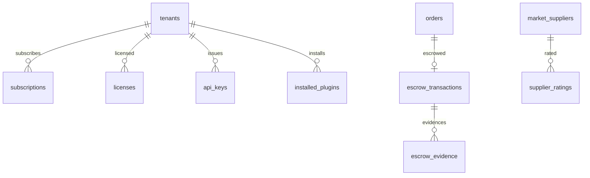

# 商业版数据模型（SaaS 云开站 + 平台化能力）

> **版本**：v1.1（2026-08-15，OmniSaaS 作为 SaaS 底座复用 + 套餐/订阅/授权机制扩展）
> **定位**：本文定义 **ZCard 商业版 / 平台版**专属的数据表——**开源版（自托管 + 分站）不包含这些表、代码不开源**。字段本文先定，保证商业版启用时表结构一次到位、无需改开源版表。
> **与开源版的边界**：开源版文档 `数据库架构设计.md` 是唯一「业务表」真理源；本文是「商业版能力」的增量。两版通过**唯一挂载点**衔接：开源版 `orders.escrow_id`（可空）预留担保交易关联。
> **与 OmniSaaS 的关系（重要）**：ZCard SaaS 版本**直接以 OmniSaaS 为「中台底座」二次开发**（两者技术栈 100% 一致：Kratos v2 + Ent + Wire + Monorepo）。OmniSaaS 提供租户/五层权限/套餐计费/应用商店/审计/通知等通用能力，ZCard 发卡作为其「应用」经 SSO 接入；本文 §3（套餐/订阅/授权）对齐 OmniSaaS billing 服务的 `Plan + Subscription + Entitlement + Quota + Role Binding` 模型——**中台层的租户/权限/计费以 OmniSaaS 为准，本文只定义 ZCard 发卡业务侧的增量表**。

---

## 0. 边界与挂载点（方向钉死）

| 项 | 开源版 | 商业版 |
|---|---|---|
| 形态 | 自托管 + 分站（`subsite_id` 行级） | SaaS 云开站（多实例 + database-per-tenant） |
| 隔离 | Row（行级） | Row/Schema/Database 三选（`tenants.mode`） |
| 远程库 | 无 | 支持（`tenants.dsn`） |
| 订阅/license | 无 | `subscriptions`/`tenant_plans`/`licenses` |
| 担保交易 | 仅 `orders.escrow_id` 空列 | `escrow_transactions`/`escrow_evidence` |
| 开放 API | 供货 API（开源） | `api_keys`/`api_scopes`（第三方接入） |
| 插件市场 | 无 | `installed_plugins`/`plugin_manifests` |
| 聚合平台 | 无 | `market_suppliers`/`supplier_ratings` |

**挂载点**：开源版 `orders.escrow_id uint64 NULL`（M1 建列、恒空），商业版启用时 `orders.escrow_id → escrow_transactions.id`，**不动开源版表结构**。

---

## 1. 多租户注册表（`tenants`）——商业版元数据基座

```sql
tenants
  id            uint64  PK
  name          string(100)
  mode          string(16)   -- row | schema | database（隔离模式，§4.11.1）
  dsn           text         -- database 模式：加密 DSN（ZCARD_DATA_KEY 加密）
  schema_name   string(64)   -- schema 模式：PG schema / MySQL database 名
  status        string(16)   -- active | disabled | provisioning
  region        string(32)   -- 地域（远程库就近调度）
  created_at    time
  updated_at    time
  UNIQUE(schema_name)
```

> 开源版自托管**无此表**（分站靠 `reseller_sites` + `subsite_id` 行级）；`tenants` 是 SaaS 控制面管理「哪个商户的数据落在哪个库/实例」的元数据。

---

## 2. 担保交易（escrow，规划 §5.19）

> 交易保障**不沉淀资金**（铁律十）：资金由持牌机构（担保代收/分账）承接，ZCard 只做状态机 + 证据链编排。

### `escrow_transactions`（担保交易单）

| 字段 | 类型 | 约束/默认 | 说明 |
|---|---|---|---|
| id | uint64 | PK | — |
| order_id | uint64 | **UNIQUE** | 关联订单（→ 开源版 `orders.id`，一单一担保单） |
| buyer_id / seller_id | uint64 | NOT NULL | 买卖双方（下游站→上游站 / 用户→商户） |
| amount | int64 | NOT NULL | 担保金额（分） |
| platform_fee | int64 | DEFAULT 0 | 平台服务费（分） |
| channel | string(30) | NOT NULL | 资金通道（持牌机构担保代收/分账） |
| status | string(20) | DEFAULT 'pending_funding' | pending_funding/funded/in_delivery/buyer_confirmed/disputed/arbitration/settled/refunded/canceled |
| settle_reference | string(120) | **UNIQUE** | 放款/退款幂等键（`escrow_settle:<id>` / `escrow_refund:<id>`） |
| disputed_at / settled_at | time | NULL | 关键时间点 |
| created_at / updated_at | time | — | — |

**索引**：`UNIQUE(order_id)`；`INDEX(status)`；`UNIQUE(settle_reference)`。

### `escrow_evidence`（证据链）

| 字段 | 类型 | 说明 |
|---|---|---|
| id | uint64 PK | — |
| escrow_id | uint64 | 担保单 |
| type | string(20) | delivery/chat/logistic/refund |
| content | json | 证据内容（交付记录/沟通/凭证引用） |
| submitted_by | uint64 | 提交方（买家/卖家/系统） |
| created_at | time | — |

**索引**：`INDEX(escrow_id)`。

---

## 3. 订阅、套餐与 license（SaaS 商业化，规划 §4.11.7 / §11）

> **核心设计哲学（对齐 OmniSaaS billing 服务）**：**billing 是「功能授权（feature entitlements）+ 用量配额（usage quotas）」的唯一决策者**。套餐 = 功能包 + 配额 + 计费规则 + 角色绑定；运行时通过 Entitlement/Quota 校验决定「这个租户能用什么、用多少」，而非「购买时一次性开通」。

### 3.1 `tenant_plans`（套餐 = 功能包 + 配额 + 计费规则 + 角色绑定）

| 字段 | 类型 | 说明 |
|---|---|---|
| id | uint64 PK | — |
| name | string(120) | 套餐名 |
| code | string(64) UNIQUE | 套餐编码（如 `basic`/`pro`/`team`） |
| category_id | uint64 | 套餐分类 |
| description | string(255) | 描述 |
| features | json | **功能包**（feature key → 值：`{profit_analysis:true, auto_pricing:false}`） |
| quotas | json | **资源配额**（`{products:1000, orders:10000, storage_mb:1024}`） |
| billing_rules | json | 计费规则（月/年价、按量、阶梯，§3.2 档位承载） |
| enable_role_binding | bool | 是否套餐绑角色（不同套餐解锁不同**权限包**） |
| enable_pay_per_use | bool | 是否按量付费 |
| enable_tiered_pricing | bool | 是否阶梯付费 |
| **isolation_mode** | string(20) | row/schema/database（套餐决定隔离模式） |
| status | string(20) | active/deprecated |
| created_at / updated_at | time | — |

### 3.2 `plan_tiers`（套餐档位：月付/年付价）

| 字段 | 类型 | 说明 |
|---|---|---|
| id | uint64 PK | — |
| plan_id | uint64 | 套餐 |
| billing_cycle | string(16) | monthly/yearly |
| price | int64 | 价格（分） |
| currency | string(3) | 币种 |

**索引**：`UNIQUE(plan_id, billing_cycle)`。

### 3.3 `subscriptions`（订阅 = 租户 ↔ 套餐绑定）

| 字段 | 类型 | 说明 |
|---|---|---|
| id | uint64 PK | — |
| tenant_id | uint64 | 租户（→ `tenants.id`） |
| plan_id | uint64 | 套餐 |
| plan_name | string(120) | 套餐名快照 |
| status | string(20) | active/trial/expired/cancelled/past_due |
| billing_cycle | string(16) | monthly/yearly |
| current_period_start / current_period_end | time | 当前计费周期 |
| auto_renew | bool | 自动续费 |
| cancelled_at | time | 取消时间 |
| created_at / updated_at | time | — |

**索引**：`INDEX(tenant_id, status)`；`INDEX(current_period_end)`（到期扫描）。

### 3.4 `licenses`（license 校验，ed25519 签名）

| 字段 | 类型 | 说明 |
|---|---|---|
| id | uint64 PK | — |
| tenant_id | uint64 | 租户 |
| instance_id | string(64) | 实例 ID（绑定） |
| domain | string(255) | 绑定域名 |
| edition | string(30) | 版本（oss/pro/team） |
| features | json | 授权特性清单 |
| expires_at | time | 到期 |
| status | string(20) | active/revoked/expired |
| signature | text | ed25519 签名（离线可验） |

**索引**：`INDEX(tenant_id)`；`UNIQUE(instance_id)`。

### 3.5 运行时校验机制（「权限包/套餐购买后可用」的关键）

> 套餐/订阅是**静态配置**，真正让「购买后能用、换套餐实时生效、过期实时禁用」的是**运行时校验**。三个校验点在业务模块的关键操作前调用：

**① Entitlement Check（功能授权）**：`GET /billing/entitlements/{feature}:check`
- 输入：`tenant_id` + `feature` key → 输出：`{feature:"profit_analysis", granted:true}`
- 用途：判断「高级功能是否可用」（利润分析、自动调价、插件市场、担保交易、开放 API…）

**② Quota Check（用量配额）**：`GET /billing/quotas/{resource}`
- 输入：`tenant_id` + `resource` key → 输出：`{resource:"products", used:800, limit:1000}`
- 用途：创建商品/订单前判断「是否超配额」

**③ Role Binding（角色绑定）**：套餐 `enable_role_binding=true` 时，订阅套餐 → 自动授予对应**权限包**（角色/权限点），如「专业版」授予 `profit_analysis:view`、`auto_pricing:use`。

**关键原则**：

- 三个校验是**运行时**的，业务模块在关键操作前调用，而非「购买时一次性开通」——才能支持「换套餐/过期」实时生效；
- 校验失败返回明确错误码（`billing.ENTITLEMENT_DENIED` / `billing.QUOTA_EXCEEDED`），业务据此降级或拒绝；
- 授权结果可缓存（短 TTL），换套餐/过期时主动失效。

**ZCard feature 清单（功能开关，对应 1.x `config/zcard.php` 的 `features.*`）**：

| 层级 | feature key | 开源版 | 套餐解锁 |
|---|---|---|---|
| 基础 | 卡密交易/本地发货/基本商品/分站（Row 行级）/三方言数据库 | ✓ 免费 | — |
| 专业版 | `profit_analysis`（利润分析）/ `team_collaboration`（多店铺团队）/ `brand_custom`（品牌定制去广告）/ `auto_pricing`（自动调价） | ✗ | pro |
| 平台版 | `plugin_market`（插件市场）/ `escrow`（担保交易）/ `open_api`（开放平台）/ `saas_multi_tenant`（SaaS 云开站） | ✗ | team/enterprise |

---

## 4. 开放平台 API（规划 §7.3，第三方/对接方接入）

### `api_keys`

| 字段 | 类型 | 说明 |
|---|---|---|
| id | uint64 PK | — |
| tenant_id | uint64 | 归属租户 |
| name | string(120) | 名称 |
| key_hash | string(64) | **UNIQUE**（key 哈希，明文 key 只发一次） |
| scopes | json | 授权 scope 列表 |
| rate_limit | int32 | 每秒限流 |
| status | string(20) | active/disabled/revoked |
| last_used_at | time | 最近使用 |

### `api_scopes`（scope 目录）

| 字段 | 类型 | 说明 |
|---|---|---|
| id | uint64 PK | — |
| code | string(64) | **UNIQUE**（权限点语言，复用 RBAC §5.14） |
| description | string(255) | 描述 |

---

## 5. 插件市场（规划 §11）

### `installed_plugins`（插件安装）

| 字段 | 类型 | 说明 |
|---|---|---|
| id | uint64 PK | — |
| tenant_id | uint64 | 租户 |
| plugin_id | string(120) | 插件标识（`com.vendor.auto-pricing`） |
| version | string(32) | 版本（semver） |
| scopes | json | 授权 scope（复用 RBAC 权限点） |
| license_fingerprint | string(128) | license 指纹 |
| status | string(20) | installed/active/disabled/uninstalled |
| installed_at | time | — |

**索引**：`UNIQUE(tenant_id, plugin_id)`。

### `plugin_manifests`（清单缓存）

| 字段 | 类型 | 说明 |
|---|---|---|
| id | uint64 PK | — |
| plugin_id | string(120) | 插件标识 |
| name | string(120) | 名称 |
| version | string(32) | 版本 |
| min_core | string(32) | 最低核心版本（semver 约束） |
| extensions | json | 声明的扩展点与 scope |
| signature | text | 市场对 manifest+artifact 的 ed25519 签名 |

---

## 6. 聚合平台（M4 供应商目录/评分）

### `market_suppliers`（供应商目录）

| 字段 | 类型 | 说明 |
|---|---|---|
| id | uint64 PK | — |
| name | string(120) | 供应商名 |
| rating | decimal | 综合评分 |
| fulfillment_rate | decimal | 履约率 |
| refund_rate | decimal | 退款率 |
| status | string(20) | active/suspended |
| created_at / updated_at | time | — |

### `supplier_ratings`（评分）

| 字段 | 类型 | 说明 |
|---|---|---|
| id | uint64 PK | — |
| supplier_id | uint64 | 供应商 |
| order_id | uint64 | 关联订单 |
| score | int8 | 评分（1-5） |
| comment | text | 评价 |
| created_at | time | — |

**索引**：`INDEX(supplier_id)`；`UNIQUE(order_id)`。

---

## 7. ER 关系（商业版增量）



> 虚线边界：`orders` 是**开源版表**，商业版仅通过 `orders.escrow_id` 软关联 `escrow_transactions`（不加 FK 约束，跨版本边界）。

---

## 8. 幂等键（商业版增量）

| 表 | 幂等键 | 取值 | 防什么 |
|---|---|---|---|
| `escrow_transactions` | `settle_reference` UNIQUE + `UNIQUE(order_id)` | `escrow_settle:<id>` / `escrow_refund:<id>` | 放款/退款重复 |
| `licenses` | `UNIQUE(instance_id)` | — | license 重复签发 |
| `api_keys` | `UNIQUE(key_hash)` | — | key 重复 |
| `installed_plugins` | `UNIQUE(tenant_id, plugin_id)` | — | 重复安装 |
| `supplier_ratings` | `UNIQUE(order_id)` | — | 重复评分 |

---

## 9. 决策速查

| # | 决策 | 结论 |
|---|---|---|
| 1 | 边界 | 12 张表全部商业版，开源版不含、代码不开源 |
| 2 | 挂载点 | 开源版 `orders.escrow_id` 唯一软关联，跨版不加 FK |
| 3 | 隔离 | `tenants.mode` 三选，套餐 `isolation_mode` 决定 |
| 4 | 幂等 | escrow/license/api_key/plugin 各自唯一键 |
| 5 | 协议 | 控制面与实例复用 supply API v2 + license API（§4.9 形态 b） |

---

*本文为商业版数据模型 v1.0，与开源版 `数据库架构设计.md` 成对；两版合并即完整 ZCard 2.0 数据模型。商业版表不进入开源仓库，启用时按本文 `CREATE TABLE` 即可，不动开源版结构。*
