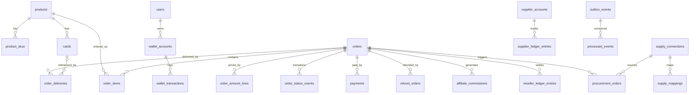

# 数据库架构设计（ZCard 2.0）

> **版本**：v1.5（2026-08-15，行式金额模型 + 状态事件溯源，超越友商宽表金额与单一状态）
> **关联文档**：`docs/ZCard2.0-重构开发规划.md`（本文是该规划 §4.11 / §3.5 / §3.6 / §3.7 / §8.4 的落地展开）
> **设计顺序**：先谈架构（多租户隔离 + 三种数据库）→ 再落到表名 → 精确到字段 → 表与表关系 → 字段与字段关系 → 1000 万量级的索引与查询优化。
> **参考依据**：1.x 现有 92 个 migration 的真实字段、友商 dujiao-next 的 `order` / `wallet` domain（父子单、`idx_orders_risk_pending` 复合索引、`wallet_transactions.reference` 幂等键）。

---

## 0. 设计总纲（一句话定位）

- **三档数据库**（ADR-D19，**全部开源**）：SQLite（最小化单体）/ MySQL 8（自托管标准）/ PostgreSQL 15+（平台多租户），一套代码（ADR-D18）。
- **版本边界（本次核心约束，方向钉死）**：**开源版 = 自托管 + 分站（`subsite_id` 行级隔离）**；**商业版 = SaaS 云开站（多实例 + database-per-tenant + 订阅/license）**。隔离模式三选（Row/Schema/Database）中，**开源版只启用 Row（分站）**；Schema/Database 隔离、远程库、`tenants` 表、订阅/license、插件市场、担保交易均属**商业版**——表字段本文先定、**代码不开源**，保证「开源版表结构一次到位、后续不做大变动」。
- **两条铁律贯穿全表**：金额一律 `int64`「分」；对外单号雪花 ID、内部主键 `uint64` 自增，二者严格分离。
- **字段物理类型映射**见规划 §8.4；本文字段表用「逻辑类型」，约定如下：

| 逻辑类型 | 说明 | MySQL 8 | PostgreSQL 15 | SQLite |
|---|---|---|---|---|
| `uint64` | 主键/外键/计数 | `BIGINT UNSIGNED` | `BIGINT` | `INTEGER` |
| `int64` | 金额（分）/有符号计数 | `BIGINT` | `BIGINT` | `INTEGER` |
| `bool` | 布尔 | `TINYINT(1)` | `BOOLEAN` | `INTEGER`(0/1) |
| `string(n)` | 定长短文本 | `VARCHAR(n)` | `VARCHAR(n)` | `TEXT` |
| `text` | 长文本 | `TEXT/LONGTEXT` | `TEXT` | `TEXT` |
| `json` | JSON 文档 | `JSON` | `JSONB` | `TEXT` |
| `time` | UTC 时间 | `DATETIME(3)` | `TIMESTAMPTZ` | `TEXT`(ISO8601) |
| `bytes` | 二进制（卡密密文） | `VARBINARY` | `BYTEA` | `BLOB` |

---

## 1. 多租户数据隔离架构

### 1.1 业务形态 ≠ 数据隔离模式（核心澄清）

「分站 / SaaS 云」是**业务形态**（谁在用、怎么开通）；「Row / Schema / Database」是**数据隔离模式**（数据怎么落盘）。两者解耦，但**版本归属不同**：**开源版 = 自托管 + 分站（Row 行级）**；**商业版 = SaaS 云开站（Schema/Database 多实例）**。开源版不含 SaaS——`subsite_id` 行级隔离是开源能力，Schema/Database 隔离与 `tenants` 表是商业版能力。

### 1.2 三种隔离模式的字段落点

| 模式 | 物理形态 | 租户字段 | 隔离机制 |
|---|---|---|---|
| **Row（行级）** | 共享库共享表 | `subsite_id uint64 NOT NULL DEFAULT 0`（0=主站） | Ent interceptor 读写自动注入；报表裸 SQL 强制租户条件（架构测试 §4.10-12） |
| **Schema（Schema 级）** | 同实例独立命名空间 | 无（隔离由 schema/database 承载） | PostgreSQL `search_path`；MySQL 独立 database；库内 `subsite_id` 恒 0 |
| **Database（库级）** | 每租户独立库，可远程 | 无 | `tenants.dsn` 指向独立库；远程 TLS + 最小权限账号 |

**统一原则**：`subsite_id` 列在三种模式下**统一保留**（Row 模式用于过滤，Schema/Database 模式恒 0），Ent schema 定义不因模式而变——业务代码只经 `TenantStore.Resolve` 取 `*ent.Client`，零感知模式差异（§4.11.2）。

### 1.3 租户注册表（`tenants`）——商业版 SaaS 元数据（**不开源**）

```sql
tenants
  id            uint64  PK
  name          string(100)
  mode          string(16)   -- row | schema | database
  dsn           text         -- database 模式：加密存储的 DSN（ZCARD_DATA_KEY 加密）
  schema_name   string(64)   -- schema 模式：PG schema / MySQL database 名
  status        string(16)   -- active | disabled | provisioning
  region        string(32)   -- 地域（远程库就近调度用）
  created_at    time
  updated_at    time
  UNIQUE(schema_name)
```

> `tenants` 是**商业版 SaaS 控制面**的元数据基座（**开源版自托管无此表**，分站靠 `reseller_sites` + `subsite_id` 行级即可，无需 database-per-tenant）；`mode` 决定该租户业务数据落在哪里（Row/Schema/Database）。

---

## 2. 三种数据库架构（同一套 schema，三种物理落地）

```
                    ┌────────────────────────────────────────────┐
                    │           Ent schema（唯一真理源）            │
                    │  跨方言类型 + 租户 Annotation（subsite_id）   │
                    └───────────────────┬────────────────────────┘
                                        │  Atlas 按 dialect 生成 DDL
        ┌───────────────────────────────┼───────────────────────────────┐
        ▼                               ▼                               ▼
   SQLite (lite)                   MySQL 8 (标准)                 PostgreSQL 15+ (平台)
   ├─ 最小化单体                    ├─ 分站 Row 行级               ├─ Schema 隔离 + RLS
   ├─ WAL + BEGIN IMMEDIATE         ├─ InnoDB + 行锁 FOR UPDATE   ├─ MVCC + 行锁
   ├─ 无 RLS/schema/JSONB           ├─ JSON 弱等价                ├─ JSONB + GIN + 部分索引
   └─ 单写者 CAS 防超卖             └─ 自托管主力                 └─ 平台/多租户/远程库
```

- **同一二进制**运行时按 DSN 切 dialect（`platform/db.Detect`），能力差异由 `Capabilities` 开关显式分支（§3.7）。
- **DDL 只从 Ent schema + Atlas 出**，禁止手写；每方言独立迁移线 `migrations/{sqlite,mysql,postgres}/`。
- **裸 SQL 只准在 `internal/data/report`**，且经 `platform/db.SQL` 跨方言原语构造。

---

## 3. 表清单（表名 → 模块归属）

> 2.0 收敛为 19 个业务模块（规划 §4.5），对应约 **50 张表**。下表「★」为核心交易/账务/租户/货源表（本文 §4 精确到字段），其余在 §5 以「表名 + 关键字段」简列。

| 域 | 模块 | 表（★=本文全字段展开） |
|---|---|---|
| 平台 | platform | ★`outbox_events` ★`processed_events` `failed_tasks` `currencies` `settings` `daily_stats` `audit_logs` `security_audit_logs` `visit_logs` `risk_lock_keys` `reconciliation_jobs` `reconciliation_items` `v1_id_map` |
| 身份权限 | identity/authz | `users` `admin_users` `admin_roles` `role_permissions` `sessions` `user_groups` |
| 目录 | catalog | ★`products` ★`product_skus` `categories` `tags` `product_controls` `member_product_groups` `reviews` `virtual_reviews` |
| 内容 | content | `banners` `posts` `post_categories`（横幅/文章，对齐友商 content 模块） |
| 库存 | inventory | ★`cards` `card_imports` |
| 交易 | order | `cart_items` ★`orders` ★`order_items` ★`order_amount_lines` ★`order_status_events` ★`order_deliveries` |
| 支付 | payment | ★`payment_channels` ★`payments` ★`refund_orders` |
| 钱包 | wallet | ★`wallet_accounts` ★`wallet_transactions` `point_accounts` `point_transactions` `recharge_orders` `withdrawals` `giftcards` `giftcard_batches` |
| 货源 | supply/procurement/supplier | ★`supply_connections` ★`supply_mappings` ★`procurement_orders` ★`procurement_items` ★`supplier_accounts` ★`supplier_ledger_entries` `supply_orders` `supply_nonces` `downstream_callbacks` `supplier_product_prices` `supply_sync_tasks` |
| 营销 | coupon/memberlevel/affiliate | `coupons` `flash_sales` `promotions` `member_levels` ★`affiliate_commissions` |
| 分站 | reseller | ★`reseller_profiles` ★`reseller_sites` ★`reseller_pricing` ★`reseller_ledger_entries` `reseller_balance_accounts` |
| 服务 | ticket/notify/media | `tickets` `ticket_messages` `notifications` `notify_templates` `media` `media_categories` |
| **商业版 SaaS（不开源）** | 见《商业版数据模型.md》 | `tenants` `escrow_transactions` `escrow_evidence` `subscriptions` `tenant_plans` `licenses` `api_keys` `api_scopes` `installed_plugins` `plugin_manifests` `market_suppliers` `supplier_ratings` —— 开源版仅预留 `orders.escrow_id` 挂载点 |

**通用字段约定（所有业务表）**：

- `id uint64 PK`（自增）；`created_at` / `updated_at time`；涉及租户的表 + `subsite_id uint64 NOT NULL DEFAULT 0`（**由 Ent interceptor 从父实体继承并校验**，保证 `cards.subsite_id == products.subsite_id` 的冗余一致性，杜绝跨租户错配）。
- **软删除仅用于**订单、账务、审计（对账追溯）；卡密/交付内容**物理删除**（防偷卡，§5.20）。
- 金额列一律 `int64`（分）；跨币种快照列 `base_currency` / `display_currency` / `exchange_rate` / `amount_display`。
- **并发表带 `version int32 DEFAULT 0` 乐观锁**（订单/钱包/账本等会被并发更新的行，与行锁双保险）；**核心业务表带 `extra json` 扩展位**（未来加字段进 `extra` 不进主列，避免频繁 DDL 迁移）。

---

## 4. 核心表字段定义（精确到字段）

### 4.1 商品目录（catalog）

#### `products`（商品主表）

| 字段 | 类型 | 约束/默认 | 说明 |
|---|---|---|---|
| id | uint64 | PK | 内部主键 |
| subsite_id | uint64 | NOT NULL DEFAULT 0 | 租户（0=主站；Row 模式隔离列） |
| category_id | uint64 | NULL | 分类 |
| name | string(150) | NOT NULL | 商品名 |
| slug | string(150) | — | 唯一标识（1.x 长度已 enlarge） |
| description | text | NULL | 详情（服务端 sanitize） |
| cover | string(255) | NULL | 封面 |
| images | json | NULL | 图集 |
| price | int64 | DEFAULT 0 | 售价（分） |
| factory_price | int64 | DEFAULT 0 | 成本价（分，上游/自营成本快照） |
| draft_premium | int64 | DEFAULT 0 | 预选卡密默认加价（分） |
| member_price | json | NULL | 按会员等级价 `{level_id: price}` |
| stock_type | string(20) | DEFAULT 'card' | card/url/code |
| stock_visible | bool | DEFAULT true | 是否显示库存 |
| delivery_mode | string(10) | DEFAULT 'status' | status=保留 / delete=删除 |
| control_config | json | NULL | 自定义控件配置 |
| dedup | bool | DEFAULT true | 导入去重开关 |
| sort | int32 | DEFAULT 0 | 排序 |
| status | int8 | DEFAULT 1 | 上架/下架/隐藏 |
| upstream_source_id | uint64 | NULL | 货源连接（NULL=自营） |
| upstream_product_code | string(128) | NULL | 上游商品标识（acg-faka code / dujiao sku_id / zcard slug） |
| upstream_synced_at | time | NULL | 最近上游同步时间 |
| created_at / updated_at | time | — | — |

**索引**：`UNIQUE(subsite_id, slug)`；`INDEX(subsite_id, category_id)`；`INDEX(subsite_id, status)`；`INDEX(upstream_source_id)`。

#### `product_skus`（多规格）

| 字段 | 类型 | 说明 |
|---|---|---|
| id | uint64 PK | — |
| subsite_id | uint64 | 租户 |
| product_id | uint64 | 所属商品 |
| name | string(100) | 规格名（如「月卡」） |
| spec_values | json | 规格值组合 `{规格: 值}` |
| price | int64 | 独立售价（分，NULL=继承商品价） |
| cost | int64 | 独立成本（分） |
| stock_offset | int32 | 独立库存位 |
| upstream_sku_id | string(64) | 上游 SKU 标识 |

**索引**：`INDEX(product_id)`；`UNIQUE(product_id, name)`。

### 4.2 库存（inventory）

#### `cards`（卡密/链接/兑换码，**最高频、最可能破千万的表**）

| 字段 | 类型 | 约束/默认 | 说明 |
|---|---|---|---|
| id | uint64 | PK | 内部主键 |
| subsite_id | uint64 | NOT NULL DEFAULT 0 | 租户 |
| product_id | uint64 | NOT NULL | 所属商品 |
| sku_id | uint64 | NULL | 所属 SKU（可空=商品级） |
| import_id | uint64 | NULL | 导入批次 |
| content | bytes | NOT NULL | **AES-256-GCM 密文**（AAD 绑定 product_id/tenant） |
| content_hash | string(64) | NOT NULL | **keyed hash** `HMAC-SHA256(cardKey, plain)`（防彩虹表） |
| number_hash | string(64) | NULL | 靓号/卡号归一化 hash（靓号自选检索） |
| status | string(10) | DEFAULT 'available' | available/reserved/used/disabled |
| order_id | uint64 | NULL | 锁定/售出订单（**软外键**，不加 FK 约束，仅索引） |
| card_type | string(20) | NULL | 卡密类型（月卡/周卡，对应 SKU） |
| note | string(255) | NULL | 备注 |
| owner_id | uint64 | DEFAULT 0 | 所属会员（0=系统；会员预选/锁定靓号，1.x owner_id） |
| draft_premium | int64 | DEFAULT 0 | 预选加价（分，1.x draft_premium） |
| draft_cost | int64 | DEFAULT 0 | 预选成本（分，1.x draft_cost） |
| price | int64 | NULL | 靓号自选价（分，NULL=商品价） |
| locked_at | time | NULL | 锁定时间（TTL 释放） |
| used_at | time | NULL | 售出时间 |
| created_at / updated_at | time | — | — |

**索引（关键，见 §7 优化）**：

- `UNIQUE(product_id, content_hash)` —— 商品内去重（1.x 决策，跨商品允许重复）。
- `INDEX(product_id, status)` —— 库存查询/发货热路径（**覆盖索引**：`INDEX(product_id, status, id)` 供 `FOR UPDATE` 锁卡）。
- `INDEX(subsite_id, status)` —— Row 模式租户过滤。
- `INDEX(order_id)` —— 订单反查卡密。
- `INDEX(import_id)` —— 导入撤销。

> **与 1.x 的三处差异**：① `content` 从「可选加密」改为**强制 AES-GCM**（1.x 默认明文是最大风险，§5.20）；② `content_hash` 从裸 sha256 改为 **keyed hash**（防低熵卡彩虹表；**代价**：密钥轮换时 hash 全变，`zcard reencrypt-cards` 需同步重算 content_hash、与密文重加密同事务完成，§4.11.4）；③ 增加 `subsite_id`（Row 模式隔离）与 `sku_id`（多规格库存位）。

### 4.3 交易（order）

#### `orders`（父订单，一个交易单元）

| 字段 | 类型 | 约束/默认 | 说明 |
|---|---|---|---|
| id | uint64 | PK | 内部主键 |
| order_no | string(40) | UNIQUE | **对外单号（雪花 ID + 前缀）**，不可枚举 |
| subsite_id | uint64 | NOT NULL DEFAULT 0 | 下单租户（Row 隔离） |
| subsite_domain | string(255) | NULL | 分站域名快照 |
| subsite_profit | int64 | DEFAULT 0 | 分站利润快照（分，1.x subsite_profit） |
| profit_eligible | bool | DEFAULT true | 是否产生分站利润（防自购/上级链命中则 false，1.x SubsiteOrderSnapshot 对齐） |
| user_id | uint64 | NULL | 下单用户（NULL=游客） |
| guest_contact | string(150) | NULL | 游客联系方式 |
| query_password_hash | string(128) | NULL | 查询密码哈希（argon2，取货三重门） |
| status | string(20) | DEFAULT 'pending_payment' | 状态机（§5.3）：pending_payment/paid/fulfilling/partially_delivered/delivered/completed/canceled/expired/refund_pending/refunded |
| total_amount | int64 | DEFAULT 0 | 应付总额（分）= SUM(order_amount_lines) 冗余快照，明细见 `order_amount_lines` 表 |
| cost | int64 | DEFAULT 0 | 成本快照（分） |
| base_currency | string(3) | NULL | 基础货币（CNY） |
| display_currency | string(3) | NULL | 展示货币 |
| exchange_rate | decimal | NULL | 汇率快照（decimal，仅快照） |
| amount_display | int64 | NULL | 展示货币金额（最小单位） |
| payment_channel | string(30) | NULL | 支付渠道码快照 |
| contact | string(150) | NULL | 联系方式（1.x 兼容） |
| client_ip | string(64) | NULL | 下单 IP |
| risk_ip | string(80) | NULL | 规范化风控 IP（IPv6 按 /64 聚合，友商 RiskIP 对齐，风控复合索引用） |
| risk_flags | json | NULL | 风控标记（M3 填充：设备指纹/黑名单） |
| parent_id | uint64 | NULL | 子单归属父单（父子单模型，友商验证） |
| escrow_id | uint64 | NULL | 担保交易关联（§5.19，M1 预留空，M4 上线） |
| invite_l1 / invite_l2 / invite_l3 | uint64 | NULL | 三级分销归因链快照（下单瞬间锁定上级） |
| version | int32 | DEFAULT 0 | **乐观锁**（状态机并发更新兜底） |
| extra | json | NULL | 扩展预留（控件答案/业务定制，EAV 只进这里不进主列） |
| paid_at / closed_at / expired_at | time | NULL | 关键时间点 |
| created_at / updated_at | time | — | — |

**索引**：`UNIQUE(order_no)`；`INDEX(subsite_id, created_at)`；`INDEX(user_id, status)`；`INDEX(status, expired_at)`（超时取消扫描）；`INDEX(parent_id)`；`INDEX(escrow_id)`；`INDEX(invite_l1)`（分销统计）；风控复合 `INDEX(risk_ip, user_id, status)`（友商 `idx_orders_risk_pending` 思路）。

#### `order_items`（订单子项，每商品一行）

| 字段 | 类型 | 说明 |
|---|---|---|
| id | uint64 PK | — |
| order_id | uint64 | 父订单 |
| subsite_id | uint64 | 租户 |
| product_id | uint64 | 商品 |
| sku_id | uint64 | SKU（可空） |
| sku_name | string(100) | SKU 名称快照 |
| unit_price | int64 | 单价快照（分） |
| quantity | int32 | 数量 |
| amount | int64 | 小计（分） |
| cost | int64 | 成本快照（分） |
| fulfillment_type | string(20) | auto/manual/upstream（履约类型） |
| fulfillment_status | string(20) | 履约状态 |
| commission_snapshot | json | 佣金快照（三级 + 费率） |
| profit_snapshot | json | 分站利润快照 |
| created_at / updated_at | time | — |

**索引**：`INDEX(order_id)`；`INDEX(product_id)`。

> **1.x → 2.0 父子单重构**：1.x 的 `orders` 是「一单一商品」（`product_id`/`quantity` 直接在 orders 上），2.0 改为「父单承载金额/支付/联系方式 + 子项承载商品行」，适配多商品/多 SKU 一单支付（友商验证）。父状态由子状态聚合（`CalcParentStatus`）。

#### `order_amount_lines`（订单金额明细行，**行式金额模型，超越友商宽表**）

> **超越友商的核心设计**：友商把金额平铺成 `orders` 11 个 + `order_items` 9 个共 **20 个 Amount 字段**（Original/Discount/MemberDiscount/PromotionDiscount/WholesaleDiscount/Total/WalletPaid/OnlinePaid/Refunded…），折扣分摊硬编码 4 种类型——**加一种折扣（积分抵扣/运费/税费）就要加字段 + 迁移**。2.0 用「**一行一笔金额**」的行式模型：价格计算管线（§5.2 PriceCalculator）的每一步落一行，`total_amount = SUM(amount)`，加折扣类型只加 `type` 枚举值、**不加列**。

| 字段 | 类型 | 说明 |
|---|---|---|
| id | uint64 PK | — |
| order_id | uint64 | 订单 |
| item_id | uint64 NULL | 订单子项（NULL=父单级，如优惠券整单折扣） |
| type | string(32) | base_price/sku_adjust/member_discount/group_discount/promo_discount/coupon_discount/points_discount/subsite_markup/fee/tax/rounding_adjust |
| amount | int64 | **有符号分**（折扣为负、加价为正） |
| source_type | string(32) NULL | member_level/coupon/flash_sale/points/subsite/manual |
| source_id | uint64 NULL | 折扣来源 ID（优惠券/会员等级/秒杀） |
| seq | int32 | 管线顺序（PriceCalculator 步骤序，可重放） |
| meta | json | 快照（费率/汇率/取整规则） |
| created_at | time | — |

**索引**：`INDEX(order_id)`；`INDEX(item_id)`。

**不变量**：`orders.total_amount == SUM(amount_lines.amount)`（对账约束，§7.2）；`seq` 单调递增对应管线顺序——「这 3 元是怎么算出来的」由逐行完整还原。

#### `order_status_events`（订单状态事件溯源，**完整审计链**）

> **超越友商的设计**：友商 `orders.status` 是单一字段，状态历史不可追溯。2.0 加事件溯源表：每次状态迁移落一行，完整审计「谁在何时把订单从 X 改成 Y、为什么」，支撑对账/客服排查/风控回放。

| 字段 | 类型 | 说明 |
|---|---|---|
| id | uint64 PK | — |
| order_id | uint64 | 订单 |
| from_status | string(20) | 迁移前 |
| to_status | string(20) | 迁移后 |
| event | string(32) | created/paid/fulfilled/delivered/completed/canceled/expired/refund_requested/refunded |
| operator | string(16) | system/user/admin/worker |
| operator_id | uint64 NULL | 操作者 |
| reason | string(255) NULL | 原因 |
| client_ip | string(64) NULL | 来源 IP |
| created_at | time | — |

**索引**：`INDEX(order_id, created_at)`；`INDEX(event)`。

#### `order_deliveries`（交付记录，**2.0 关键改造：无明文快照**）

| 字段 | 类型 | 说明 |
|---|---|---|
| id | uint64 PK | — |
| order_id | uint64 | 订单 |
| item_id | uint64 | 订单子项 |
| card_id | uint64 | 卡密引用（**不再存明文 card_content**） |
| delivery_token_hash | string(64) | 一次性取货令牌哈希 |
| delivered_mode | string(10) | status/delete |
| delivered_by | uint64 | 人工发货管理员（auto 为 0，友商 DeliveredBy 对齐） |
| logistics | json | 结构化交付信息（物流单号/追踪链接，友商 LogisticsJSON 对齐） |
| fetch_count | int32 | 已取货次数（默认 1 次后掩码） |
| delivered_at | time | 交付时间 |
| fetched_ip | string(64) | 取货 IP（审计） |
| created_at / updated_at | time | — |

**索引**：`INDEX(order_id)`；`INDEX(card_id)`。

> **1.x 痛点反转**：1.x `order_deliveries.card_content` 存**明文卡密**；2.0 改为「卡密引用 + 一次性令牌」，取货时现场解密返回、不落库明文（§5.20.2）。

### 4.4 支付（payment）

#### `payment_channels`（渠道配置）

| 字段 | 类型 | 说明 |
|---|---|---|
| id | uint64 PK | — |
| subsite_id | uint64 | 租户（分站可配自有支付） |
| name | string(60) | 名称 |
| code | string(30) | 渠道码 |
| driver | string(100) | 驱动类型（alipay/wechat/epay/stripe/paypal/usdt…） |
| config | bytes | **AES-GCM 加密凭据**（解密失败降级为空） |
| fee | int64 | 手续费（分 或 万分比，按 fee_type） |
| fee_type | string(10) | percent/fixed |
| fee_bearer | string(10) | 谁承担（merchant/user） |
| sort / enabled | — | 排序/启用 |

**索引**：`UNIQUE(subsite_id, code)`。

#### `payments`（支付单）

| 字段 | 类型 | 说明 |
|---|---|---|
| id | uint64 PK | — |
| order_id | uint64 | 关联订单（1.x 已补多单关联，2.0 保留） |
| channel | string(50) | 渠道码 |
| channel_order_no | string(80) | **网关单号**（隔离下游回传格式） |
| amount | int64 | 应收（分，基础货币） |
| charged_amount | int64 | 实收（分，回调核对） |
| fee | int64 | 手续费（分） |
| status | string(20) | pending/success/failed |
| paid_at | time | 支付时间 |
| raw | json | 回调原文（审计） |
| idempotency_key | string(64) | 幂等键 |
| created_at / updated_at | time | — |

**索引**：`INDEX(order_id)`；`UNIQUE(channel, channel_order_no)`（幂等核对）；`INDEX(status, created_at)`。

#### `refund_orders`（退款单，2.0 新增退款编排）

| 字段 | 类型 | 说明 |
|---|---|---|
| id | uint64 PK | — |
| order_id | uint64 | 订单 |
| amount | int64 | 退款金额（分，可部分） |
| channel | string(30) | 渠道原路 / wallet / upstream |
| status | string(20) | created/processing/succeeded/failed |
| reason | text | 原因 |
| operator_id | uint64 | 操作者 |
| upstream_refund_id | string(64) | 上游退款单号（传导） |
| created_at / updated_at | time | — |

**索引**：`INDEX(order_id)`；`INDEX(status)`。

### 4.5 钱包与账务（wallet，**账务纪律核心**）

#### `wallet_accounts`（账户，冻结分离——超越友商）

| 字段 | 类型 | 约束/默认 | 说明 |
|---|---|---|---|
| id | uint64 | PK | — |
| user_id | uint64 | UNIQUE | 用户 |
| currency | string(3) | DEFAULT 'CNY' | 币种（基础货币） |
| available | int64 | DEFAULT 0 | **可用余额（分）** |
| locked | int64 | DEFAULT 0 | **冻结余额（分）** |
| version | int32 | DEFAULT 0 | **乐观锁**（并发扣款/冻结，配合行锁兜底） |
| updated_at | time | — | — |

> **`total = available + locked` 恒真**（§5.6）。友商 `wallet.account` 只有单一 `Balance`，无冻结态——2.0 用 available/locked 分离支撑提现与佣金冻结期。

#### `wallet_transactions`（流水，**余额永可由流水重算**）

| 字段 | 类型 | 约束/默认 | 说明 |
|---|---|---|---|
| id | uint64 | PK | — |
| user_id | uint64 | NOT NULL | 用户 |
| direction | string(8) | NOT NULL | in/out |
| type | string(40) | NOT NULL | order_pay/order_refund/recharge/commission/adjust… |
| amount | int64 | NOT NULL | 金额（分，正数） |
| balance_before | int64 | — | 变动前快照 |
| balance_after | int64 | — | 变动后快照 |
| currency | string(3) | DEFAULT 'CNY' | 币种 |
| reference | string(120) | **UNIQUE** | **幂等键**（`order_pay:<id>` / `recharge:<payID>` / `commission:<id>`…） |
| order_id / operator_id | uint64 | NULL | 关联订单/操作管理员 |
| remark | string(255) | — | 说明 |
| created_at | time | — | — |

**索引**：`UNIQUE(reference)`（幂等）；`INDEX(user_id, created_at)`；`INDEX(type, created_at)`。

> 对照友商 `wallet.transaction`：字段一致，但 2.0 把 `Reference` 幂等键规范扩展到全账务（佣金/分站/供货账本共用）。

### 4.6 分销与分站（affiliate / reseller）

#### `affiliate_commissions`（三级佣金）

| 字段 | 类型 | 说明 |
|---|---|---|
| id | uint64 PK | — |
| order_id | uint64 | 订单 |
| buyer_id | uint64 | 买家 |
| referrer_id | uint64 | 收佣人 |
| tier | int8 | 层级 1/2/3 |
| rate | decimal | 费率快照（百分比） |
| base_amount | int64 | 毛利基数（分） |
| amount | int64 | 佣金（分） |
| status | string(20) | pending_confirm/available/withdrawn |
| available_at | time | 冻结到期转可用 |
| created_at / updated_at | time | — |

**索引**：`UNIQUE(order_id, tier)`（幂等防重）；`INDEX(referrer_id, status)`；`INDEX(available_at)`。

#### `reseller_profiles` / `reseller_sites` / `reseller_pricing` / `reseller_ledger_entries`

| 表 | 关键字段 | 说明 |
|---|---|---|
| `reseller_profiles` | id, user_id, status(申请/审核), apply_reason, reject_reason, **default_markup_percent**, **max_markup_percent**, settlement_status, reviewed_by/at | 站长资格 + 加价率上下限（1.x SubsitePricingService 对齐） |
| `reseller_sites` | id, profile_id, domain, type, verification_token, verification_status, **is_primary**, site_name, logo, favicon, announcement_json, support_json, status | 分站域名 + 白标配置（DNS/文件验证） |
| `reseller_pricing` | id, subsite_id, product_id, sku_id, mode(inherit/markup_percent/fixed_markup/fixed_price), value | 分站定价（优先级 SKU>商品>默认） |
| `reseller_ledger_entries` | id, subsite_id, order_id, type(order_profit/refund_deduct/withdraw_lock/withdraw_paid/manual_adjust), amount(有符号分), currency, status(pending/available/locked/withdrawn), available_at, **idempotency_key UNIQUE**, metadata_json, remark | 分站利润账本（友商 accounting 对齐） |
| `reseller_related_accounts` | id, reseller_id, user_id, relation_type, source, status | 分站关联子账户/成员（友商 related_account 对齐） |

**索引**（ledger）：`UNIQUE(idempotency_key)`；`INDEX(subsite_id, status)`；`INDEX(available_at)`（到期确认任务扫描）。

### 4.7 货源（supply / procurement / supplier）

#### `supply_connections`（上游连接，1.x `supply_sources`）

| 字段 | 类型 | 说明 |
|---|---|---|
| id | uint64 PK | — |
| name | string(100) | 运营命名 |
| driver | string(30) | zcard/dujiao_next/acg_faka |
| base_url | string(255) | 上游地址（**SSRF 出站校验** §5.7.3） |
| credentials | bytes | **AES-GCM 加密凭据**（结构随 driver） |
| status | string(20) | active/disabled |
| callback_url | string(500) | 上游主动回调地址（本站作下游时） |
| retry_max | int32 | 重试次数上限（默认 5） |
| retry_intervals | string(200) | 重试间隔数组 `[30,60,300]` 秒 |
| exchange_rate | decimal | 汇率（上游价 × 汇率 = 本地价，默认 1） |
| price_markup_percent | decimal | 加价百分比（如 100 = 翻倍，默认 0） |
| price_rounding_mode | string(20) | 取整模式 none/ceil_int/ceil_tenth |
| auto_sync_price | bool | 同步时自动更新本地价 |
| stock_mode | string(20) | 库存模式 real/plenty（真实拉取 vs 展示充足） |
| settings | json | 其余开关（发卡模式/失败策略等，EAV 只进这里） |
| last_ping_at / last_ping_ok | time/bool | 健康检查（Ping 时间/是否成功） |
| last_synced_at / last_error | time/text | 同步状态 |
| balance_cache | int64 | 上游余额缓存（分） |
| created_at / updated_at | time | — |

**索引**：`INDEX(status, driver)`；`INDEX(last_synced_at)`。

#### `supply_mappings`（商品映射）

| 字段 | 类型 | 说明 |
|---|---|---|
| id | uint64 PK | — |
| connection_id | uint64 | 货源连接 |
| upstream_category | string(128) | 上游分类 |
| local_category_id | uint64 | 本地分类 |
| upstream_product | string(128) | 上游商品标识 |
| local_product_id | uint64 | 本地商品 |
| upstream_sku | string(64) | 上游 SKU |
| local_sku_id | uint64 | 本地 SKU |
| up_stock | int32 | 库存缓存（-1=无限） |
| pricing_override | json | 定价覆盖 |

**索引**：`UNIQUE(connection_id, upstream_product, upstream_sku)`；`INDEX(local_product_id)`。

#### `procurement_orders` / `procurement_items`（采购单，2.0 显式建模 items）

| 表 | 关键字段 | 说明 |
|---|---|---|
| `procurement_orders` | id, order_item_id, connection_id, upstream_order_id(**UNIQUE**), status(pending/submitted/polling/fulfilled/rejected/refunding/refunded/manual), fail_strategy(auto_refund/manual), last_poll_at, dedupe_key | 采购单状态机（§5.7.2） |
| `procurement_items` | id, procurement_id, upstream_sku, quantity, unit_cost, received_content(密文) | **显式多卡密/多 SKU**（友商隐式单商品的补强） |

**索引**：`UNIQUE(connection_id, upstream_order_id)`；`INDEX(order_item_id)`；`INDEX(status, last_poll_at)`（巡检）。

#### `supplier_accounts` / `supplier_ledger_entries`（对外供货，本站作上游）

| 表 | 关键字段 | 说明 |
|---|---|---|
| `supplier_accounts` | id, name, api_key, api_secret(**加密**), status(申请/审核), balance_cache, notify_url | 下游账户 |
| `supplier_ledger_entries` | id, account_id, supply_order_id, amount(有符号), reference(**UNIQUE** `supply_order:<downID>`), remark | 供货余额账本 |
| `supply_nonces` | id, key, nonce(**UNIQUE**), expires_at | Nonce 防重放（Redis/DB 双实现） |
| `downstream_callbacks` | id, **supply_order_id(UNIQUE)**, account_id, downstream_order_no, callback_url, trace_id, callback_status(pending/success/failed), retry_count, last_callback_at | **下游回调转发重试**（本站作上游，下游订单 `supply_orders` 交付完成回调下游 notify_url，友商 downstreamcallback 对齐） |

### 4.8 平台（platform）

#### `outbox_events` / `processed_events`（事务性 Outbox，§4.8）

| 表 | 字段 | 说明 |
|---|---|---|
| `outbox_events` | id, module, type, aggregate_id, payload(json), **dedupe_key UNIQUE**, status(publishing/published/failed), created_at | 业务事务同写，relay 投递 |
| `processed_events` | id, event_id, consumer, **UNIQUE(event_id, consumer)**, processed_at | 消费幂等 |

**索引**：`INDEX(status, created_at)`（relay 扫描）；`UNIQUE(dedupe_key)`；`UNIQUE(event_id, consumer)`。

### 4.9 担保交易（escrow）——见《商业版数据模型.md》

> 担保交易是**商业版**能力（规划 §5.19，资金由持牌机构承接）。开源版仅在 `orders` 预留 `escrow_id` 空列作为挂载点；`escrow_transactions` / `escrow_evidence` 两表完整字段见《商业版数据模型.md》§2，开源仓库不建这两张表。

---

## 5. 其余表简列（表名 + 关键字段）

| 表 | 关键字段 | 要点 |
|---|---|---|
| `users` | id, username(UNIQUE), email(UNIQUE), password_hash, status, last_login_at, invite_l1/l2/l3(三级链快照) | 1.x 基础 + 分销归因链 |
| `admin_users` | id, username, password_hash, role_id, totp_secret, last_login_ip/time, enabled | 员工（§5.14） |
| `admin_roles` / `role_permissions` | role_id, permission_code | **自建 RBAC**（角色-权限多对多，权限目录自动生成） |
| `external_identities` | id, user_id, provider, provider_user_id(**UNIQUE(provider, provider_user_id)**), username, avatar_url, auth_at | 第三方登录 OAuth（友商 externalidentity 对齐） |
| `email_verifications` | id, email, user_id, purpose(register/reset), code, expires_at, verified_at, attempt_count | 邮箱验证码（友商 emailverification 对齐） |
| `categories` | id, subsite_id, parent_id(树形), name, icon, hide | 分类树 |
| `tags` | id, name, slug, icon, color, position | 商品标签 |
| `member_levels` | id, name, threshold_cents(升级阈值), discount, points_rule | 会员等级（充值/消费双条件） |
| `coupons` | id, name, type(fixed/percent), value, scope(json), expire_at, per_user_limit | 优惠券 |
| `flash_sales` | id, product_id, sku_id, price, start_at, end_at, limit_qty | 秒杀 |
| `settings` | id, group, key, value(json) | 运行时配置真理源（§5.15） |
| `currencies` | id, code, symbol, position, precision, rate, enabled | 多币种（§5.1） |
| `daily_stats` | id, subsite_id, date, metric, dimension(json), value | 日结报表（§5.18，避免扫大表） |
| `reconciliation_jobs` | id, connection_id, type, status, time_range_start/end, total_count, matched_count, mismatched_count, result_json | 对账任务（货源采购单对账，友商 reconciliation job 对齐） |
| `reconciliation_items` | id, job_id, procurement_order_id, local_order_no, upstream_order_no, status | 对账明细（本地单号 vs 上游单号，友商 item 对齐） |
| `audit_logs` / `security_audit_logs` | id, operator_id, action, before(json), after(json), ip | 审计（§5.17） |
| `recharge_orders` | id, user_id, amount, gift_amount, status, payment_id | 充值（复用支付管线） |
| `withdrawals` | id, user_id, amount, fee, method, status, reviewed_by | 提现 |
| `tickets` / `ticket_messages` | id, user_id, type, priority, status, order_id / ticket_id, sender_type, content | 工单（§5.12） |
| `notification_logs` | id, event_type, biz_type, biz_id, channel, recipient, locale, title, body, status, error_message, variables(json) | 通知发送日志（友商 notification log 对齐） |
| `media` / `media_categories` | id, category_id, path, mime, size, ref_count | 素材库（§5.16） |
| `cart_items` | id, user_id, product_id, sku_id, quantity, fulfillment_type, **UNIQUE(user_id, product_id, sku_id)** | 购物车（多商品下单，对齐友商 cart） |
| `banners` | id, subsite_id, name, position, title_json(多语言), image, mobile_image, link_type, link_value, is_active, start_at, end_at, sort | 横幅/轮播（营销位独立表） |
| `posts` / `post_categories` | id, slug(UNIQUE), type(blog/notice), title_json, content_json, category_id, is_published, published_at | 文章/CMS（公告/帮助，对齐友商 content） |
| `risk_lock_keys` | key_hash(PK, IP 维度哈希), created_at | 风控锁定（对齐友商 orderrisk，IP 维度 pending 闸门） |
| `giftcards` / `giftcard_batches` | id, batch_id, **code(bytes 加密)**, **code_hash(keyed hash, UNIQUE)**, amount, currency, status, expires_at / batch_no(UNIQUE), name, quantity | 礼品卡（M3 营销；code 同 cards 强制 AES-GCM + keyed hash，**不落明文**，优于友商明文 `code varchar(80)`） |
| `promotions` | id, name, type, scope(json), discount, start_at, end_at, status | 促销活动（比 flash_sales 更通用的营销位） |
| `reviews` | id, product_id, user_id, order_id, rating, content, status | 真实评价（1.x Review 对齐，审核流） |
| `virtual_reviews` | id, product_id, nickname, content, rating, sort | 虚拟评论（导图「虚拟评价」，与真实评价合并展示） |
| `supplier_product_prices` | id, supplier_account_id, product_id, sku_id, price, **UNIQUE(account_id, product_id, sku_id)** | 对外供货定价（本站作上游，给不同下游定不同价，1.x SupplierProductPrice 对齐） |
| `supply_sync_tasks` | id, connection_id, mode, scope, force_reprice, status, total/processed/created/updated/price_updated/manual_skipped/hidden/deleted_count, error_code, error_context, started_at, heartbeat_at, current_stage/page, cancel_requested_at, worker_version, finished_at | 货源同步任务追踪（进度/统计/心跳/取消，1.x SupplySyncTask 对齐） |
| `v1_id_map` | table, old_id, new_id, **UNIQUE(table, old_id)** | 1.x→2.0 迁移 ID 映射（§8） |

#### 5.2 商业版 SaaS 表——见《商业版数据模型.md》

> 商业版 12 张表（`tenants`/`escrow_transactions`/`escrow_evidence`/`subscriptions`/`tenant_plans`/`licenses`/`api_keys`/`api_scopes`/`installed_plugins`/`plugin_manifests`/`market_suppliers`/`supplier_ratings`）的完整字段、关系、幂等键见《商业版数据模型.md》。开源版不含这些表，仅在 `orders` 预留 `escrow_id` 挂载点；对账 `reconciliations` 属开源基础能力，已在本章 §5 简列。

---

## 6. 表与表关系（ER）



**关系规则（关键）**：

1. **外键策略分两类**：
   - **硬外键**（`FK` 约束 + `ON DELETE` 语义）：`order_items.order_id → orders`、`payments.order_id → orders`、`cards.product_id → products`（核心聚合内，保证一致性）。
   - **软外键**（只加索引、不加 FK 约束）：`cards.order_id`（锁定/售出反查，1.x 有意不加 FK 避免环）、跨库/分片场景、`procurement.upstream_order_id`（外部标识）。
2. **租户列下推**：`subsite_id` 出现在 `products/cards/orders/order_items/payments/categories/coupons/…` 所有租户可见表，由 Ent interceptor 自动注入（§1.2）。
3. **聚合根**：`orders`（交易聚合）、`wallet_accounts`（账务聚合）、`supply_connections`（货源聚合）、`cards`（库存聚合）。

---

## 7. 字段与字段关系（跨表关联、幂等键、快照）

### 7.1 幂等键规范（全账务统一，方向钉死）

| 表 | 幂等键字段 | 取值格式 | 防什么 |
|---|---|---|---|
| `wallet_transactions` | `reference` UNIQUE | `order_pay:<orderID>` / `order_refund:<id>:<seq>` / `recharge:<payID>` / `commission:<id>` / `adjust:<auditID>` | 重复入账 |
| `affiliate_commissions` | `UNIQUE(order_id, tier)` | 复合唯一 | 重复发佣 |
| `reseller_ledger_entries` | `idempotency_key` UNIQUE | `order_profit:<orderID>` | 重复结算 |
| `supplier_ledger_entries` | `reference` UNIQUE | `supply_order:<downID>` | 供货重复扣款 |
| `outbox_events` | `dedupe_key` UNIQUE | `order:123:paid` | 重复发布 |
| `processed_events` | `UNIQUE(event_id, consumer)` | — | 重复消费 |
| `payments` | `UNIQUE(channel, channel_order_no)` | — | 回调重复 |

### 7.2 快照字段（下单瞬间锁定，防事后漂移）

- 订单金额：`total_amount` + `cost` + `base_currency` + `display_currency` + `exchange_rate` + `amount_display`——展示价与记账价差入 `rounding_adjust`（§5.1）。
- 商品行：`order_items.unit_price/sku_name/commission_snapshot/profit_snapshot`。
- 分销归因：`orders.invite_l1/l2/l3` + `affiliate_commissions.rate` 费率快照。
- 分站：`orders.subsite_domain` + `subsite_profit` 快照。

### 7.3 ID 与 hash 关联（防偷卡 + 跨库唯一）

| 关联 | 字段 | 关系 |
|---|---|---|
| 对外 ↔ 内部 | `orders.order_no`（雪花）↔ `orders.id`（自增） | 对外不可枚举、内部高效；迁移用 `v1_id_map` 保追溯 |
| 卡密去重 | `cards.content_hash = HMAC-SHA256(cardKey, plain)` | 商品内唯一，keyed hash 防彩虹表 |
| 卡密 ↔ 订单 | `cards.order_id`（软外键）→ `orders.id` | 反查，不加 FK（防环） |
| 交付 ↔ 卡密 | `order_deliveries.card_id` + `delivery_token_hash` | 一次性取货，无明文快照 |
| 上游 ↔ 本地 | `products.upstream_source_id` + `upstream_product_code` + `supply_mappings` | 货源映射三件套 |

---

## 8. 1000 万量级：索引优化与查询优化

### 8.1 分库分表预留（不提前做，但路由先收敛）

- **最可能破千万的表**：`cards`（卡密量大）、`wallet_transactions`、`orders`、`order_items`。
- **shard key**：Row 模式按 `subsite_id`；Schema/Database 模式按 schema/database（天然分片）。
- **路由收敛点**：`TenantStore` + Ent interceptor + report 裸 SQL 都过同一租户上下文（§4.11.9），未来哈希分片只改 data 层，biz 无感。
- **本期（M1–M3）单库单表足够**：发卡系统单站量级，1000 万是「M4 平台化 / 大客户」才需面对，届时按 `subsite_id` 哈希分片或直接 database-per-tenant。

### 8.2 索引设计原则（每条都对应真实热路径）

1. **租户复合索引**：所有高频查询索引**前缀必须是 `subsite_id`**（Row 模式），否则租户过滤下索引失效——`INDEX(subsite_id, status)`、`INDEX(subsite_id, created_at)`。
2. **覆盖索引替代回表**：发货热路径 `SELECT ... WHERE product_id=? AND status='available' ... FOR UPDATE` → `INDEX(product_id, status, id)` 让锁卡只走索引不回表。
3. **唯一索引含租户**：`UNIQUE(subsite_id, slug)`、`UNIQUE(subsite_id, product_id, content_hash)`——避免分站间误判重复（§4.11.5）。
4. **状态机扫描索引**：超时取消 `INDEX(status, expired_at)`、巡检 `INDEX(status, last_poll_at)`、冻结到期 `INDEX(available_at)`。
5. **避免前缀模糊**：`order_no`、`username` 等查等值用完整唯一索引，禁止 `LIKE '%xxx%'` 前缀模糊（必要时外置搜索，M3 统一走搜索引擎）。

### 8.3 查询优化清单

| 场景 | 优化手段 |
|---|---|
| 商品列表（首页） | 只查 `id/name/cover/price/stock_visible` 列，`WHERE subsite_id=? AND status=1`，`ORDER BY sort LIMIT n`；库存数走 `COUNT` 覆盖索引或缓存 |
| 库存/下单锁卡 | 事务内 `FOR UPDATE` + 覆盖索引 `(product_id, status, id)`；SQLite 走 `BEGIN IMMEDIATE` + CAS（§5.20.3） |
| 取货 | 按 `order_no` 唯一索引命中 → `order_deliveries` 反查卡密 → 现场解密；取货审计写日志表异步 |
| 订单列表（后台） | 游标分页（`WHERE id > ? ORDER BY id LIMIT n`）替代 `OFFSET` 深分页；`subsite_id + created_at` 复合 |
| 钱包流水 | `INDEX(user_id, created_at)`，余额以 `wallet_accounts` 为准、流水只追加不更新 |
| 报表 | 走 `daily_stats` 日结（low 队列聚合），**不扫大表**；实时今日数据查主表 + 缓存 |
| 大表归档 | `cards` `status=used` 且超 N 天 → 归档冷表 `cards_archive`（或分区表按 `used_at`），主表只留可售 + 近期 |

### 8.4 慢查询与容量护栏

- **慢查询日志 + Prometheus 指标**（§10.5）：DB 连接池、慢查询 TOP N、表大小监控。
- **容量告警**：`cards`/`wallet_transactions` 表超阈值（如 500 万行）告警，触发归档/分片评估。
- **只读副本**：报表与对账查询走只读副本，主库专注写路径。
- **批量操作分片**：卡密导入/导出、批量关单按 `id` 分片 + low 队列，避免长事务锁大范围（1.x `closeExpired` 无 chunk 的教训，§Support/CLAUDE.md 已标注）。

---

## 9. 决策速查表（方向钉死）

| # | 决策 | 结论 |
|---|---|---|
| 1 | 租户字段 | `subsite_id uint64 NOT NULL DEFAULT 0` 全表统一保留，三种隔离模式通用 |
| 2 | 卡密加密 | `content` 强制 AES-GCM，无关闭开关；`content_hash` keyed hash |
| 3 | 交付 | `order_deliveries` 不存明文，存 `card_id` + 一次性令牌 |
| 4 | 金额 | 全表 `int64` 分，快照用 `exchange_rate` decimal（仅快照） |
| 5 | 单号 | 对外雪花 `order_no`、内部自增 `id` 分离 |
| 6 | 幂等 | 全账务 `reference`/`idempotency_key` 唯一索引 |
| 7 | 外键 | 核心聚合硬 FK，跨域/反查软外键 |
| 8 | 索引 | 租户复合索引 + 覆盖索引 + 状态机扫描索引 |
| 9 | 大表 | 归档/分片 M4+，M1–M3 单库 + `daily_stats` 报表 |
| 10 | 乐观锁 | 并发更新行带 `version int32`（订单/钱包/账本），与行锁双保险 |
| 11 | 扩展预留 | 核心表带 `extra json`，未来加字段进 `extra` 不进主列，避免频繁 DDL |
| 12 | 商业版边界 | 商业版 12 张表见《商业版数据模型.md》，开源版仅留 `orders.escrow_id` 挂载点 |

---

## 10. 与友商对比：数据架构更健硕的差异点

> 对照 dujiao-next **实际 domain 源码**（金额 `decimal(20,2)`、钱包单一 `Balance`、`fulfillment.Payload text` 存交付内容、单级分销、单币种 CNY、无多租户、**金额 20 个平铺字段**、**单一 status 无状态审计**），ZCard 2.0 在数据表层面做出 **12 处结构性强化**——这是「优于现系统 + 优于友商」的落点：

| # | 维度 | 友商 dujiao-next | ZCard 2.0（本文） | 健硕点 |
|---|---|---|---|---|
| 1 | 金额 | `decimal(20,2)` | `int64` 分 | 整数分杜绝精度/四舍五入，跨币种记账严谨 |
| 2 | 钱包冻结 | 单一 `Balance` | `available` + `locked` + `version` | 支撑提现冻结、佣金冻结期 |
| 3 | 卡密安全 | `fulfillment.Payload text` 存交付内容 | 无明文快照 + AES-GCM + keyed hash + 一次性令牌 | 防偷卡（§5.20） |
| 4 | 分销 | 单级 | 三级（`invite_l1/l2/l3` + `tier`） | 三级分销 |
| 5 | 多币种 | 单币种 CNY | `base_currency` + `display_currency` + 快照 | 多币种记账 |
| 6 | 退款 | 仅退钱包（`order_refund_record`） | `refund_orders` 三通道（渠道原路/钱包/上游传导） | 退款编排 |
| 7 | 事件 | 直 enqueue（丢失窗口） | `outbox_events` + `processed_events` 事务性 | 事件不丢 |
| 8 | 多租户 | 无（单站点） | `subsite_id` 行级 + 三模式隔离 + 远程库 | 分站 + SaaS 就绪 |
| 9 | 采购单 | 隐式单商品 | `procurement_items` 显式多 SKU | 多卡密/多 SKU |
| 10 | 数据库 | sqlite/postgres（mysql 驱动未启用） | 三方言（SQLite/MySQL/PG）+ 能力开关 | 一套代码三方言 |
| 11 | 金额建模 | 20 个平铺 Amount 字段（orders 11 + items 9），折扣硬编码 4 种 | `order_amount_lines` 行式金额（一行一笔，加折扣不加列） | 金额可扩展、对账可追溯 |
| 12 | 状态审计 | 单一 `status` 字段，历史不可追溯 | `order_status_events` 事件溯源（谁/何时/为何改状态） | 完整审计链 |

> 另有 4 处「对齐友商并补强」：`downstream_callbacks`（下游回调重试）、`reconciliation_jobs/items`（对账明细）、`cart_items`（购物车）、`notification_logs`（通知日志）——友商有雏形，2.0 显式建表并加幂等键/乐观锁。

---

*本文为数据库架构设计 v1.5，与 `docs/ZCard2.0-重构开发规划.md` §3.5/§3.6/§3.7/§4.11/§8.4 对齐；Ent schema 落地时逐表生成 `internal/data/ent/schema/*.go`，字段以本文为准、细节差异在模块规格文档回链。开源版与商业版的表边界见 §0/§1.1/§5.2；与友商对比见 §10。*
