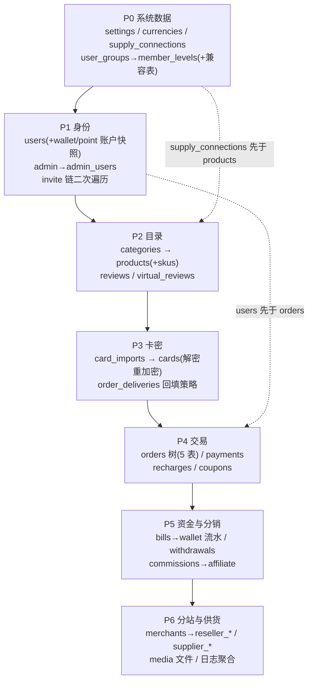

# ZCard 1.x → 2.0 数据迁移工具开发计划

> 文档定位：本文是《ZCard2.0-重构开发规划.md》§8「数据迁移策略」的**落地开发计划**——把策略细化为工具架构、逐表字段映射规格、命令行接口、校验方案、开发排期与风险清单。开发产物全部落在 2.0 仓库（`/Users/mac/Project/go/zcard-next`）。
>
> 配套文档：《数据库架构设计.md》（目标端 schema 权威）、《ZCard2.0-重构开发规划.md》§4.11（ID/单号/加密铁律）、§8（迁移策略总纲）。
>
> 撰写日期：2026-09-06 ｜ 目标端基线：zcard-next（Ent v0.14 + Atlas 版本化迁移，三方言）

---

## 交付日志

| 日期 | 交付 | 验证 |
|---|---|---|
| 2026-09-06 | **P0 基建**：`zcard migrate-from-v1` 子命令骨架、preflight 巡检（表完整性/版本探测/密钥解析含 settings 兜底/卡密与凭据抽样）、报告框架（md+json+errors.jsonl）、`v1id_maps` 读写、laracrypt 解密器（18 条 Laravel 真机 golden vectors） | 单测全绿；MySQL 容器冒烟全绿 |
| 2026-09-06 | **P0+P1 数据迁移执行器**：currencies（注意 1.x 主键是 code 无 id，走 scanAll）、user_groups→member_levels+兼容表（discount 百分数×100→万分比；阈值 both_or 判定）、supply_sources→supply_connections（凭据 APP_KEY 解密→DataBox 重加密）、settings 首批映射（20 key 命中 + v1_legacy 保真 + 7 个 SECRET 跳过）、users（bcrypt 直迁/状态映射/时区转 UTC/wallet+point 快照/用户名冲突检测）、admin 提取（spatie super_admin→admin_users）、invite 链（pid 上溯 3 级 + 环防护 + 断链容错） | sqlite 双端全链路单测（幂等重跑/dry-run/边界）；**E2E：1.x artisan 在 docker MySQL 建真 schema + 种子 → Go 工具跨库迁移 → 目标库逐表核验通过**（含 v1id_maps 对照、GCM 密文、邀请链） |
| 2026-09-06 | **PHP 侧迁移页面**：`/api/admin/migration/{preflight,command,keys}` 三端点（源端自检：密钥/卡密抽样/schema 版本/在途单；命令生成；密钥包导出——走当前默认连接）+ sysadmin「数据迁移」页面（路由/i18n/构建产物 public/admin） | 本地实例 curl 三端点验证通过（含 1 密文+1 明文卡抽样）；1.x 全量 458 测试通过；pnpm build（vue-tsc）通过 |
| 2026-09-06 | **P2 目录域执行器**：categories（树结构，真实 schema 的 parent_id/icon 均可空→Null 扫描）、products（member_price JSON key 由用户组重写为 member_level 新 ID；fixed 商品 delivery_message→direct_content 以 2.0 卡密钥匙 GCM 重加密、AAD=product/subsite 与 catalog 读取端一致；slug 超 150 按 rune 截 140+`-v1-<旧ID>`；软删→下架、hide→隐藏；virtual_reviews 的 list 数组展开为表行）；product_skus（停用跳过、spec_values 置空、超 64 上游编码报错）；reviews（状态同名直传）；supply_mappings 自动生成（幂等）；主站先行：merchant_id>1 全部跳过计数留 P6 | sqlite 双端单测（含幂等/边界）；E2E 真 schema 三轮迭代修复（零日期防御：`0000-00-00` 与缺失 created_at 走 ent 默认），direct_content 用 2.0 读取端口径解密验证通过 |
| 2026-09-06 | **P3 卡密域执行器**：card_imports（operator 不直迁——1.x 是普通用户、2.0 语义为管理员）、cards 全链（Laravel CBC 解密→2.0 卡密钥匙 GCM Seal、content_hash 从裸 sha256 全量重算为 HMAC、同商品重复卡批内+DB 双层跳过、locked 超 30 分钟释放为 available、order_id 置 0 留 P4 回填）、order_deliveries 物理删卡回填（status=used + v1id_maps("order_deliveries") 供 P4 关联）；性能路径：cards 专用批量循环（keyset 分页 + GetBatch 批级幂等 + CreateBulk，冲突回退逐行） | 单测（密文/明文混合/重复/锁释放/hash 漂移告警/回填/幂等）；E2E 真 schema + 真 Laravel 密文卡 6 种明文全部解密命中；**2.0 全量测试与改动前基线完全一致（零回归）** |
| 2026-09-06 | **P4 交易域执行器**：orders 五表合成（状态映射附录A、`order_no` 原样保留、`extra.query_password` 提升为列、v1 快照进 extra、行式金额恒等式 total=SUM(lines)——subsite_profit 语义修正：仅分站单拆 base/markup 行，主站单只进列；order_items/amount_lines/status_events 三锚点合成）、payments（聚合支付取首单+raw、charged_amount→charged_units 口径）、recharge_orders（单号无 2.0 列入报告）、coupons（percent×100 万分比、门槛与商品范围进 scope）、order_deliveries（card_id 双路径定位：P3 回填映射或源库反查；delivery_token_hash 置空——历史单走查询密码取货）、cards.order_id 回填（双路径：1.x cards.order_id 与 order_deliveries 回填卡）；1.x charged_currency 为 char(3)——4 字符币种码在源端不可能存在 | 单测（状态映射/恒等式/聚合支付/幂等）全绿；E2E 真 schema 核验：金额恒等式 1400=1400、支付双链路（订单+充值）、已售卡回填、交付记录、优惠券关联全部正确；2.0 全量测试基线一致（零回归） |
| 2026-09-06 | **P5 资金域执行器**：bills → wallet_transactions 重放（direction in/out、balance_before 由 balance_after 反推、幂等键 `v1_import:bills:<id>`、type=v1_bill 标记来源）、**余额三方对账**（末条流水 balance_after vs 钱包快照 available=1.x users.balance，差异进清单不修复——职责是暴露 1.x 账实不符）、withdrawals（approved→paid 已打款语义、method/account/name 合成 method JSON、actual_amount 差异记录在案）、commissions → affiliate_commissions（available/pending→pending_confirm/paid→withdrawn 三态、order_id 关联、available_at 补迁移时刻） | 单测全绿（含注入不一致被对账抓到的用例）；E2E 真 schema：流水链 direction/before 推算正确、幂等重跑全跳过、**对账差异暴露机制在真实环境如实工作**（源库快照与流水不符时精确列出差额）；2.0 全量测试基线一致（零回归） |
| 2026-09-07 | **收尾三件套交付**：①`--verify-only` 事后校验命令（金额恒等式逐单核对、钱包/分站余额对账、卡密随机抽样含 AAD 校验、行数三方核对、订单引用完整性；独立 verify.json+报告章节）；②切换运维手册 `zcard-next/docs/migrations/v1-cutover-runbook.md`（前置条件/演练清单/窗口时间线/回滚/分站动员/FAQ/覆盖速查）；③**100 万卡密压测达标：6 分 41 秒零失败**（目标 ≤20 分钟）——优化点：cards 批量路径改「MAX(id) 基线 + 区间回查 + PutBatch 批量写 v1id_maps」（3 次往返替代 2N 次，提速 35 倍：优化前 65 行/s → 2500 行/s），回查异常自动回退逐行保正确性 | verify 单测（故意差异被抓/修平后通过/金额破坏被拦截）；压测后核验：100 万行 + 100 万映射 + 密文/hash 完整；2.0 全量测试基线一致（零回归）。**迁移工具全部交付完毕** |
| 2026-09-07 | **P6 尾域执行器（全量阶段收官）**：①分站 reseller——`subsiteFor` 重构（merchant→subsite_id 解析：主站先行时 merchant>1 自动跳过，P6 建 profiles 后**重跑同一套 P2-P4 映射器即补上分站数据**，卡密 AAD 绑定分站 subsite、分站订单启用 base/markup 金额拆分）；merchants→reseller_profiles（subsite_id 即 profile 主键）、subsite_domains→sites、product_settings→pricings（markup_percent×100 万分比）、ledger_entries→ledger + 余额快照。②供货 supplier——accounts（api_secret 解密重加密）、prices（1.x sku_id 是 nullable）、supply_orders（单号保留、金额在订单侧 extra 保真）、downstream_callbacks（sent→success）。③内容/日志——media 行 + 文件复制（--old-storage，sha256 补算）、visit_logs 小时聚合（uv=pv 近似）、audit 12 个月窗口（1.x 列差异进 metadata） | 单测（分站补迁/AAD/供货凭据/聚合）全绿；E2E 真 schema phase 0-6 零失败：分站商品/订单 subsite 与 profile 一致、金额恒等式 1800=1800、卡密 order_id 回填、定价万分比、余额快照、供货全链正确；2.0 全量测试基线一致（零回归）。**P0-P6 全部交付** |
| 2026-09-06 | 决策确认：主站先行分批、visit_logs 聚合 90 天/audit 12 个月、聚合支付取首单+raw 保真（§10） | — |

**实现期澄清的两个口径**（写代码时钉死的语义）：
1. 2.0 会员等级是「阈值实时推导」（`memberlevel.effectiveLevel` 按累计充值/消费计算），users 表无等级列——1.x 显式 `group_id` 不落列，等级在交易域（P4/P5）迁完后自然恢复；不达标用户由迁移报告的 `errors.jsonl` 列出。
2. 2.0 supply_connections.driver 枚举与 1.x 同名（dujiao_next/acg_faka/zcard），直传无需映射（本计划 §5.1 早期写法已按此修正）。

---

## 0. 结论摘要

| 决策点 | 结论 |
|---|---|
| 工具形态 | 2.0 二进制内嵌子命令 `zcard migrate-from-v1`（总纲 D11/§8.1 既定），代码落 `server/internal/migratev1/` + `internal/admincmd/` 注册，模式参考已实现的 `reencrypt-cards`（`admincmd/reencrypt.go`） |
| 源端 | 固定 1.x MySQL，**只读连接**（专用只读账号或 `transaction READ ONLY`），DSN 可手传也可 `--old-env` 指向 1.0 部署目录自动读 `.env` |
| 目标端 | 经既有 ent client 写入，**天然跨三方言**（SQLite/MySQL/PG），无需在工具内做 DDL |
| 内部 ID | **不保留**，目标端自增分配，新旧对照写 `v1id_maps(table_name, old_id, new_id)`（表已预留）；对外可见号（`orders.order_no`、`recharge_no`、`api_key`、`coupons.code`）**原样保留**，保证老顾客可继续查单 |
| 幂等/增量 | 以 `v1id_maps` 存在性为准逐行跳过，**重跑即增量**（新增行自动补入）；切换窗口模型 = 停写后全量重跑校验 |
| 加密链路 | 1.x 两把钥匙（`APP_KEY`、`CARD_ENCRYPTION_KEY`）→ 解密（Laravel Crypt AES-256-CBC 载荷 + 形态识别兼容明文）→ 2.0 重加密（卡密 `CardCipher` AES-256-GCM 带 AAD；凭据 `DataBox` AES-256-GCM） |
| 密码 | bcrypt 哈希直迁（Go `x/crypto/bcrypt` 可校验 `$2y$`，P0 用 golden vector 测试钉死） |
| 金额 | 全程 int64 分，发现非整数金额列**阻断告警**（总纲 §8.4 决策 1）；`payment_channels.fee` fixed 模式元→分 ×100、percent 模式小数→万分比是仅有的两处换算 |
| 排期 | 7 个阶段 P0–P6，约 **7~8 周**，与总纲 M2（第 11–16 周）匹配 |
| 验收 | 对齐总纲可迁移性指标：迁移后抽样对账 **100% 一致**，dry-run 差异报告为交付物 |

---

## 1. 两端现状速览（迁移相关）

### 1.1 源端 1.x（Laravel 13 + MySQL）

- 95 个迁移、37 模型、约 45 张业务表；金额以「分」整数存储。
- **两类加密**（详见附录 B）：
  - `cards.content`：`CardCipher`（独立 `CARD_ENCRYPTION_KEY`，AES-256-CBC），**开关可关、存在历史明文**，需形态识别；密钥优先存于 `settings.card_encryption_key`（其值本身可能又是 Crypt 密文或历史明文），回退 `.env CARD_ENCRYPTION_KEY`（支持 `base64:` 前缀）。
  - `APP_KEY` 系（Laravel Crypt）：`supply_sources.credentials`、`supplier_accounts.api_secret`、`payment_channels.config`（**双层**：列值是 JSON 字符串、内层才是密文）、`settings` 中 6 个 SECRET_KEYS。
- **软删除 7 表**：users、merchants、products、supply_sources、supplier_accounts、media、media_categories。
- **潜在大表**：cards（最大）、orders、order_deliveries、payments、bills、visit_logs（原始 PV，增长最快）、security_audit_logs。
- 已交付卡密的明文快照在 `order_deliveries.card_content`（delivery_mode=delete 时 cards 行已物理删除，**这里可能是唯一副本**）。

### 1.2 目标端 2.0（Go/Kratos/Ent，三方言）

- 迁移基础设施**已预留**：`v1id_maps` 表与 ent 生成物存在但尚无调用方；`user_groups` 表注释明确「仅 migrate-from-v1 写入、memberlevel 读取」；`admincmd` 包已确立「同二进制运维子命令」模式。
- 卡密：AES-256-**GCM**，AAD 绑定 `product:<id>:subsite:<id>`；`content_hash = HMAC-SHA256(cardKey, plain)`（与 1.x 的裸 sha256 **语义不同，必须全量重算**）。
- 凭据类：`ZCARD_DATA_KEY` AES-256-GCM Box（支付渠道 config、supply credentials、supplier api_secret）。
- 金额 `money.Cents`（int64 分）；多租户 `subsite_id` 行级（主站=0，users 为全局表）。
- `reencrypt-cards` 已实现「密文形态识别 + 分批重加密 + 幂等续跑」基建，迁移工具直接复用同一套。

### 1.3 关键结构差异（驱动映射设计的点）

| 差异 | 1.x | 2.0 | 处理 |
|---|---|---|---|
| 管理员 | users 表 + Spatie 角色 | 独立 `admin_users` 表 | 从 `model_has_roles` 提取 admin 角色用户 → 建 admin_users |
| 订单状态机 | pending/paid/closed/refunded + delivery_status | 10 态（pending_payment…refunded） | 状态映射表（附录 A）+ 回填 `order_status_events` |
| 金额模型 | orders 平铺列 | `order_amount_lines` 行式（total=SUM） | 迁移时合成行（base_price / coupon_discount / subsite_markup） |
| 余额/积分 | users.balance / users.points 列 | `wallet_accounts` + `point_accounts` + 流水表 | 快照建账户 + bills 重放为流水 + 对账报告 |
| 分销上级 | users.pid 单字段 | users.invite_l1/l2/l3 三字段 | 迁移后二次遍历 pid 链计算 |
| 会员等级 | user_groups（id 关联） | member_levels（阈值驱动）+ user_groups 兼容表 | 双写：member_levels（真）+ user_groups（兼容） |
| 分站 | merchants + subsite_* | reseller_profiles / reseller_sites / reseller_pricings / reseller_ledger_* | 域级重建（§5.7，最复杂域） |
| 访问日志 | visit_logs 原始 PV | visit_logs 预聚合（date+hour+path, pv/uv） | 聚合迁移，uv 近似 |
| 卡密 hash | sha256(明文) | HMAC-SHA256(cardKey, 明文)，商品内唯一 | 全量重算 + 冲突跳过计数 |

---

## 2. 总体设计

### 2.1 代码落点与分层

```
server/
├── cmd/zcard/main.go                  # 注册 migrate-from-v1 子命令
├── internal/admincmd/migratev1.go     # 入口壳：flag 解析 → scanConf → open(client) → 调内核（仿 RunReencrypt）
└── internal/migratev1/                # 可测试内核包（不依赖 kratos runtime）
    ├── preflight.go                   # 源库巡检：连通性、只读性、schema 版本探测、密钥自检
    ├── source/                        # 源端读取：*sql.DB（go-sql-driver，只读），keyset 分页扫描
    ├── laracrypt/                     # 1.x 解密：Crypt 载荷解析（APP_KEY）、CardCipher 载荷、形态识别
    ├── mapping/                       # 逐表转换器（本计划 §5 的机器可读版）
    │   ├── settings.go  users.go  catalog.go  cards.go  trade.go  money.go
    │   ├── reseller.go  supply.go  supplier.go  content.go
    │   └── enums.go                   # 状态/枚举映射表（附录 A 的代码化）
    ├── idmap.go                       # v1id_maps 读写 + 内存缓存（users/products/orders 等常驻）
    ├── loader.go                      # 目标写入：ent client、分批事务、幂等跳过、错误收集
    ├── phases.go                      # 阶段编排（依赖拓扑，§4）
    └── report/                        # 差异/对账报告（markdown + json 双输出）
```

依赖方向约束：`migratev1` 只准 import `data/ent`、`platform/*`，不准 import 任何 `mods/*` 业务层（复用 `inventory.CardCipher` 与 DataBox 经 platform/crypto 或直接引 inventory 的 cipher 函数，避免业务耦合——实现期若 cipher 无法独立引用，则把加密封装下沉到 `platform/crypto`，这是 P0 的一号技术决策）。

### 2.2 运行模型

1. **preflight**：连源库 → 探测 schema 版本（列形态探测，见下）→ 抽样验证两把钥匙能解开加密样本（cards 抽 10 行、credentials 抽 1 行、payment config 抽 1 行）→ 目标库确认 `atlas_schema_revisions` 已到最新 → 输出巡检报告。任何一步失败立即退出，**不带病迁移**。
2. **逐阶段执行**：按 §4 拓扑序；每表 keyset 分页（`WHERE id > ? ORDER BY id LIMIT batch`），逐批在目标端一个事务内完成「查 v1id_maps → 转换 → 插入 → 写 v1id_maps」。
3. **幂等**：行级。old_id 已在 `v1id_maps` → 跳过（计 skipped_existing）。因此中断续跑、二次重跑都安全。
4. **错误策略**：默认 `--on-error=continue`（失败行记入 `errors.jsonl`，含表名/old_id/原因/堆栈摘要），资金类表（bills/wallet/commissions/ledger）默认 abort 可覆盖；结束时代码非零 + 汇总。
5. **报告**：无论 dry-run 还是实跑，都产出 `migrate-report-<ts>/{report.md,report.json,errors.jsonl}`。

**schema 版本探测（preflight 必做）**：1.x 历史上发生过两批「元→分」列型改造（`cards.draft_premium/draft_cost`、`user_groups.min_recharge/min_consumption`，2026_08_02 两个迁移）。工具检查这些列类型：若仍是 decimal（老库停在改造前）→ **阻断**，提示先升级 1.x 到 ≥1.9.x 再迁移。同时核对关键列存在性（如 `products.slug` 长度、`cards.dedup_hash`），给出「源库版本过老/过新」的明确报错。

### 2.3 密钥链路（全工具最敏感部分）

```
优先级：命令行 flag  >  环境变量  >  --old-env 指向的 1.x .env  >  源库 settings 表

APP_KEY（Laravel Crypt 用）
  └─ 解：supply_sources.credentials / supplier_accounts.api_secret
        / payment_channels.config（剥 JSON 外层后解内层）/ settings 6 个 SECRET_KEYS

CARD_ENCRYPTION_KEY（卡密用）
  └─ 解析顺序：flag → env(ZCARD_V1_CARD_KEY) → 1.x .env 的 CARD_ENCRYPTION_KEY
        → 源库 settings.card_encryption_key（先当 Crypt 密文用 APP_KEY 解，失败则视为历史明文）
  └─ 支持 base64: 前缀

重加密（目标端）：
  cards.content       → CardCipher.Seal(plain, productID, subsiteID)   [AES-256-GCM + AAD]
  凭据类              → DataBox Seal                                    [AES-256-GCM]
```

- 解密全部做**形态识别**（base64 解出 JSON 含 iv/value/mac 才当密文，否则按明文原样通过）——1.x 卡密加密可关、`payment_channels.config` 存在历史明文 JSON，都必须兼容。
- Crypt 载荷的 mac 校验：默认校验（防密钥错配静默产出乱码）；`--skip-mac` 仅限抢救场景。
- **两把 1.x 密钥不迁入 2.0**，仅迁移期使用；2.0 用自己的 `ZCARD_CARD_KEY`/`ZCARD_DATA_KEY`。
- 密钥自检失败的报错信息要给出可操作的指引（去哪找 key、settings 表怎么查）。

### 2.4 ID 与单号策略

- 内部主键：目标端自增分配 + `v1id_maps` 记录（与总纲 §4.11「内部主键可重排，对外单号保持可追溯」一致）。避免跨库序列复位坑，也让 2.0 的雪花/自增体系不被历史数据污染。
- **原样保留**的对外标识：`orders.order_no`、`recharges.recharge_no`（作为 2.0 单号写入）、`supplier_accounts.api_key`、`coupons.code`、`supply_orders.downstream_order_no`、商品 `slug`、域名。
- 内存映射缓存：users/products/categories/orders/skus 常驻 map（量级可控：十万级）；cards 不缓存（按需查 `v1id_maps`）。
- **users.pid → invite_l1/l2/l3**：主迁移 pass 不解析，users 全部迁完后第二个 pass 沿 1.x pid 链向上走两步填充（避免顺序依赖）。

---

## 3. 命令行接口

```
zcard migrate-from-v1 [flags]
```

| flag | 默认 | 说明 |
|---|---|---|
| `--conf` | `configs` | 2.0 配置目录（决定目标库 dialect/DSN 与新密钥） |
| `--dsn-old` | — | 1.x 源库 DSN（mysql）。与 `--old-env` 二选一 |
| `--old-env` | — | 1.x 部署目录路径，自动读 `.env`（DB_*、APP_KEY、CARD_ENCRYPTION_KEY、APP_TIMEZONE） |
| `--old-app-key` / `--old-card-key` | — | 显式覆盖密钥（优先级最高；支持 `base64:` 前缀） |
| `--phase` | 全部 | 执行到哪个阶段：`0..6`（见 §4），可重复指定 |
| `--tables` / `--skip-tables` | — | 精确控制表级范围（调试用） |
| `--batch` | 1000 | 每批行数 |
| `--dry-run` | false | 只读源库 + 全量转换 + 产出报告，不写目标端（v1id_maps 也不写） |
| `--verify-only` | false | 不迁移，仅对已迁移数据跑 §6 校验项 |
| `--report-dir` | `./migrate-report-<ts>` | 报告输出目录 |
| `--on-error` | `continue` | `continue` / `abort`（资金类表强制 abort 的例外见 §2.2） |
| `--visit-days` | 90 | visit_logs 聚合迁移的保留窗口（0=不迁） |
| `--audit-months` | 12 | security_audit_logs 保留窗口（0=全量，-1=不迁） |
| `--sample` | 100 | 卡密抽样比对数量 |
| `--yes` | false | 跳过交互确认（实跑前展示阶段计划 + 目标库地址，要求确认） |
| `--reset` | — | **危险**：清空目标端迁移写入的行 + v1id_maps（仅开发演练用，需二次输入 YES） |

交互确认 + `--reset` 守卫的原因：这是唯一会**批量写生产库**的子命令，对齐总纲「运维子命令打进同一二进制」的安全要求。

---

## 4. 迁移阶段与依赖拓扑



| 阶段 | 内容 | 为什么这个顺序 |
|---|---|---|
| P0 | settings、currencies、supply_sources→supply_connections、user_groups→member_levels+兼容表 | 全是被引用的字典表；supply_connections 必须先于 products（products.upstream_source_id 引用它） |
| P1 | users、admin_users、wallet/point 账户快照、invite 链 | orders/bills/分销都引用 users |
| P2 | categories、products、product_skus、reviews、virtual_reviews | cards/orders 引用 products |
| P3 | card_imports、cards、（交付缺失卡密回填） | orders 引用 cards（软外键 order_id）；卡密最重，单独成阶段便于压测与续跑 |
| P4 | orders+order_items+order_amount_lines+order_status_events+order_deliveries、payments、recharges→recharge_orders、coupons | 交易主链 |
| P5 | bills→wallet_transactions、withdrawals、commissions→affiliate_commissions | 依赖 orders/users |
| P6 | merchants/subsite_*→reseller_*、supplier_accounts/prices/ledger/supply_orders、media 文件复制、visit_logs 聚合、security_audit_logs | 相对独立、可整体 `--skip`，主站先行场景下最后甚至暂缓 |

> 分站分批策略（总纲 §8.3）：主站先行时 `--phase 0-5` 跳过 reseller 域；分站后续单独补跑 P6 的 reseller 部分。注意 1.x 里分站商户的商品在 products.merchant_id>1 —— 若跳过 reseller 域则这些商品也一并跳过（工具按 `merchant_id=1` 过滤并在报告计数）。

---

## 5. 逐域映射规格

> 约定：「→」左为 1.x 列，右为 2.0 列；`(map)` 表示经 v1id_maps 换新 ID；`(enum)` 表示查附录 A 映射；金额列 1.x/2.0 同为分，直传；未列出的列默认丢弃并在报告「未映射列」清单中列出。

### 5.0 通用规则（全表适用）

- 时间：1.x `APP_TIMEZONE`（默认 UTC，实际多为 Asia/Shanghai）→ 统一转 **UTC** 写入（preflight 读 .env/询问确认，报告里打印时区口径）。
- 软删除：7 张 SoftDeletes 表迁移时 `deleted_at` 语义映射——users→status=deleted；products/supply_sources/supplier_accounts/media* → 照搬 deleted_at（2.0 同为软删）或按实现期核实的口径。
- JSON 列：原样透传（Go 侧 `json.RawMessage`），但**含旧 ID 引用的 JSON 必须重写 key**（已识别的：`products.member_price` 的 key 是 1.x user_groups.id，需重写为 member_levels 新 ID）。
- 乐观锁 version 列：目标端插入时置 0。
- `subsite_id`：1.x `merchant_id=1` → 0（主站）；`merchant_id>1` → reseller 域分配的 subsite_id（§5.7）。

### 5.1 P0 系统与配置

**settings → settings（group/key/value 三元组）**

- 机制：内置声明式映射表（yaml 编译进二进制，路径 `internal/migratev1/mapping/settings_map.yaml`），1.x key → 2.0 group+key + 值变换函数（少数）。
- 分组去向（1.x group=storefront 约 100 key → 2.0 17 组）：site_*/brand_* → `site`；footer_* → `footer`；外观列表类 → `template`；trade_*/order_*/guest_* → `trade`；register_*/captcha_*/forget_* → `security`；distribution_* → `affiliate`（key 改名）；subsite_* → `reseller` 组或 `ops`（实现期按 `mods/settings/directory.go` 核对）；mail_* → `notify`（`mail_password` 解密重加密）；sms_* → `notify`；cash_* → `withdraw`；base_currency/default_display_currency/enabled_languages/default_language → `i18n`；maintenance_* / analytics / allowed_hosts → `ops`/`site`。
- 特殊：`card_encryption_key`、`card_encryption_enabled` **不迁**（1.x 密钥仅迁移期用）；`admin_alert_tg_token`/`admin_alert_wecom_webhook` 解密重加密后入 `notify`。
- 未映射 key：不丢弃，原样写入 `settings(group='v1_legacy')`，报告列出，人工决定去向。**映射表是本计划附录 C 的交付物，实现时逐 key 完成并与 directory.go 对账。**

**currencies → currencies**：`code`(PK) 直传；`exchange_rate→rate`；`symbol_position→position`；`decimal_places→precision`；`is_enabled→enabled`；`sort→sort`；`is_base` 不迁列（2.0 基础货币在 settings/i18n，映射时写 `base_currency` setting，报告提示不一致风险——如 1.x 基础货币非 CNY）。

**user_groups → member_levels + user_groups(2.0 兼容表)**

- member_levels：`name→name`；`discount→discount`（1.x decimal(5,2) 百分数 100.00=原价 → 2.0 口径实现期核对：万分比则 ×100）；`min_recharge→threshold_recharge`；`min_consumption→threshold_consume`；`threshold_type`：两者均>0 → `both_or`，仅 recharge → `recharge`，仅 consume → `consume`；`sort→sort`；`status→enabled`。
- user_groups(2.0)：`code = 'v1-' + old_id`；`name→name`；`level_id = map(member_levels)`。（该表契约：「仅 migrate-from-v1 写入、memberlevel 读取」。）
- ⚠️ P1 首日核实项：2.0 用户与等级的关联落点（users 表是否有 level 列 / memberlevel 是否有用户关联表），若缺失则需一次小 schema 变更——这是 P0→P1 的硬依赖，排入 P1 第 2 天。

**supply_sources → supply_connections**（提前到 P0，因 products 引用）

- `name/driver/base_url/status/last_error/balance_cache` 直传（driver 枚举 `dujiao_next→dujiao`、`acg_faka→acgfaka`、`zcard→zcard`，实现期按 2.0 driver 常量核对拼写）。
- `credentials`：APP_KEY 解密出 JSON → DataBox 重加密 → `credentials` blob。
- `settings` JSON：字段级映射（库存模式/同步开关/定价/product_url_template）→ `settings` json + 顶层列（`stock_mode`、`auto_sync_price`、`price_markup_percent`、`price_rounding_mode`）；实现期对照 2.0 supply 模块读取的 key 清单逐项落。
- `last_synced_at→last_synced`；`sort` 丢弃（2.0 无此列则并入 settings）。
- **supply_mappings 生成**：遍历 1.x products 中 `upstream_source_id` 非空的行，`upstream_product = upstream_product_code`、`local_product_id = map(products)` —— 但这依赖 P2 的 products。处理：P0 只建 connections；supply_mappings 在 P2 末尾随 products 一起生成（编排上属 P2，映射规格记在此处）。

### 5.2 P1 身份

**users → users + wallet_accounts + point_accounts**

| 1.x | 2.0 | 变换 |
|---|---|---|
| username/email/phone | 同名 | 直传（email/phone 可空语义一致） |
| password | password_hash | **bcrypt 直迁**（`$2y$` 前缀保留，Go bcrypt 可校验；P0 golden vector 钉死；第三方无密码用户天然兼容 null） |
| status + deleted_at | status | 1→active；0→banned；deleted_at 非空→deleted |
| last_login_at/login_ip | last_login_at | login_ip 无对应列→丢弃入报告 |
| balance | wallet_accounts.available | 快照建账（currency=CNY），流水见 §5.6 bills |
| points | point_accounts.balance | 快照建账 + 一条 `v1_import:points:<uid>` 初始流水 |
| pid | invite_l1/l2/l3 | 二次遍历：l1=map(pid)，l2/l3 沿 1.x pid 链上溯 |
| group_id | （见 P1 核实项） | 经 user_groups 兼容表关联 member_level |
| total_recharge / total_consumption | — | 丢弃（2.0 由阈值/统计表推导）；若 P1 核实发现 memberlevel 依赖它，改为写入 daily_stats 或用户扩展 |
| name/qq/avatar/password_changed_at | — | 无对应列默认丢弃，报告列出（avatar 若 2.0 users 有列则直传） |
| — | promo_code | 新生成 8 位（剔除 I/O/0/1 字符集），冲突重试 |

**admin 提取 → admin_users**：`model_has_roles` 中 role∈{admin, super_admin}（实现期核对 1.x 实际角色名）的用户 → `admin_users`（username/password_hash/nickname=name/last_login_*），role_id 指向 2.0 内置超管角色；`zcard admin list` 可见。**Spatie 五表本身不迁**（2.0 自有 RBAC）。

**不迁**：sessions、personal_access_tokens（JWT 体系，全员重登录；游客查单走 order_no+query_password 不受影响）、password_reset_tokens、cache/jobs 系框架表。

### 5.3 P2 目录

**categories → categories**：`parent_id(map)`、`name/icon/sort`、`hide→hide`、`status`（tinyint→枚举核对后映射）；`slug/description` 丢弃入报告（2.0 categories 无此二列）；`visible_subsites` 置空。

**products → products**

| 1.x | 2.0 | 变换 |
|---|---|---|
| merchant_id | subsite_id | 1→0；>1→reseller 映射（§5.7） |
| category_id | category_id | (map) |
| name/slug/description/cover/images | 同名 | 直传（slug 的 subsite 内唯一性由 merchant_id→subsite_id 一致映射保持） |
| price/factory_price/draft_premium | 同名 | 直传（分） |
| member_price | member_price | **JSON key 重写**：1.x `{user_group_id: 分}` → `{member_level_new_id: 分}` |
| stock_type | stock_type | 枚举同名直传 |
| fulfillment_type=fixed + delivery_message | direct_content | 明文 → DataBox 加密 blob（`stock_type/direct_content` 直发形态） |
| fulfillment_type=manual / upstream | （order_items 层语义） | 产品级不落列，记入 `extra.v1_fulfillment_type` 保真 |
| delivery_mode | delivery_mode | status/delete 同名直传 |
| control_config | control_config | JSON 直传；**同时展开**为 product_controls 行（若 2.0 前端已消费该表——P2 首日核实，二者取一） |
| dedup/stock_visible/sort/is_featured | dedup/stock_visible/sort/is_recommend | 直传 |
| virtual_sales / virtual_reviews | — / virtual_reviews 表 | virtual_reviews JSON 展开为行；virtual_sales 入 `extra` |
| min_order/max_order/purchase_limit/contact_type/send_email/leave_message/only_user/level_disable/hide | — | 大部分 2.0 有对应或入 `extra`；P2 按 2.0 products 最终列清单逐项核对，未对应的统一 `extra.v1_*` 保真 |
| pick_type | （cards.number_hash 语义） | 通用/靓号由 cards 层承载；pick_type 本身入 extra |
| upstream_source_id / upstream_product_code / upstream_synced_at | 同名 | (map)；并生成 supply_mappings 行（见 §5.1） |
| upstream_product_url / stock_cache / price_manual / upstream_price / seo_* | — | upstream_* 入 supply_mappings.meta 或 extra；seo_* 待 2.0 seo 模块核实落点 |
| status/hide | status | 1=上架→1；0=下架→0；hide=1→2(隐藏) |

**product_skus → product_skus**：`product_id(map)`、`name`、`price`（可空继承语义一致）、`stock_type` 丢弃（2.0 无则入 extra）、`upstream_sku_code(text)→upstream_sku_id`（ACG-Faka 的 JSON race/sku 原样存，实现期核对 2.0 该列语义）、`sort/status`。

**reviews → reviews**：`product_id/user_id(map)`、`rating/content/status`（pending/approved/rejected 同名）、`order_id(map)` 保 UNIQUE(order_id,product_id) 语义（冲突跳过计数）。

### 5.4 P3 卡密（最重域，独立压测）

**card_imports → card_imports**：`product_id(map)`、`operator_id(map)`、`source→filename`、`total/success_count→imported/skipped/failed` 拆分核对、`status(enum)`（running→processing、completed→done、failed→failed）、`error_log` 丢弃入报告。

**cards → cards（逐行：解密 → 重加密 → 重算 hash）**

```
读行 → content 形态识别：
  ├─ Laravel 载荷(base64 json 含 iv/value/mac) → 旧 CARD_ENCRYPTION_KEY 解密 → plain
  └─ 否则视为明文 → plain
→ 校验：sha256(plain) == content_hash（不一致计入警告，不阻断；content_hash 不可信的老数据允许漂移）
→ Seal = 2.0 CardCipher.Seal(plain, productID_new, subsite_id)   [AES-256-GCM + AAD]
→ content_hash_new = HMAC-SHA256(cardKey, plain)
→ 插入（status/order_id/locked_at/used_at/note/card_type/owner_id(map)/
        draft_premium/draft_cost/price/number_hash 直传或 map；
        number_hash 是裸 sha256 且语义一致，直传保全局唯一）
```

- **唯一约束冲突**（`UNIQUE(subsite_id, product_id, content_hash)`）：同商品同卡密重复行（1.x 的 `dedup_hash` 可空导致合法重复）→ 跳过并计 `skipped_dup`，报告列出 old_id 对。
- **locked 状态卡的释放**：`locked_at` 超过 1.x 锁卡 TTL 的按 `available` 迁移（对齐 1.x CloseExpiredOrders 语义），否则保留 `reserved`；状态映射 unused→available、locked→reserved、used→used、disabled→disabled。
- **order_deliveries 回填**：P3 末尾扫描 1.x order_deliveries，凡对应 cards 行缺失（delivery_mode=delete 已物理删）→ **重建 cards 行**（status=used、content 按上述流程重加密、order_id 留待 P4 订单映射后回填）——保证顾客历史订单在 2.0 仍能看到已购卡密。P4 迁移 orders 后再补一次 `UPDATE cards SET order_id` 回填。
- 性能目标：≥5,000 行/秒（本机 MySQL→MySQL），100 万卡密 ≤ 20 分钟；批事务 + `CreateBulk`（PG 走批量 COPY 可作为 P6 优化项）。P3 末尾抽样比对（§6）。

### 5.5 P4 交易

**orders → orders + order_items + order_amount_lines + order_status_events**

| 1.x orders | 去向 | 变换 |
|---|---|---|
| order_no | orders.order_no | **原样保留**（老顾客凭单号+查询密码查单不断链；2.0 对新建单用雪花，迁移行共存不冲突） |
| merchant_id | subsite_id | §5.0 规则 |
| user_id | user_id | (map)，游客 null |
| status + delivery_status + closed_at | status | 附录 A 映射 |
| amount | total_amount | 直传 |
| discount_amount | order_amount_lines(type=coupon_discount, 负数行) | 行式合成 |
| cost | cost / items.cost | 直传 |
| base_currency/display_currency/exchange_rate/amount_display | 同名 | 直传 |
| payment_channel | payment_channel | 直传 |
| contact | contact / guest_contact | user_id 空 → guest_contact |
| extra.query_password | query_password_hash | 从 JSON 提升为列（bcrypt 直迁） |
| extra.access_token_hash + 其余 extra | extra | 余量透传 |
| sku_name | order_items.sku_name | 快照 |
| instructions_snapshot / delivery_message_snapshot / fulfillment_type_snapshot / create_device / source / coupon_code / subsite_domain / subsite_profit / upstream_* | extra.v1_* / 对应列 | subsite_profit→同名列；其余快照保真进 extra |
| create_ip | client_ip | 直传 |
| paid_at/closed_at/created_at | paid_at/closed_at/expired_at | closed 单 expired_at=closed_at |

- **order_items 合成**：1.x orders+order_items 双写（orders 有 product_id/quantity，order_items 另有一行）→ 统一以 order_items 为准生成 2.0 order_items（quantity/unit_price=amount/quantity/fulfillment_type=fulfillment_type_snapshot 映射 auto_card→auto、fixed→auto、manual→manual、upstream→upstream；fulfillment_status=delivered 当 1.x delivery_status=delivered）。
- **order_amount_lines 合成**：`base_price = amount + discount_amount`（正）；`discount_amount>0` → coupon_discount 行（负）；`subsite_profit>0` → subsite_markup 行（正）——保证 `total_amount = SUM(lines)` 恒等式可被对账校验。
- **order_status_events 回填**：合成事件链 created→(附录A目标态)（operator=system）：created_at 落 pending_payment；paid_at 落映射态；closed_at 落 canceled/expired。仅回填三个已知锚点，不臆造中间态。
- **order_deliveries → order_deliveries**：`order_id/product_id(map)`、`delivered_mode/delivered_at` 直传；card_id 关联回填的重建卡密；1.x `card_content` 明文**不迁**（已由 cards 承载），delivery_token_hash 置空。

**payments → payments**：`order_id(map)`；**聚合支付 `order_ids` JSON 数组**→ order_id 取首个 + 完整数组保 raw（报告列出，人工核对是否拆分）；`recharge_id(map)`→recharge_order_id；`channel/channel_order_no/amount/fee/status/paid_at` 直传；`charged_currency/charged_amount/channel_exchange_rate→exchange_rate/charged_units`（实现期核对列名）；`raw` 透传。

**recharges → recharge_orders**：`recharge_no` 保留进 extra（2.0 单号体系不同则只保 extra，核实后定）；`amount/gift_amount(=0)/target/status` 映射 pending→pending、paid→success、closed→expired；`paid_at` 直传；关联 payments 经 recharge_order_id 回链。

**coupons → coupons**：`code` 保留；`type/value`：fixed 直传（分）、percent `value×100` → 万分比；`min_amount`→scope 元数据（P4 首日核对 2.0 门槛落点）；`product_id/category_id(map)`→`scope` JSON（{type, id}）；`status`：active→unused、used→used、disabled→disabled；`used_by→user_id(map)`、`order_id→used_order_id(map)`、`expires_at→expire_at`；`batch_id` 指向合成的「v1-import」批次（若 2.0 batch 表必填则建一条，否则 null——实现期核实）。

**在途单处理（运维流程而非代码）**：切换窗口前等待 pending 支付自然超时（1.x 订单关闭 TTL），残余 pending 单迁为 `pending_payment` 且报告高亮，人工在 2.0 后台关闭或联系顾客——对齐总纲 §8.2。

### 5.6 P5 资金与分销

**bills → wallet_transactions（重放）+ wallet_accounts 对账**

- `type`：1→in、0→out；`amount` 直传；`balance_before = balance_after ∓ amount`（由快照推算）；`reference = 'v1_import:bills:<old_id>'`（幂等键）；`order_id(map)`、`admin_id→operator_id(map)`、`log→remark`。
- **对账不变量**：每用户 `wallet_transactions` 末条 balance_after 必须 == 快照 available（来自 1.x users.balance）。差异 → 报告「资金差异清单」（这是 1.x 可能存在的账实不符的历史问题，迁移工具负责**暴露**而非修复）。

**withdrawals → withdrawals**：`user_id(map)`、`amount/fee` 直传、`actual_amount` 丢弃（2.0 无则入 extra）；`method+account+account_name → method` JSON（{channel: alipay/wechat/usdt, account, name}）；status：pending→pending、approved→**paid**（1.x approved=已打款，有 processed_at）、rejected→rejected；`reject_reason/reviewed_by(map)/processed_at→paid_at`。

**commissions → affiliate_commissions**：`order_id/buyer_id/referrer_id(map)`、`tier/rate/base_amount/amount` 直传（rate decimal(8,4)→decimal(20,8)）；status：available→available、pending→pending_confirm、paid→withdrawn；`available_at` 空则置迁移时刻；UNIQUE(order_id,tier) 语义一致，冲突跳过计数。**历史 pending 佣金折算为冻结态**（总纲 §8.2 口径：pending_confirm）。

### 5.7 P6 分站域（merchants/subsite_* → reseller_*，最复杂，先 spike 后实现）

> P6 启动前先出半页 spike 文档确认映射模型（列入 P6 首个 PR），以下为初始方案：

| 1.x | 2.0 | 要点 |
|---|---|---|
| merchants(id>1) + merchant_members(role=owner) | reseller_profiles | owner 用户 (map)；status→approved；subsite_order_snapshots.reseller_user_id 作 owner 兜底校验 |
| merchants(id=1 主站) | — | 不迁，产物统一落 subsite_id=0 |
| subsite_domains | reseller_sites | domain/type(subdomain→custom? 核对)/verification_*/is_primary/status 直传 |
| subsite_product_settings | reseller_pricings | merchant_id→subsite_id(map)、product_id/sku_id(map)、pricing_mode→mode 同名、markup_percent 直传、fixed_*_amount 直传 |
| subsite_ledger_entries | reseller_ledger_entries + reseller_balance_accounts | type 五值同名直传；status：canceled 丢弃→报告；idempotency_key 直传；账户快照 = 可用余额合计（同 §5.6 对账暴露差异） |
| subsite_order_snapshots | （orders 主链已承载 + extra 保真） | 不单独建行；profit 走 order_amount_lines.subsite_markup |
| merchants.commission_rate/settings | reseller_profiles 默认加价参数 | 字段级核对后落 |

### 5.8 P6 货源与供货（本站作上游的部分）

- **supplier_accounts → supplier_accounts**：`name/api_key(保留)/contact/status`（active+approved→approved；active+未 approved→applying？——历史已回填 approved=true，统一 approved；实现期核对 2.0 状态机）；`api_secret`：APP_KEY 解密 → DataBox 重加密；`balance→balance_cache`；`remark→extra`。
- **supplier_product_prices → supplier_product_prices**：三键 (map) + price 直传。
- **supplier_ledger_entries → supplier_ledger_entries**：`account_id(map)`、`type` 同名、有符号 amount 直传、`balance_after` 丢弃（2.0 无则 extra）、`idempotency_key` 直传、`supply_order_id` 由 supply_orders 映射。
- **supply_orders → supply_orders**：`account_id/downstream_order_no(保留)/amount/status` 映射（fulfilled 以 1.x 订单是否交付推断，实现期定映射表）；1.x callback 状态→downstream_callbacks 行（pending/sent/failed 保留，历史 failed 不重发）。
- **supply_sync_tasks**：默认不迁（历史任务快照）；`--tables supply_sync_tasks` 可选迁，状态映射 queued/running→processing 等。
- **supply_nonces**：**不迁**（5 分钟时效，无意义）。
- **reconciliation_***：不迁（2.0 新能力）。

### 5.9 P6 内容、媒体与日志

- **media/media_categories**：行直传（category_id map、path/name/mime/size/width/height）+ **文件本体复制**：1.x `storage/app/public/<path>` → 2.0 存储根；`url` 重写为 2.0 URL 规则；`sha256` 迁移时计算补齐；`ref_count` 置 0。失败文件清单入报告（不阻断）。
- **security_audit_logs → security_audit_logs**：`--audit-months` 窗口内直传；`source→actor_type`（admin/user/guest/system 推断：actor_id 关联 admin 则 admin，有 user 则 user，否则 guest）；列差异（method/path/status_code/user_agent）→ metadata JSON 保真。
- **visit_logs → visit_logs（聚合）**：`GROUP BY DATE(created_at), HOUR(created_at), path` → pv=count；**uv 不可重建**，置 uv=pv 并在报告标注口径；`--visit-days` 窗口外聚合前丢弃（原始表不整表迁移——百万行 PV 原文对 2.0 无消费方）。
- **不迁总清单**：sessions、cache*、jobs*、personal_access_tokens、password_reset_tokens、Spatie 五表、supply_nonces、`footer_analytics`（1.x 已弃用）。

---

## 6. 校验与报告（dry-run / verify-only / 实跑尾部共用）

报告分四部分，markdown 给人看、json 给脚本比对：

1. **行数对账**：逐表 `源行数 vs 目标行数(migrated) + skipped_existing + skipped_dup + failed`，恒等式必须成立。
2. **金额对账**（总纲验收指标「抽样对账 100% 一致」）：
   - `SUM(orders.amount)` vs `SUM(orders.total_amount)` vs `SUM(order_amount_lines.amount)`（三方一致）
   - `SUM(payments.amount WHERE status=success)`、`SUM(bills.type=收入-支出)`、`SUM(commissions.amount)`、各 ledger 有符号合计逐表比对
   - 每用户 `users.balance` vs `wallet_accounts.available` vs 末条流水 balance_after 三方核对，差异单列「资金差异清单」
3. **卡密抽样**：随机 N（默认 100）+ 全部靓号（number_hash 非空）行：源端解密明文 vs 目标端 Seal 前明文逐字节相等 + hash 重算一致；抽样失败 = **致命错误**（exit 非零）。
4. **引用完整性**：cards.product_id、orders.user_id、bills.order_id、commissions.order_id 等全部可解析（map 命中率 100%）；v1id_maps 无 (table,old_id) 重复。

dry-run 额外输出：加密形态统计（密文/明文占比，确认形态识别符合预期）、时区口径、schema 版本探测结论、未映射 key/列清单、方言列映射（对齐总纲 §8.4 决策 6）。

---

## 7. 切换流程与回滚（运维剧本，随工具交付文档化）

1. **演练 ≥2 次**：生产库 dump 到测试环境 → `migrate-from-v1 --dry-run` → 修复报告项 → 实跑 → verify-only 全绿。演练同时实测耗时，决定窗口长度。
2. **密钥归档前置检查**（演练前完成）：确认 `APP_KEY`、`CARD_ENCRYPTION_KEY`（或 settings.card_encryption_key 可解）齐备并离线备份——**钥匙丢失 = 卡密与凭据永久不可迁**，这是唯一不可逆风险。
3. **切换窗口**：公告 → 1.x 置维护模式（停写）→ 等待 pending 支付 TTL 清空 → 终次全量重跑（幂等，只补新增）→ verify-only 100% → 切 DNS/入口到 2.0。
4. **回滚**：窗口内保留 1.x 只读快照；回滚 = 入口切回 1.x。2.0 侧已迁数据可 `--reset` 或留待下次窗口复用（幂等重跑兼容）。
5. **分站**：主站先行；分站按站长意愿分批补跑 P6 reseller 域；双跑期 1.x/2.0 供货 API 不互通——切换公告**必须明确告知**（总纲 §8.3）。

---

## 8. 开发里程碑与交付物

> 排期单位：人周；总计约 7~8 周，落在总纲 M2（第 11–16 周）内。每个 P 收口 = PR 合并 + 测试绿 + 本节「收口标准」达成。

| 阶段 | 内容 | 排期 | 收口标准 |
|---|---|---|---|
| **P0 基建** | 子命令骨架（flag/env/conf/确认守卫）、源库连接与 preflight（版本探测/密钥自检/只读检查）、v1id_maps helper、报告框架、laracrypt 解密器（Crypt 载荷 + CardCipher 形态识别 + payment 双层）、cipher 下沉 platform 决策 | 1 周 | golden vector 单测全绿（PHP 侧生成固定密文样本入 testdata）；对真实 1.x 测试库跑通 preflight 报告 |
| **P1 身份** | settings_map.yaml 首批核心 key、currencies、user_groups 双写、users+admin 提取+wallet/point 快照+invite 链、memberlevel 关联落点核实（可能含小 schema 变更） | 1 周 | 测试库身份域迁移绿 + `zcard admin list` 可登录 + 登录验证老密码成功 |
| **P2 目录** | categories/products/skus/reviews/virtual_reviews、supply_connections+supply_mappings、control_config 展开/保真二选一定案 | 1 周 | 目录域对账绿；member_price 重写抽测；分站商品过滤计数正确 |
| **P3 卡密** | card_imports、cards 全链（解密→Seal→hash 重算→冲突策略）、order_deliveries 回填、批量性能 | 1 周 | 10 万级卡密演练 ≤ 5 分钟；抽样比对 100%；明文/密文混合形态测试通过 |
| **P4 交易** | orders 五表合成、payments（含聚合支付边界）、recharge_orders、coupons、在途单报告 | 1.5 周 | 金额三方对账恒等式绿；状态映射单测（附录 A 全组合）；老单号查询链路手工验证 |
| **P5 资金** | bills 重放+对账差异清单、withdrawals、commissions | 1 周 | 资金差异清单产出机制可用（在测试库注入差异能被抓住） |
| **P6 分站+货源+收尾** | reseller spike+实现、supplier 域、media 文件复制、日志聚合、三方言 CI、运维手册、大库压测（100 万卡密） | 1.5 周 | 三方言 CI 全绿；100 万卡密 ≤ 20 分钟；运维手册评审通过 |

**交付物清单**：

1. `zcard migrate-from-v1` 子命令（dry-run / 实跑 / verify-only / report / reset）；
2. `internal/migratev1` 包 + 完整测试（golden vectors、逐映射器单测、fixture 库端到端、三方言矩阵）；
3. 字段映射规格文档 `docs/migrations/v1-field-mapping.md`（本计划 §5 的实现核对版，逐列签字）+ `settings_map.yaml`（完整 key 映射）；
4. 运维手册 `docs/migrations/v1-cutover-runbook.md`（§7 剧本展开：演练清单/窗口时间线/回滚/分站动员话术）；
5. 测试资产：PHP 生成的加密 golden vectors、匿名化 1.x fixture 库 dump。

**测试策略**：

- **crypto golden vectors**：PHP 脚本（放 1.x 仓库 `docs/重构/generate-v1-crypto-fixtures.php`）用真实 Laravel Encrypter/CardCipher 生成「密钥+明文+载荷」三元组样本（覆盖：Crypt 序列化/非序列化、卡密密文/明文、payment 双层、settings 双层），Go 侧解密断言。**这是 P0 最高优先级测试**——解密错则一切皆错。
- **fixture 库**：用 1.x 测试/开发库导出匿名化 dump（含软删除行、聚合支付单、delivery_mode=delete 订单、locked 卡、重复卡密等边界 fixture），端到端断言对账恒等式。
- **架构测试**：migratev1 的 import 白名单（禁 mods/*）、金额列不经 float 的既有守卫自动覆盖。
- 三方言：CI 矩阵 sqlite + mysql + postgres 各跑一遍端到端。

---

## 9. 风险清单

| # | 风险 | 影响 | 缓解 |
|---|---|---|---|
| R1 | **1.x 密钥遗失**（APP_KEY / CARD_ENCRYPTION_KEY） | 卡密、渠道凭据、上游凭据永久不可解 | 演练前归档检查为硬门槛（§7.2）；preflight 钥匙自检失败即拒跑 |
| R2 | Go bcrypt 校验 `$2y$` 的兼容性假设不成立 | 用户无法登录 | P0 golden vector + 真实账号登录验证；不成立则迁移时用已知明文重哈希（不可行）→ 改为「首次登录走重置流」兜底 |
| R3 | 1.x 生产库停在老 schema（元→分改造前） | 金额错 100 倍 | preflight 列型探测阻断（§2.2），要求先升级 1.x ≥1.9.x |
| R4 | content_hash 语义变化 + 唯一约束 | 同商品重复卡密迁移冲突 | 冲突跳过 + 计数 + 报告清单（§5.4）；dedup 语义在 2.0 收敛是预期行为 |
| R5 | 时区口径错误（DATETIME 无时区） | 全部时间戳偏移 8h | preflight 显式确认 APP_TIMEZONE 并打印口径；抽单人工比对 created_at |
| R6 | 在途支付/在途订单 | 切换期资损或客诉 | 窗口前等 TTL + 残余人工清单（§5.5）；发布计划避开高峰 |
| R7 | 2.0 schema 仍会演进（项目未发版） | 映射器反复返工 | 映射器集中生成（mapping 包）+ 字段映射文档版本化；P6 前冻结一次 2.0 schema 基线 |
| R8 | 大表性能（cards 百万级、visit_logs 千万级） | 窗口过长 | keyset 分页 + 批事务 + CreateBulk；visit_logs 聚合窗口默认 90 天；P6 压测校准 |
| R9 | 双跑期分站/供货 API 不互通 | 分站站长困惑 | 公告话术 + 分批动员（§7.5）；这是产品决策已定，不是技术债 |
| R10 | 资金差异（1.x 本身账实不符） | 对账不绿、切换受阻 | 工具职责 = 暴露差异出清单，人工核销后二次 verify（§5.6）；不静默抹平 |

## 10. 已确认决策（2026-09-06 用户拍板）

1. **分站范围**：✅ 主站先行、分站分批（总纲默认方案；首演仅 `--phase 0-5`，reseller 域随分站分批补跑）。
2. **日志保留策略**：✅ 按默认——visit_logs 聚合迁 90 天、security_audit_logs 12 个月。
3. **聚合支付单**（payments.order_ids 多单）：✅ 取首单关联 + 完整数组保 raw。
4. **生产库规模**：⏳ 待提供 cards/orders 行数（仅影响压测目标与窗口时长，不阻塞 P0–P3）。
5. **1.x 版本基线**：⏳ 由 preflight 自动探测（当前 1.0 仓库基线 v1.15.0，远晚于「元→分」列改造，正常情况下无兼容分支）。

---

## 附录 A：状态映射总表

**orders.status（结合 delivery_status / closed_at）**

| 1.x | 条件 | 2.0 |
|---|---|---|
| pending | 创建 < 订单 TTL 且未关单 | pending_payment |
| pending | 已超时（closed_at 非空或老旧） | expired |
| paid | delivery_status=pending | paid（刚付款未发货的历史态，理论少见） |
| paid | delivery_status=delivered | completed（已交付完成；如需保留「已发货」细节由 order_status_events 表达） |
| closed | closed_at 由超时关单 | canceled（人工关闭）/ expired（TTL）——按 1.x 关单原因区分，无原因列则统一 canceled 并入 extra |
| refunded | — | refunded |

**其余枚举**

| 表.列 | 1.x → 2.0 |
|---|---|
| cards.status | unused→available；locked→reserved（超 TTL→available）；used→used；disabled→disabled |
| payments.status | pending→pending；success→success；failed→failed |
| recharges.status | pending→pending；paid→success；closed→expired |
| recharges.target | balance→balance；supply→supply |
| coupons.status | active→unused；used→used；disabled→disabled |
| coupons.type | fixed→fixed；percent→percent（value ×100 → 万分比） |
| commissions.status | available→available；pending→pending_confirm；paid→withdrawn |
| withdrawals.status | pending→pending；approved→paid；rejected→rejected |
| reviews.status | 同名直传 pending/approved/rejected |
| card_imports.status | running→processing；completed→done；failed→failed |
| supply_sources.driver | dujiao_next→dujiao；acg_faka→acgfaka；zcard→zcard（以 2.0 常量为准核对） |
| supply_sources.status | active→active；disabled→disabled |
| fulfillment_type | auto_card→auto；fixed→auto（内容入 direct_content）；manual→manual；upstream→upstream |
| products.status/hide | 1/0→1/0；hide=1→2 |
| users.status | 1→active；0→banned；deleted_at→deleted |
| bills.type | 1→in；0→out |
| payment_channels.fee_type/fee | percent: decimal(0.05)→万分比(500)；fixed: 元→分 ×100 |
| subsite_ledger status | pending/available/locked/withdrawn 同名；canceled→丢弃入报告 |
| supply_sync_tasks.status | queued/running→processing；success→done；failed→failed；cancelled→canceled；timed_out→failed |

> 每张映射表在 `mapping/enums.go` 中代码化并配单测；本附录与代码不一致时**以代码+字段映射文档为准**并回改本附录。

## 附录 B：1.x 加密载荷格式（laracrypt 实现依据）

**Laravel Crypt（APP_KEY，AES-256-CBC + PKCS7）**：

```
列值 = base64( json{"iv": b64(iv16), "value": b64(cipher), "mac": hex} )
mac  = HMAC-SHA256( b64(iv) + b64(cipher), key )    // 注意参与运算的是 base64 字符串
key  = APP_KEY 去掉 "base64:" 前缀后 base64 解码的 32 字节
明文 = AES-256-CBC-Decrypt(key, iv, cipher) 去 PKCS7
```

- `Crypt::encryptString` = serialize=false；`Encrypter::encrypt`（数组类）会 `serialize`——1.x 全部用 `encryptString`（已核实 supply/payment/settings/cards 四处），解出即原始字符串，但 laracrypt 仍做 `maybe-unserialize` 兜底防御。
- `payment_channels.config`：列值是 **JSON 字符串**（外层带引号），`json_decode` 后才是上式密文；兼容历史明文 JSON。
- `settings` SECRET_KEYS：value 列本身 JSON 编码，字符串值内层才是密文。

**CardCipher（CARD_ENCRYPTION_KEY）**：与 Crypt 同构的独立 Encrypter 载荷（同上式），密钥独立；开关关闭时列存明文——形态识别：base64 解出 JSON 且含 iv/value/mac 三键才当密文。

**2.0 侧重加密**：`CardCipher.Seal(plain, productID, subsiteID)` = AES-256-GCM，输出 `nonce || ciphertext+tag`，AAD=`"product:<id>:subsite:<id>"`；`content_hash = HMAC-SHA256(ZCARD_CARD_KEY, plain)` hex。DataBox 同为 AES-256-GCM（无 AAD 或按 platform 实现核对）。

## 附录 C：settings key 映射（首批核心，随 P1 交付完整版）

| 1.x key（group=storefront） | 2.0 group.key | 值变换 |
|---|---|---|
| site_name / site_logo / site_keywords / site_description | site.* | 直传 |
| base_currency | i18n.base_currency | 直传（并校验 currencies 表有此 code） |
| default_display_currency / enabled_languages / default_language | i18n.* | 直传 |
| maintenance_mode / maintenance_message | ops.maintenance* | 直传 |
| register_open / register_type / captcha_register / captcha_login / username_min_length / forget_type | security.* | 直传（key 名以 directory.go 为准核对） |
| trade_captcha / guest_checkout / require_contact / order_query_password / order_close_minutes | trade.* | 直传 |
| distribution_enabled / distribution_rate_l1/l2/l3 | affiliate.enabled / affiliate.rate_l1/l2/l3 | 直传 |
| mail_host / mail_port / mail_username / mail_password / mail_from_* | notify.smtp_* | mail_password 解密重加密 |
| sms_access_key / sms_access_secret | notify.sms_* | 解密重加密 |
| cash_* | withdraw.* | 直传 |
| analytics / service_widget / allowed_hosts | site / ops | 直传 |
| supply_enabled / supply_upstream_enabled / supply_supplier_enabled / supply_auto_approve | supply.* | 直传 |
| card_encryption_key / card_encryption_enabled | **不迁** | 仅迁移期使用 |
| （其余 ~60 key） | P1 期间逐 key 补齐入 settings_map.yaml | — |
